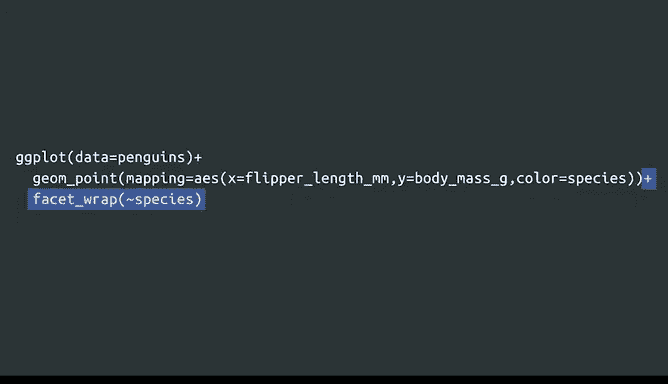
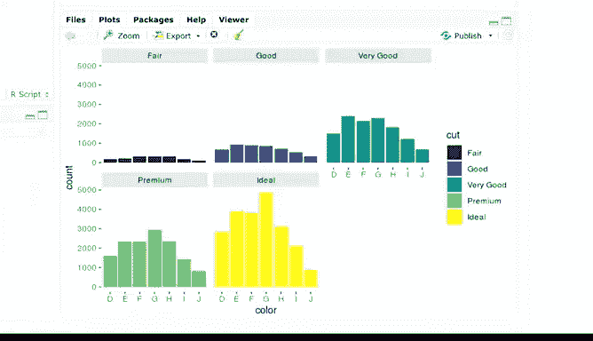
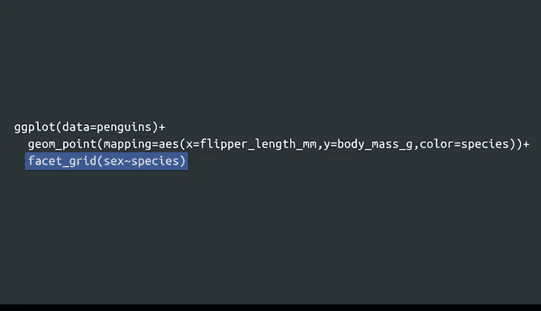
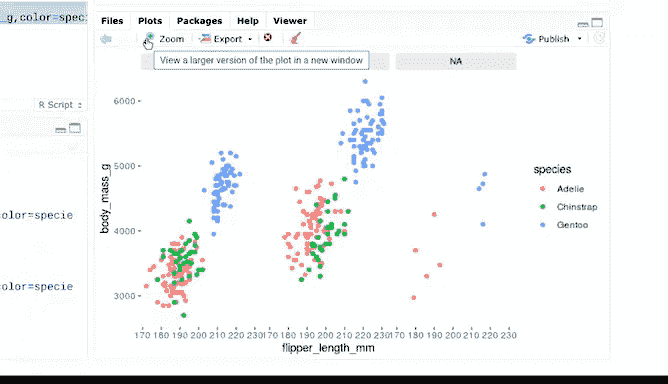

# 029：分面系统 🎨

在本节课中，我们将要学习如何使用ggplot2包中的分面功能，以全新的方式展示数据。分面功能允许你将数据按子集或分组进行展示，就像宝石的不同切面一样，它能从不同角度揭示数据中的模式和关系。

上一节我们介绍了基础绘图，本节中我们来看看如何使用分面来深化数据分析。

## 什么是分面？🔍

分面功能让你能够展示数据中更小的组或子集。一个分面就像是对象的一个侧面，例如宝石的各个切面。通过将每个数据子集放在单独的图形中，分面可以展示你数据的不同侧面。

分面有助于发现数据中的新规律，并聚焦于不同变量之间的关系。

以下是分面功能的一些应用场景：
*   例如，在查看一家服装公司的销售数据时，你可能希望按类别分解数据，以展示特定趋势，如童装与成人装，或春季时装与秋季时装。
*   或者，在进行员工敬业度调查时，你可能希望按在职年限分解数据，比较资深员工与新员工。

## 分面函数介绍 🛠️

ggplot2有两个用于分面的函数：`facet_wrap` 和 `facet_grid`。让我们逐一探索它们。

### 使用 `facet_wrap` 进行单变量分面

要对绘图按单个变量进行分面，请使用 `facet_wrap` 函数。

假设我们想专注于每种企鹅的数据。以展示每种企鹅物种体重与鳍肢长度关系的图形为例，`facet_wrap` 函数可以让我们为每个物种创建一个单独的图形。

要为图形添加新图层，我们将在代码中添加一个加号 `+`。然后，在 `facet_wrap` 函数的括号内，键入波浪符号 `~`，后跟变量名。

以下是具体操作步骤：
1.  加载ggplot2包和企鹅数据集。
2.  在键盘左上角、Esc键下方可以找到波浪符号 `~`。
3.  运行代码后，单独的图形将展示每种企鹅物种内部体重与鳍肢长度的关系。

分面帮助我们专注于数据中在单一图形里可能被忽略的重要部分。如果你的图形元素过多，例如变量太多或变量内的层级太多，分面是一个很好的选择。

让我们尝试对钻石数据集进行分面。之前，我们创建了一个条形图，展示了每种切工类别（一般、良好、很好、优质、理想）的钻石数量。我们可以对 `cut` 变量使用 `facet_wrap`，为每个切工类别创建一个单独的图形。

### 使用 `facet_grid` 进行双变量分面

要使用两个变量对绘图进行分面，请使用 `facet_grid` 函数。

`facet_grid` 将根据第一个变量的值在垂直方向分割图形，并根据第二个变量的值在水平方向分割图形。

例如，我们可以对企鹅图形使用 `facet_grid`，并传入两个变量：`sex` 和 `species`。在 `facet_grid` 函数后的括号中，我们写入 `sex`，然后是波浪符号 `~`，接着是 `species`。

运行代码后，将得到9个独立的图形，每个图形基于三种企鹅物种和三种性别类别的组合。

`facet_grid` 让你能够快速重组和展示复杂数据，并更容易发现不同组别之间的关系。

如果需要，我们可以将图形聚焦于两个变量中的一个。例如，我们可以让R从图形的垂直维度中移除 `sex`，只展示 `species`。这样，你可以轻松发现三种物种间鳍肢长度与体重关系的差异。

同样地，我们也可以将图形聚焦于 `sex` 而非 `species`。

## 总结 📝

本节课中我们一起学习了ggplot2的分面系统。分面功能让你能够重组数据，以展示变量间的特定关系，并揭示数据子集中的重要模式和趋势。通过 `facet_wrap` 和 `facet_grid`，你可以更清晰、更有针对性地进行数据可视化分析。

接下来，我们将学习如何使用标签和注释来自定义图形。下次见！