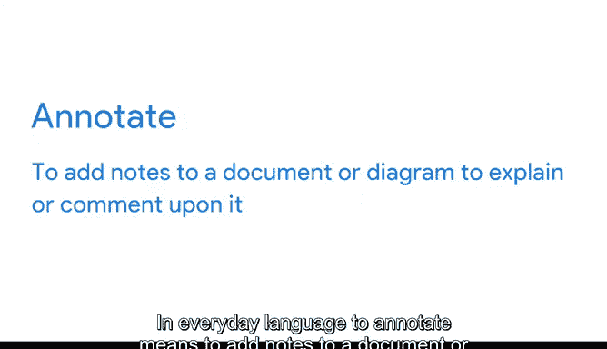
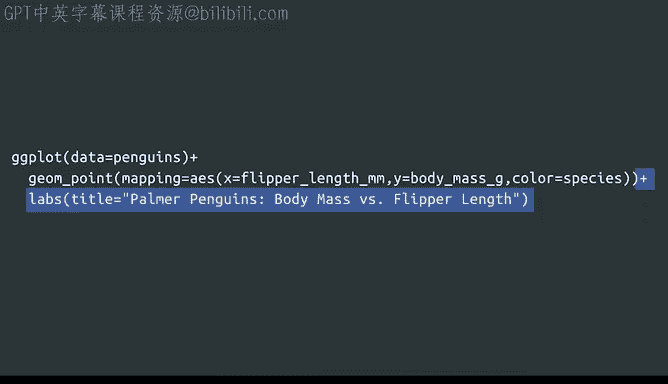
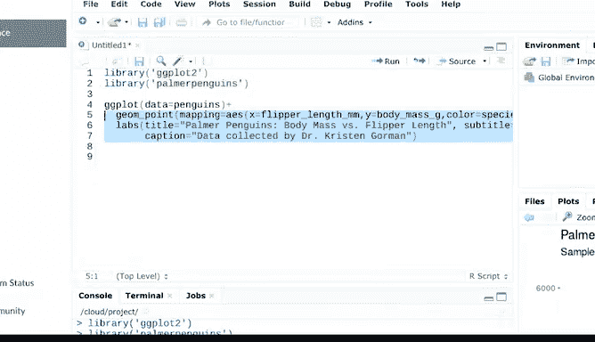
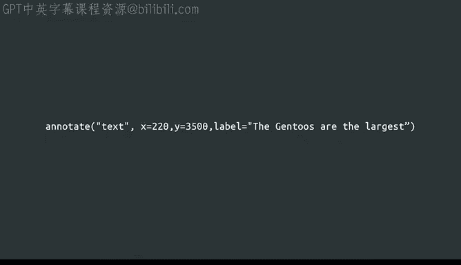
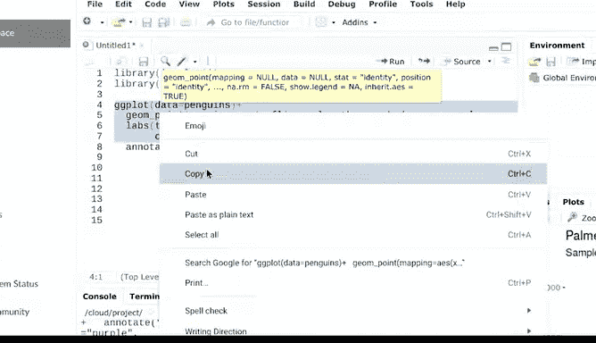

# 030：注释图层详解 📝


在本节课中，我们将学习如何使用 `labs()` 和 `annotate()` 函数来自定义图表的外观，通过添加标签和注释来增强图表的可读性和信息传达能力。

---

## 概述



上一节我们介绍了如何创建基础的图表。本节中，我们来看看如何通过添加标题、副标题、图注以及数据点注释，使图表更清晰、更具解释力。标签和注释能帮助观众快速抓住图表重点，尤其是在时间有限的汇报场景中。

以下是 `labs()` 函数的基本用法，它用于为图表添加标题、副标题和说明文字。

*   **添加标题**：使用 `labs(title = “标题文本”)`。
*   **添加副标题**：使用 `labs(subtitle = “副标题文本”)`。
*   **添加图注**：使用 `labs(caption = “说明文字”)`。

---

## 使用 `labs()` 函数添加标签

首先，我们加载必要的包和数据。

```r
library(ggplot2)
library(palmerpenguins)
```

创建一个展示企鹅物种间体重与鳍肢长度关系的散点图。

```r
ggplot(data = penguins) +
  geom_point(mapping = aes(x = flipper_length_mm, y = body_mass_g, color = species))
```



现在，使用 `labs()` 函数为其添加一个标题，以明确图表目的。


```r
ggplot(data = penguins) +
  geom_point(mapping = aes(x = flipper_length_mm, y = body_mass_g, color = species)) +
  labs(title = "三种企鹅的鳍肢长度与体重关系")
```

**注意**：`+` 号应放在一行的末尾，这是很容易忘记的细节。R会自动将标题显示在图表顶部。

我们还可以添加副标题来强调数据的关键信息。方法与添加标题类似，只需在 `title` 参数后用逗号分隔，添加 `subtitle` 参数。

```r
labs(title = "三种企鹅的鳍肢长度与体重关系",
     subtitle = "数据来自帕尔默企鹅数据集")
```

R会自动将副标题显示在标题下方。同样地，我们可以添加图注来注明数据来源。

```r
labs(title = "三种企鹅的鳍肢长度与体重关系",
     subtitle = "数据来自帕尔默企鹅数据集",
     caption = "数据由帕尔默站长期生态研究计划的Kristen Gorman博士于2007-2009年收集")
```

R会自动将图注显示在图表右下角。

---



## 使用 `annotate()` 函数添加注释

标题、副标题和图注是放置在图表网格之外的标签。如果我们需要在网格内部添加文本来标注特定的数据点，则可以使用 `annotate()` 函数。

例如，我们想突出显示Gentoo企鹅的数据。可以使用 `annotate()` 在对应数据点旁添加说明文字，以强化数据中的重要部分。

以下是 `annotate()` 函数的代码结构，它包含了标签类型、位置和内容信息。

*   **指定标签类型**：`annotate(“text”, …)`
*   **指定标签位置**：`x = 220, y = 3500`
*   **指定标签内容**：`label = “Gentoo体型最大”`

让我们运行以下代码：

```r
ggplot(data = penguins) +
  geom_point(mapping = aes(x = flipper_length_mm, y = body_mass_g, color = species)) +
  labs(title = "三种企鹅的鳍肢长度与体重关系",
       subtitle = "数据来自帕尔默企鹅数据集",
       caption = "数据由帕尔默站长期生态研究计划的Kristen Gorman博士于2007-2009年收集") +
  annotate(“text”, x = 220, y = 3500, label = “Gentoo体型最大”)
```

R会自动将文本标签放置在图表中指定的坐标位置。



---

## 自定义注释样式

我们可以进一步自定义注释的样式。例如，改变文本颜色。

```r
annotate(“text”, x = 220, y = 3500, label = “Gentoo体型最大”, color = “purple”)
```

也可以改变文字的字体样式和大小。

```r
annotate(“text”, x = 220, y = 3500, label = “Gentoo体型最大”, 
         color = “purple”, fontface = “bold”, size = 5)
```

甚至可以改变文本的角度，例如，将文字倾斜25度以更好地与数据点对齐。

```r
annotate(“text”, x = 220, y = 3500, label = “Gentoo体型最大”, 
         color = “purple”, fontface = “bold”, size = 5, angle = 25)
```

---

## 优化代码：使用变量存储图表

随着代码变长，我们可以将图表存储为一个R变量来简化后续操作。在R中创建变量的方法是：`变量名 <- 值`。

让我们用变量名 `p` 来存储基础图表。



```r
p <- ggplot(data = penguins) +
  geom_point(mapping = aes(x = flipper_length_mm, y = body_mass_g, color = species)) +
  labs(title = "三种企鹅的鳍肢长度与体重关系",
       subtitle = "数据来自帕尔默企鹅数据集",
       caption = "数据由帕尔默站长期生态研究计划的Kristen Gorman博士于2007-2009年收集")
```

现在，我们无需重写所有代码，只需调用变量 `p` 并为其添加注释即可。

```r
p + annotate(“text”, x = 220, y = 3500, label = “Gentoo体型最大”)
```

你将得到相同的结果。有些人喜欢看到代码每一步都清晰地列出来，因此较长的写法也有其优点。这完全取决于你的偏好，重要的是你知道自己有选择。

---

## 总结

本节课中，我们一起学习了如何使用 `labs()` 和 `annotate()` 函数为ggplot2图表添加标签和注释。通过添加标题、副标题、图注以及自定义的数据点标注，我们可以有效地突出数据的关键部分，并更清晰地向观众传达核心信息。掌握这些技巧能让你的数据可视化作品更具专业性和表现力。


接下来，你将学习在ggplot2中保存图表的几种实用方法。下次见！