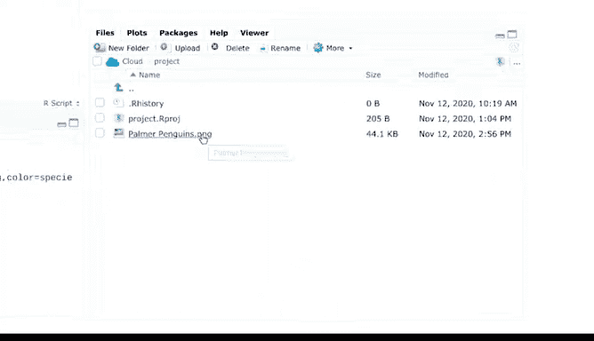
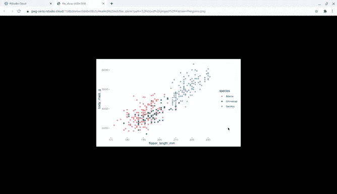
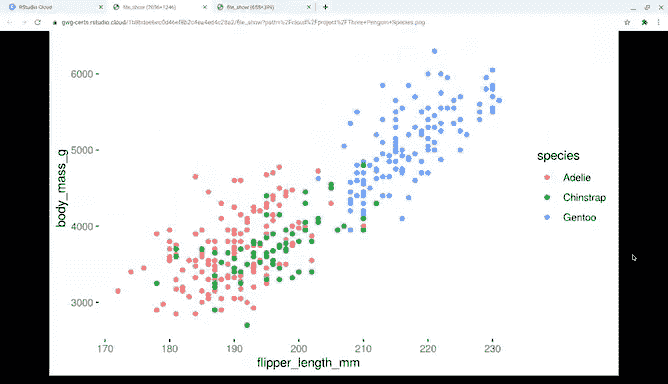

# 031：可视化作品保存方法


在本节课中，我们将学习如何保存使用R语言创建的图表。保存工作成果至关重要，它使你能够后续继续处理或与他人分享。能够复现和分享成果是数据分析师角色的关键部分，这有助于团队协作、成果复核与反馈。

## 保存图表的重要性

上一节我们学习了如何创建和自定义图表，本节中我们来看看如何将这些成果保存下来。保存图表使你能够轻松地将其用于报告、演示或存档。

## 方法一：使用RStudio的导出选项

首先，我们将学习通过RStudio界面中的“导出”选项来保存图表。

1.  登录RStudio Cloud。
2.  加载`ggplot2`包和`penguins`数据集。
3.  编写代码，创建一个展示三种企鹅体重与鳍肢长度关系的散点图。





以下是创建示例图表的代码：
```r
library(ggplot2)
library(palmerpenguins)

ggplot(data = penguins, aes(x = flipper_length_mm, y = body_mass_g)) +
  geom_point(aes(color = species))
```

创建图表后，在“Plots”标签页中点击“Export”按钮。你可以选择将图表保存为图像文件（如PNG、JPEG）或PDF文件。选择PNG格式，为文件命名，然后点击保存。保存后，你可以在“Files”标签页的文件列表中找到它。


## 方法二：使用`ggsave()`函数

接下来，我们学习使用`ggplot2`包提供的`ggsave()`函数来保存图表，这种方法更便于在脚本中自动化执行。



`ggsave()`函数默认保存你显示的最后一个图表，并默认使用当前图形设备的大小。

以下是使用`ggsave()`函数保存图表的代码示例。该函数会自动保存我们刚刚创建的展示三种企鹅体重与鳍肢长度关系的图表。
```r
ggsave("Three_penguin_species.png")
```
在函数括号内，我们以引号开始，输入文件名（例如“Three_penguin_species”），在文件名后加一个句点，然后指定文件类型（例如“png”），最后以引号结束。运行代码后，同样可以在“Files”标签页中找到新保存的文件。


## 课程总结

本节课中我们一起学习了两种保存`ggplot2`图表的方法：通过RStudio的图形界面导出，以及使用`ggsave()`函数。在辛苦创建出图表后，务必记得保存，以便日后访问和分享。

至此，我们的数据可视化专题就告一段落了。你已经为使用`ggplot2`可视化数据打下了良好的基础。我们所涵盖的概念为你未来深入学习数据和R语言奠定了坚实的基础。

我们首先学习了在`ggplot2`中创建图表的基本步骤，接着了解了如何通过美学属性改变图表外观并突出数据重点。我们使用不同的几何对象创建了散点图、条形图等各类图表，并利用分面函数展示数据的子集。然后，我们通过标签和注释对图表进行了定制。最后，我们学会了如何保存所有劳动成果。

学习`ggsave()`对于任何对数据可视化感兴趣的人来说都是一个改变游戏规则的技能。掌握新概念和培养新技能需要大量的时间和练习，没有人能第一次就做好所有事情。但练习得越多，你就会对`ggplot2`越熟悉。如果感觉不总是那么容易，没关系，那恰恰说明你的思维在拓展，技能在增长。请相信，这一切都是值得的。

接下来，你将学习如何使用R来记录和报告你的数据。下次见！