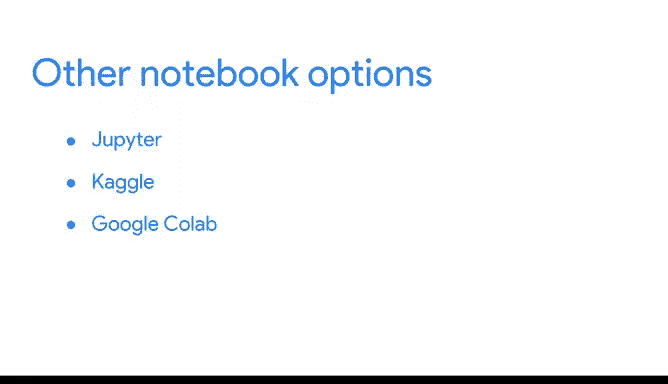

# 033：使用R编程进行数据分析 🧮
## 第33课：R Markdown概览 📄

在本节课中，我们将要学习R Markdown，这是一个用于创建动态文档的强大工具，它能将你的分析代码、结果和解释整合在一起，便于记录和分享。

上一节我们介绍了R编程的基础，本节中我们来看看如何有效地记录和展示我们的数据分析工作。

作为一名数据分析师，你需要能够随时查阅自己的分析。你可能需要与团队成员分享分析过程，或者利益相关者可能会询问你的某个结论。记录你的工作可以让你轻松快捷地与任何人分享你的分析。这就是R Markdown的用武之地。

之前我们了解到，R Markdown是一种用于创建动态文档的文件格式。它允许你在一个文档中创建分析过程和结论的记录。它将你的代码和报告结合在一起，因此你可以分享分析的每一个步骤。最棒的是，你甚至无需离开RStudio就能完成这一切。

这个文档将帮助利益相关者和团队成员理解你在分析中做了什么以及如何得出结论。他们的反馈也将帮助你改进分析。

R Markdown文档使用Markdown语法编写。Markdown是一种用于格式化纯文本文件的语法。使用Markdown可以更轻松地在文档中编写和格式化文本。Markdown也易于阅读和学习。

以下是Markdown的一些基本格式化示例：

*   如果你想在Markdown中使一个单词或短语变为斜体，只需在该单词或短语的前后各添加一个下划线 `_` 或星号 `*`。
*   当你生成文档报告时，Markdown的格式化标记将不再可见，只有变为斜体的单词或短语会显示出来。

稍后你会看到更多格式化选项，但它们都与此示例类似。基本上，它们足够简单，可以让你专注于对分析的描述和解释，而不必过多考虑如何格式化它们。

除了文本，R Markdown还包含一个称为“R笔记本”的交互式选项，它允许用户运行你的代码并显示可视化代码的图表。任何R Markdown文档都可以用作笔记本。这为你的分析和结论创建了一个清晰的全局视图。

R Markdown还允许你将文件转换为多种不同的格式。你可以创建HTML、PDF和Word文档，也可以转换为幻灯片演示文稿或仪表板。拥有这些选项使得可以根据你的受众，以多种方式轻松分享相同的分析。

Markdown语言最初是为HTML输出而设计的。HTML是用于创建网页的一组标记符号和代码。R Markdown对此格式提供了最丰富的功能支持。但你也可以在其他任何格式中获得良好的效果。

虽然R Markdown是记录和分享分析的绝佳方式，但也有其他选择。像Jupyter、Kaggle和Google Colab这样的笔记本，其功能与R Markdown笔记本非常相似，包括交互式元素。

你将在稍后阅读更多关于这些选项的信息。接下来，我们将创建一个R Markdown文档。你将亲眼看到这个高效分析工具的实际应用。

本节课中我们一起学习了R Markdown的基本概念、其重要性以及核心功能。我们了解到它是一个将代码、文本和输出结合在一起的动态文档工具，支持多种输出格式和交互式笔记本功能，极大地便利了数据分析工作的记录、重现与分享。