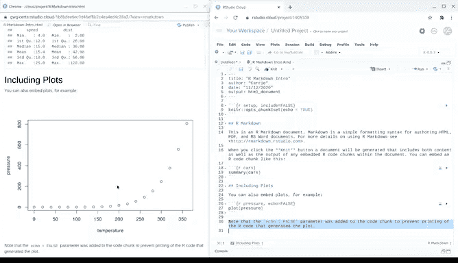

# 034：谷歌数据分析师第七课《使用R编程进行数据分析》data-analysis-r 📊


## 第34讲：RStudio中的R Markdown应用 📝

在本节课中，我们将学习如何在RStudio中使用R Markdown工具。R Markdown是一个强大的文档工具，它允许你将代码、分析结果、文本解释和可视化整合到一份格式优美的报告中。这对于记录分析过程，特别是完成项目后的总结与分享，非常有帮助。

上一节我们介绍了R编程的基础，本节中我们来看看如何利用R Markdown来提升你的分析文档质量。

### 安装与创建R Markdown文件

首先，我们需要在RStudio中安装R Markdown包。这可以通过R的控制台完成。

以下是安装R Markdown包的代码：

```r
install.packages("rmarkdown")
```

安装过程可能需要一些时间。控制台可能会出现红色提示文本，这属于正常现象。

安装完成后，我们可以通过RStudio的“File”菜单创建一个新的R Markdown文件（文件扩展名为 `.Rmd`）。创建时，系统可能会提示安装一些必要的依赖包，请点击“Yes”确认。

### 认识R Markdown文档结构

新创建的R Markdown文件包含几个部分：
*   **YAML头部**：文件顶部的元数据，用于设置文档标题、作者、输出格式等。
*   **代码块**：灰色的区块，用于编写和运行R代码。
*   **文本区域**：代码块之间的区域，用于用Markdown语法编写分析说明、注释和结论。

以下是R Markdown文档的一个基本结构示例：

```markdown
---
title: "我的分析报告"
author: "你的名字"
output: html_document
---

## 简介
这是报告的介绍部分。

```{r}
# 这是一个R代码块
summary(cars)
```

以上代码分析了`cars`数据集。
```

### 生成与分享分析报告

R Markdown文档本身是可编辑的源文件。要生成一份包含所有文本、代码和运行结果的完整报告，我们需要点击编辑器上方的 **“Knit”** 按钮。

点击后，R Markdown会执行所有代码块，并将文本转换为更友好的格式，最终生成一份HTML报告。这份报告清晰、格式统一，即使是没有R使用经验的利益相关者也能轻松理解。

你可以将原始的 `.Rmd` 文件与生成的 `.html` 报告进行对比。在报告中，文本格式更美观，代码块的输出结果（如数据摘要、图表）也直接展示出来。



### R Markdown的优势总结

以下是使用R Markdown进行数据分析文档化的主要优势：
*   **一体化工作流**：在同一个RStudio工作空间内完成从分析到报告撰写的全过程。
*   **可重复性**：报告与代码紧密绑定，确保分析结果可被他人复现。
*   **易于分享**：生成的HTML或PDF报告无需依赖特定软件即可查看。
*   **灵活的输出**：除了HTML，还支持输出为PDF、Word等多种格式。

本节课中我们一起学习了R Markdown的基本用法。你可以在R中开始分析，并在同一环境中创建包含代码和可视化的完整报告。在接下来的课程中，我们将展示更多使用R Markdown提升文档效率的实例。