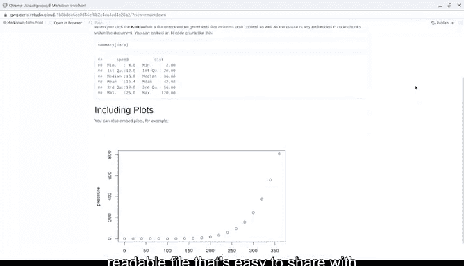

# 035：使用R编程进行数据分析 📊

## 第35课：R Markdown文档结构解析

在本节课中，我们将学习R Markdown文档的结构，并了解如何格式化文本来更好地组织和突出你的数据分析发现。

---

上一节我们介绍了如何开始使用R Markdown。我们创建了一个名为RMD文件的Markdown文档，这对于制作和保存总结数据探索与分析发现的最终报告非常有用。

本节中，我们来看看RMD文件中文本的结构，以及如何格式化它以更好地组织和强调你的发现。

让我们进入RStudio并打开之前保存的名为“R Markdown Intro”的文件。如果你没有保存的文件，可以通过文件菜单新建一个R Markdown或RMD文件。如果提示安装包，请点击“是”。点击“确定”以默认选项打开，然后保存文件。

现在，让我们深入探讨这个文件。我们从顶部开始。

这是YAML头部区域。YAML是一种用于数据的语言，使其可读。有趣的是，YAML最初代表“另一种标记语言”。该部分通过第一行和最后一行的三个破折号标出。在RMD文件中使用此语法会自动创建YAML头部区域。

在RMD文件中，此部分基本上用于元数据，即文件中其余数据的数据。创建新文件时，会自动包含标题、作者、日期和输出文件类型。此部分有许多不同的功能和格式化选项。目前，请确保至少拥有我们文件中现有的四个详细信息。你可以使用打开文件时出现的模板并直接编辑它，或者使用三个破折号从头开始创建YAML部分和文件中的其余内容。我们将在接下来的视频和其他课程资源中介绍这些步骤。

接下来，让我们检查文件中白色区域的文本。

将文本视为评论和解释你的代码、分析以及包含的任何可视化的方式。你可以格式化文本以包含链接、有序列表、公式等。文本使用Markdown格式化，这是我们之前介绍的语法。我们包含了一份阅读材料，展示了所有格式化文本的方法，以及许多其他优秀的Markdown技巧。你还将在下一个视频中学到更多格式化示例。

现在，让我们尝试此文件中的一些示例。

在第12行，“R Markdown”一词前有两个井号和一个空格。井号用于标题。井号越多，标题越小。空格也很重要，否则RStudio不会识别这是一个标题。让我们再次编织文件。HTML文件中出现了R Markdown标题。如果我们在.RMD文件中再添加两个井号并再次点击编织，输出会改变。标题现在变小了。我们将改回来，因为原始格式更合理。由于此标题介绍了接下来两段中关于Markdown的信息，我们希望强调它。

在本节的第一段中，有一个关于Markdown的简要总结。文本中有一个链接，使用尖括号格式化。使用这些括号会在输出中生成可点击的链接。如果你想引用任何有用的链接或将其作为分析的来源，这是一个方便的功能。

在下一段中，“knit”一词两侧各有两个星号。这会使单词加粗。使用一个星号会使单词斜体。

让我们滚动到最后一段。这里有一些内联代码，可以直接插入到.RMD文件的文本中。代码出现在一个灰色框中，类似于我们即将讨论的代码块。使用这样的内联代码可以让你在解释时直接引用代码。

让我们再次编织文件。所有格式化共同作用，形成了一个设计良好、易于阅读的文件，便于与利益相关者和团队成员分享。

---

本节课中我们一起学习了R Markdown文档的基本结构，包括YAML头部、文本格式化以及内联代码的使用。掌握这些基础将帮助你创建清晰、专业的分析报告。关于创建自己的报告，还有更多内容需要学习，敬请关注。