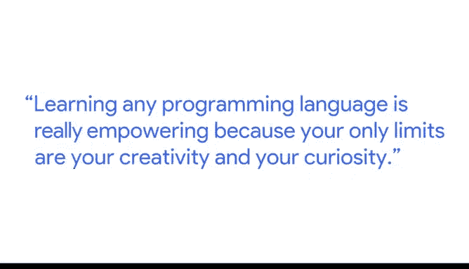

# 036：谷歌数据分析师课程第七课《使用R编程进行数据分析》📊

## 概述

在本节课中，我们将跟随谷歌产品负责人Meg，了解学习R编程语言如何为数据分析工作赋能。我们将探讨R语言带来的核心优势、学习过程中的挑战，以及如何有效利用其强大的社区资源。

---

## 学习编程的赋能之路 🚀

我是Meg，在谷歌担任产品负责人。我的工作是与设计师和网页开发人员合作，构建用户喜爱的功能。我具体为CAL工作，CAL是一个面向数据科学与机器学习学习者的在线社区。我们构建令人兴奋的功能，帮助人们从数据中学习并推动职业发展。

我与设计师和研究员合作进行研究，以理解用户的需求以及他们对产品的期望。我与工程师合作，精确地规划如何编写我们决定构建的功能的需求文档。

学习任何编程语言都极具赋能效果，因为你的唯一限制就是你的创造力和好奇心。

## 好奇心驱动研究与分析 🔍

正是我对世界的好奇心引领我走向研究和数据分析。尤其是使用R语言时，我感到非常自由，能够对世界提出问题，并知道如何利用数据来找到答案。

## 可迁移的技能与社区生态 🤝

我认为掌握编程语言第二个令人兴奋和赋能之处，在于它赋予你的可迁移技能。最后一个令人兴奋的点，则是随之而来的社区和生态系统。在这方面，R语言毫不例外。事实上，我认为R社区非常出色。能够触手可及地拥有这个社区和公共资源生态系统，将极大地增强你作为数据分析师利用数据的能力，我认为这非常令人兴奋。

## 克服初学阶段的挑战 💪

刚开始学习R时，感到畏惧、困惑或卡住是完全正常的。这门语言有一些独特的“怪癖”，但这并非你的过错，你只需要克服这些障碍。我可以保证，一切都会变得清晰起来。

特别是当你能够开始使用 **`tidyverse`** 生态系统时。我的建议是坚持下去。另一个建议是，在你的R学习之旅中，尽早尝试与R社区建立联系。R语言最棒的一点在于其社区充满活力且非常友好。

你会发现，社区里有R语言的专家实践者，他们乐于分享自己的错误和学习历程。我认为这将真正帮助你认识到，你并不孤单。

## 从挫折到顿悟的转折点 ✨

在我最初学习R时，肯定有过相当沮丧的时刻。对我来说，真正的转折点出现在我有机会使用R来回答我个人的研究问题时。当你感觉对分析结果有个人切身利益时，那种在突破难关后获得的奖励感和满足感，能够帮助你真正建立持续学习的动力。

---

## 总结

本节课中，我们一起学习了Meg分享的R编程学习心得。我们了解到，学习R语言能通过满足好奇心、提供可迁移技能以及连接活跃社区来赋能数据分析工作。同时，我们也认识到初学时的挑战是正常的，而将R应用于解决个人感兴趣的问题，是克服困难、获得成就感并持续进步的关键。坚持学习并积极融入社区，将帮助你充分利用R语言进行数据分析。