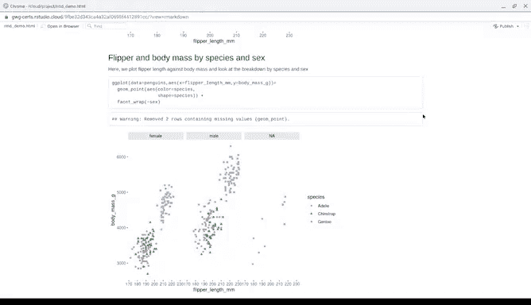

# 038：使用R编程进行数据分析 📊
## 第38课：代码块使用指南


在本节课中，我们将学习如何在R Markdown文件中使用代码块。代码块是RMD文件的核心，它允许我们将R代码、其输出结果以及分析说明整合到一份报告中，便于分享和展示。

上一节我们介绍了R Markdown文件的格式、YAML头部以及如何为报告添加注释和描述。本节中，我们来看看如何将实际的R代码嵌入到报告中。

### 设置环境与添加描述

在添加任何代码之前，我们首先需要描述代码的用途。这有助于他人（以及未来的自己）理解报告的结构。

首先，我们创建一个新的 `.Rmd` 文件，并设置好标题和作者。接着，我们删除模板中除头部以外的所有内容，以便从一个干净的空间开始工作。

以下是为代码添加描述性标题和注释的步骤：

*   使用两个井号 `##` 创建一个二级标题，例如：`## 设置我的环境`。
*   在标题下方，添加一段文字说明接下来要运行的代码的目的。例如，说明我们将加载必要的R包。

### 插入代码块

描述完成后，我们就可以插入代码块了。代码块在R Markdown文件中显示为灰色区域，由特定的分隔符界定。

以下是插入代码块的几种方法：

*   **使用菜单**：在RStudio中，点击“代码”菜单，选择“插入代码块”。
*   **使用按钮**：在脚本窗格顶部，有一个插入代码块的按钮（通常显示为“C+”图标）。
*   **使用快捷键**：在PC或Chromebook上按 `Ctrl + Alt + I`，在Mac上按 `Cmd + Option + I`。
*   **手动输入**：直接键入三个反引号 ```，后跟一个花括号 `{r}` 来开始代码块，并以三个反引号结束。

一个基础的代码块结构如下所示：
```r
# 这里是你的R代码
library(tidyverse)
```

### 组织与运行代码

为了更好的组织性，我们可以为代码块添加标签。在开始分隔符 `{r}` 后面，我们可以添加一个空格和标签名，例如 `{r loading-packages}`。这样，我们就可以利用RStudio脚本窗格底部的“内容”菜单快速定位到特定的代码块。

在代码块内部，我们可以直接编写或粘贴R代码。例如，加载 `tidyverse` 和 `palmerpenguins` 数据包：
```r
library(tidyverse)
library(palmerpenguins)
```
即使这些包已经加载，再次运行也能确保我们使用的是最新版本。我们可以在RMD文件中直接运行代码块来检查是否有错误。

### 配置代码块选项

代码块提供了丰富的选项，允许我们控制其输出和行为，这在准备面向利益相关者的最终报告时非常有用。

以下是常用的代码块选项示例：
```r
{r my-chunk, echo=FALSE, warning=FALSE, message=FALSE}
# 你的代码
```
*   **`echo=FALSE`**：在最终报告中隐藏代码，只显示输出结果。
*   **`warning=FALSE`** 和 **`message=FALSE`**：隐藏警告信息和包加载消息等。如果这些信息不影响你的分析结论，隐藏它们可以使报告更简洁、专业。

通过灵活运用这些选项，你可以精确控制报告中呈现给读者的内容。

### 代码块的价值

代码块是将R Markdown文件转变为强大沟通工具的关键。它将分析过程（代码）、分析结果（输出、图表）和分析解读（文字描述）无缝地结合在一起。



当你在文件中嵌入代码并展示其输出时，你为分析结论提供了直接的证据和可追溯的来源。这使得报告不仅是一份结论文档，更是一个可复现、可验证的分析记录。

本节课中我们一起学习了如何在R Markdown文件中插入、描述、运行和配置代码块。我们了解到，代码块是报告的核心，它让我们能够整合代码与叙述，创建出既有说服力又可复现的数据分析文档。在接下来的课程中，我们将继续探索R Markdown的更多功能，以更好地记录和展示你的分析工作。