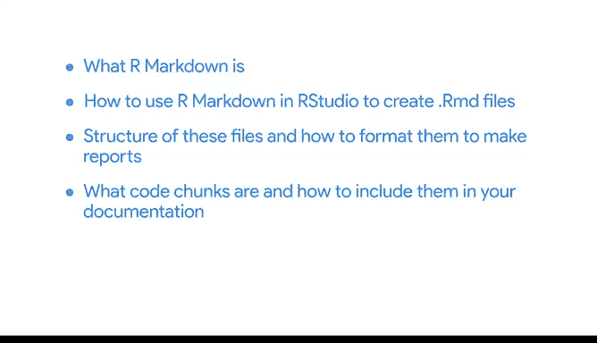

# 039：文档导出与发布 📄➡️📤

在本节课中，我们将学习如何将R Markdown文件转换为不同类型的可共享报告。我们将重点介绍导出选项、元数据编辑以及创建模板的基本概念。

---

上一节我们介绍了如何在R Markdown中编写代码和分析。本节中，我们来看看如何将你的工作成果导出并发布为正式报告。

R Markdown文件最强大的功能之一，就是可以将其转换为不同的输出类型，从而创建可共享的报告。我们之前一直专注于HTML文档，但其实还有其他选项可供探索。

让我们从打开之前创建的报告开始。这份报告最初是作为学习文档创建的，旨在帮助你梳理代码和分析思路。在本视频中，请想象这是一份你需要与利益相关者分享的报告。

文件目前是 `.Rmd` 格式，但正如我们演示过的，可以使用 **Knit** 按钮进行转换。

以下是主要的导出选项：
*   **HTML**：适合在网页浏览器中查看。
*   **PDF**：适合打印或作为正式文档分发。
*   **Word** 文档：方便与他人协作编辑。

你可以随时使用 **Knit** 将文件转换为以上任意类型。但一个好的做法是，在工作时先保持HTML格式。因为HTML没有分页符，你可以专注于报告内容的生成，而无需担心其外观布局。

**Knit** 按钮并非转换文件的唯一方式。你还可以通过编辑YAML元数据来更改输出格式或加入更多细节。

例如，我们将此文件中的输出格式改为PDF。当我们点击 **Knit** 按钮来渲染文件并运行代码时，输出就会是PDF格式。由此可见，更改元数据会影响整个报告的生成方式。

如果你需要反复创建某种特定类型的文档，或者希望自定义最终报告的外观，你可以创建一个模板。

例如，如果你需要每月或每年为利益相关者创建报告，你只需运行一行代码来更新数据，报告就准备就绪了。我们在此不深入讲解如何创建模板，但随着你在R方面经验增加，这可能是你希望自行深入学习的主题。

---

至此，我们已经探讨了R Markdown及其文档化的核心部分。我们解释了R Markdown是什么，以及如何在RStudio中使用它来创建 `.Rmd` 文件。我们查看了这些文件的结构，以及如何格式化它们以生成报告。我们向你展示了什么是代码块，以及如何将它们包含在你的文档中。最后，我们还展示了如何将所有这些分析内容及其解释，从一个 `.Rmd` 文件转化为一份可用作学习文档或与利益相关者分享的报告。

这是在R和RStudio中完成数据分析流程的一个绝佳方式，也意味着本课程即将接近尾声。如果你想回顾任何概念或在RStudio中进行更多练习，随时可以重新观看视频以获取额外帮助。

本节课中，我们一起学习了R Markdown文档的导出与发布流程，掌握了通过Knit按钮和编辑YAML元数据来生成不同格式报告的方法，并了解了创建报告模板的基本概念。