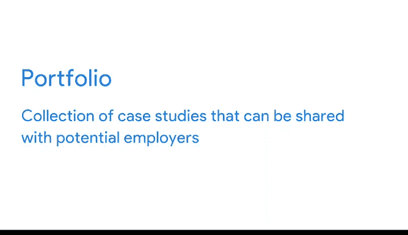

# 001：完成一个案例研究》

在本节课中，我们将学习数据分析师认证项目的顶点项目——案例研究。我们将了解什么是案例研究，它在求职过程中的作用，以及如何构建一个展示你技能的个人作品集。

---

## 🎯 什么是顶点项目？

上一节我们介绍了课程的整体结构，本节中我们来看看顶点项目的具体含义。

顶点项目将你在整个课程中学到的所有知识整合在一起。你将有机会运用所有新学到的知识，在一个数据分析案例研究中付诸实践。在本视频中，我们将详细讨论案例研究的内容，以及它如何帮助你在求职过程中脱颖而出。

---

## 🔍 案例研究：实践性数据分析项目

案例研究类似于实践性的数据分析项目。在求职过程中，你可能会在预筛选电话或初次面试后被要求完成一个案例研究。

案例研究是雇主评估求职者技能、并深入了解你如何处理常见数据相关挑战的常用方式。不同的雇主可能会给你不同类型的案例研究。

以下是几种常见的案例研究类型：
*   例如，你可能会被要求清理和分析一个数据集。
*   或者，围绕如何衡量一个项目的成功提供建议。
*   又或者，为特定产品找出并定义成功指标。

通常，案例研究会有时间限制。例如，潜在雇主可能会给你一些样本数据和项目问题，并要求你在24到48小时内创建一份包含建议的演示文稿或备忘录。

这个时间限制可能有点挑战性，但好消息是，你对案例研究的答案不必完美。重要的是展示你的思考过程，以便面试官理解你如何解决问题。你可以使用我们在整个课程中学到的**数据分析流程**来指导你。

---

## 📝 案例研究示例解析

让我们看一个例子，并分解它的所有部分。这个案例研究包含了我们执行此任务所需的所有信息。

它从这里开始，包含标题和行业焦点：
**预测人力资源的员工流失率**

它还包括一个概述总体目标的问题陈述。在本例中，他们要求深入探讨关键数据分析概念，以预测组织中的员工流失率，以及哪些因素影响员工离开组织。

所以，基本上，这个案例研究关注的是预测员工可能离开组织的比率及其原因。

下一部分有一些更具体的目标：
它要求我们找出员工在未来五年内离开公司的概率。这相当直接。但他们也对提高员工保留率的方法感兴趣。

接下来的部分非常关键：
**可交付成果**是我们完成案例研究后实际要交给他们的东西。在这个例子中，他们要求提供一份概述我们发现和建议的演示文稿。

最后，他们包含了一些关于我们将用于此任务的数据的部分。这里是一个我们可以下载的数据集。

---

## 💼 个人作品集的重要性

现在我们对案例研究以及它在求职申请过程中如何呈现有了更多了解。但是，热衷于数据分析的人有时会在自己的时间里做案例研究，并将它们添加到个人作品集中。

作品集是一个案例研究的集合，可以与潜在雇主分享。作品集可以存储在公共网站上，如 **GitHub**、**Kaggle** 或 **Tableau**，或者你的个人博客上。你的作品集链接也可以放在你的简历中。

这将为你提供过去如何处理数据任务的例子，你可以在面试中谈论这些。这些作品集展示了你的技能，帮助你在求职申请中脱颖而出。

除了案例研究，我们还将讨论如何构建你的作品集以及如何分享它。这将是一个很好的基石，你可以用它来丰富你的简历。

接下来，我们将查看一些优秀的案例研究和作品集示例，希望它们能激励你开始创建自己的项目。

---

## ✨ 总结

本节课中，我们一起学习了数据分析师认证的顶点项目——案例研究。我们了解了案例研究的定义、在求职中的作用、其常见结构和组成部分，以及构建个人作品集对于展示技能和积累经验的重要性。接下来，我们将通过具体示例来获得更多灵感。