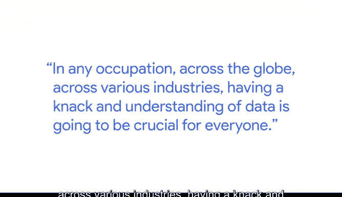
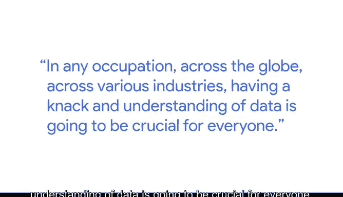
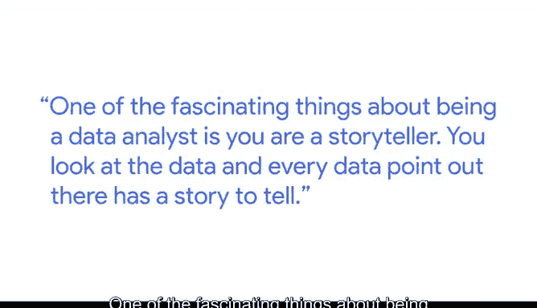

# 002：雇主在数据分析师中寻找什么

在本节课中，我们将跟随谷歌全球分析技能课程经理Rishie，了解雇主在招聘数据分析师时最看重哪些核心素质和思维方式。这对于准备面试和规划职业发展至关重要。

---

## 🏢 数据驱动的谷歌

谷歌是一家建立在数据之上的公司，其核心理念是：**数据驱动一切**。

无论你是工程师、市场人员、销售人员，还是处理物流、文书和薪资的行政人员，每个人都在以某种形式与数据打交道。我们试图承认一个事实：在全球任何行业、任何职业中，拥有对数据的敏锐感和理解力对每个人都至关重要。

上一节我们了解了数据在谷歌的普遍性，接下来我们看看在面试中，雇主具体关注什么。

---

## 🎨 数据分析师：既是科学家，也是艺术家

在面试中，我个人或我的同事们所寻找的，是候选人**创造性的思维方式**。

当人们听到“数据分析师”这个词时，通常会想到工程师或技术极客，认为这完全是关于处理数据和数字的工作。

但我恳请大家重新思考这种认知：**成为一名数据分析师不仅是成为科学家，也是成为艺术家**。整个世界都是你的画布。

你处理问题的方式，甚至有时挑战解决问题的传统规范，我认为这非常强大。在面试这类职位时，这种能力实际上能让你比其他人更具优势。

---

## 🤔 面试官寻找的是思维过程，而非标准答案

关于求职存在一个误解或误区：当你申请工作时，你应该知道所有正确答案，应该正确回答他们提出的每一个问题。

但这是错误的。每位面试官寻找的是**你的思维方式、你的思考过程**。你如何看待某个特定问题，以及你如何着手解决这些问题。

当你表达这些时，更多地谈论你如何从某个角度思考、为什么从这个角度思考，这能充分说明你作为一个人是怎样的，也说明了你在该职位上的专业能力。

---

## 📖 数据分析师是讲故事的人

作为一名数据分析师，最迷人的一点在于：**你是一个讲故事的人**。

你审视数据，每一个数据点都在讲述一个故事。如果你能完善这项技能，就能讲述一些精彩的故事。人们记住的将不仅仅是数据，更是你如何向人们或你的听众讲述这些故事。

如果你能聚焦故事的核心本质——即“数据告诉我什么”或“数据告诉你该做什么”——你将会成功得多。我保证，你将在数据分析师的道路上不断进步，你的职业生涯将无限繁荣。

---

## 🎯 课程总结

本节课中，我们一起学习了雇主在数据分析师身上寻找的关键特质：

1.  **创造性思维与艺术视角**：数据分析不仅是科学，也是艺术，需要挑战常规的创造力。
2.  **思维过程重于标准答案**：面试官更关注你如何分析和解决问题，而非你是否知道“正确答案”。
3.  **讲故事的能力**：能够从数据中提炼并讲述引人入胜的故事，是将洞察转化为行动的关键。

掌握这些思维方式和软技能，与掌握技术工具同等重要，它们将帮助你在数据分析领域脱颖而出，推动职业生涯长远发展。