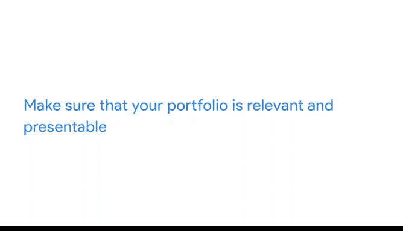

# 003：构建案例研究与作品集的最佳实践

在本节课中，我们将学习如何构建出色的数据分析案例研究和个人作品集。我们将探讨一些核心的最佳实践，并通过实例来理解如何让你的分析成果在求职过程中脱颖而出。

## 🎯 案例研究的核心要点

上一节我们介绍了案例研究的基本概念及其重要性。本节中，我们来看看构建一个有效案例研究需要遵循哪些关键原则。

首先，确保你的案例研究能够准确回答所提出的问题。我们来看一个名为“数据伙伴房地产公司”的示例案例。该公司向求职者提出的问题是：你如何评价数据伙伴房地产公司在2020年的转售业绩？是什么驱动了这些趋势？你的行动计划是什么？

公司为求职者提供了一个市场数据集，包含活跃房源、访问量、转售合同、价格点和地理编码等信息。求职者需要完成数据分析流程并提交一份提案。

以下是一位求职者制作的演示文稿。第二张幻灯片清晰地列出了核心问题。

这位求职者识别出公司在某个特定房价区间的表现不佳，并提出了改进方案。在此处快速概述研究发现，有助于将案例研究的焦点集中在手头的任务上。

## 🔍 展示你的思考过程

除了回答问题，你还需要清晰地传达你所采取的步骤以及对数据所做的假设。潜在雇主对案例研究感兴趣的原因之一，是它们能展示你的思维过程和解决问题的能力。

因此，展示你得出结论的步骤，能帮助他们很好地了解你的工作方式。

以下是他们对用于进行分析的指标所做的解释。

在随后的每一张幻灯片中，他们都使用标题来讲述故事并解释分析的深度。他们指出，该公司转售合同的整体市场份额保持稳定。他们解释说，这是一个区域的高增长和另一个区域的损失共同导致的结果。接着，他们解释了这种差距，并概述了一些潜在原因。在演讲者备注中，他们添加了一些所做的重要假设。

## 💡 总结与建议

最后，他们根据数据采取了行动，为企业提供了可供考虑的建议。他们的指标定义明确，数据发现按逻辑顺序组织，并且确保解释了受众可能不了解的任何数据背景信息。

在这个案例中，求职者还分享了他们的分析文档，包括SQL查询和电子表格。这是一个绝佳的范例，展示了案例研究如何体现分析师的思想过程。

## 🗂️ 构建个人作品集的最佳实践

现在，在求职申请期间完成的任何案例研究通常需要保密。但你也可以利用自己的时间完成案例研究，并将其添加到你的个人作品集中。

正如之前提到的，你的作品集是你想要展示的案例研究的集合。创建作品集也有一些最佳实践可以遵循。

最好的作品集是**个性化**、**独特**且**简洁**的。

你已经学习了发布和分享作品集的不同方式，例如通过博客、GitHub或Kaggle。

## 🌟 个性化：展示真实的你

让我们探索一些作品集，以便理解个性化、独特和简洁的真正含义。你可能还记得，这些示例也在之前的阅读材料中出现过，欢迎随时返回查看。

你的作品集是一个向人们展示你是谁、你对什么感兴趣以及什么对你重要的机会。这里有一个作品集示例。从标题“用数据分享我的抗癌故事”中，我们立刻就能感受到它的个性化。

这个数据可视化作品展示了这位分析师在准备马拉松比赛的同时接受癌症治疗的健康历程。这是一个非常个人化且有力的故事，他在博客文章中详细谈论了这个项目。同时，数据可视化本身也展示了他的个性。让我们读一下其中的一些备注：“妈妈，如果你在读，请寄更多饼干来。”“Fitbit没电了，懒得充电9天。”

除了数据讲述的个人故事，我们还通过这些备注洞察到分析师的个性。让你的作品集个性化，并不意味着焦点必须完全放在你身上，但这是一个让别人更好地了解你的机会。因此，最好将你关心的事物、你感兴趣的东西以及你乐于分享的内容添加到作品集中。这不仅能突出你的技术技能，还能展示你处理技术问题的方法。

## 🦄 独特性：让你脱颖而出

让你的作品集个性化也有助于使其变得独特。通过突出你感兴趣的事物，你可以从人群中脱颖而出。

让我们看看另一个例子。这是一个Kaggle用户个人资料，展示了她创建的一些笔记。每一个基本上都是她出于兴趣完成的案例研究。她有几个使用我们在R课程中用过的“帕尔默企鹅”数据的笔记。但她也有分析她喜欢的电子游戏的笔记。

使用常见的示例可以是很好的练习，并能展示实用的工作技能，但在作品集中添加一些独特而有趣的案例研究，会使其变得酷炫且令人难忘。

## ✨ 简洁性：聚焦核心技能

总的来说，你希望保持作品集的简洁性。我们的目标是突出我们作为数据分析师的技能，因此我们不希望用不必要的杂乱信息分散访问者的注意力。

这里有一个GitHub上的作品集示例。这位用户创建了一个他们制作的艺术教程的主列表。它简单明了。有一个目录可以链接到不同的页面，以保持作品集主页的简洁和易于导航。这并不意味着这个页面很无聊。他们添加了有趣的封面艺术，并在这里谈论了他们自己使用R的经验。但即便如此，我们也不会被杂乱的网页所干扰。

## ✅ 确保相关性与专业性

最后，你需要确保你的作品集是相关且专业的。

如果你知道自己对某种类型的数据分析职位感兴趣，你可以调整你的作品集以突出这些技能。确保你保持作品集的更新，随时准备让雇主查看，最重要的是，为你所整理的内容感到自豪。

## 📝 本节总结

本节课中我们一起学习了构建案例研究和作品集的最佳实践。对于案例研究，你需要确保**回答问题**并**清晰地传达分析步骤**。在构建作品集时，请记住保持其**个性化**、**独特**和**简洁**。

现在我们对如何创建出色的案例研究和作品集有了一些想法，你已经准备好开始着手创建自己的了。接下来，我们将迈出构建自己案例研究的第一步。