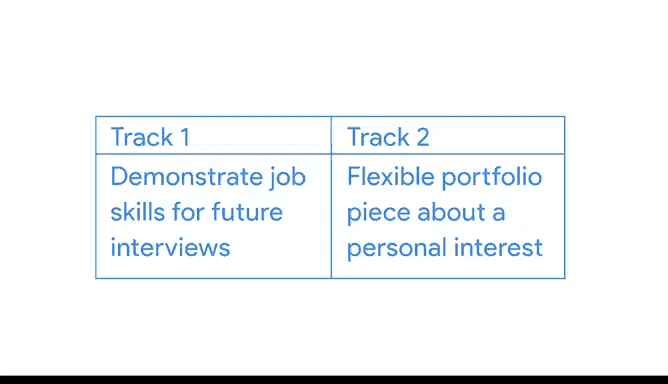

# 004：开始您的案例研究

在本节课中，我们将学习如何开始构建您自己的数据分析案例研究。我们将介绍两种不同的项目启动方法，并引导您使用一个结构化的案例研究大纲来规划您的项目。

---

很高兴再次见到您。我们已经查看了一些案例研究和作品集的示例，现在是时候开始创建您自己的项目了。接下来，您将进行一项活动来帮助您开始。

但在开始之前，我想简要介绍一下启动项目时可以采用的两种不同方法。

以下是两种可能的路径，您可以用它们来构建您的案例研究框架并帮助您起步。

在路径一中，您可以选择一个类似于面试官可能会问到的商业问题。您可以从多个选项中进行选择，每个选项都包含特定的商业任务和不同的数据集供您使用。

上一节我们介绍了路径一，本节中我们来看看路径二。

在路径二中，您需要找到一个公共数据集，来探索您个人感兴趣的领域。这可以是任何内容，从分析您喜欢的电子游戏到研究您关心的野生动物种群。这是一个更灵活的选择，您将有更多自由来构建真正属于您个人的项目。

根据您对案例研究的期望，您可能会选择其中一种路径。例如，如果您想创建一个案例研究来展示您在求职面试中的技能，那么路径一对您可能更有用。但如果您有个人感兴趣并希望深入探索的领域，路径二可以帮助您构建一个灵活的作品集项目。或者，如果您对两种路径都感兴趣，您可以同时进行。

---

一旦您决定了最感兴趣的路径，您将使用案例研究大纲来帮助您启动项目。

该大纲遵循我们在整个课程中一直使用的数据分析生命周期阶段。您将完成每个阶段，从提出正确的问题，到准备、处理和分析您的数据，直到最终构建您的演示文稿并将其分享到您的作品集中。

每个阶段都有关键问题和活动，以指导您完成整个过程。如果您需要回顾任何内容，您可以随时返回课程的任意部分进行复习。

作为快速提醒，您在此项目中使用的数据将是公开且开源的。这些数据非常适合展示您作为数据分析师的技能。但必须通过引用来源来避免抄袭。公开的开源数据很容易被搜索到，我们不应将其冒充为自己的作品。抄袭可能会带来严重的法律和个人负面后果。我们作为数据分析师工作的美妙之处在于我们可以相互分享和协作，因此请记住要注明我们的来源。

---

我希望您对开始您的案例研究感到兴奋。我非常期待看到您将构建出什么。接下来，您将能够开始着手大纲，然后我们还有一些其他活动来指导您。之后，我们将讨论如何分享您的作品集。祝您好运。

---

本节课中我们一起学习了如何启动数据分析案例研究项目。我们介绍了两种项目路径：一种是基于预设商业问题的路径一，另一种是基于个人兴趣探索的路径二。我们还了解了如何使用结构化的案例研究大纲来规划项目，并强调了使用公开数据时正确引用来源、避免抄袭的重要性。接下来，您就可以开始使用大纲来构建您自己的项目了。