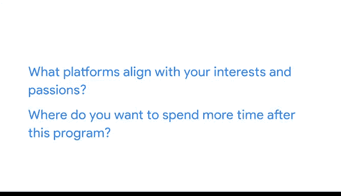

# 006：完成一个案例研究》 - 分享您的作品集

在本节课中，我们将学习如何创建并在线分享您的数据分析作品集。完成案例研究是一个重要的里程碑，但要让您的分析成果被看见，还需要将其整理成作品集并发布到合适的平台上。

## 🌐 选择作品集平台

上一节我们介绍了完成案例研究的重要性，本节中我们来看看如何选择分享您作品的平台。当您考虑在哪里分享作品集时，有两个问题可以帮助您做出决定：

1.  哪些平台符合您的兴趣和热情？
2.  完成本课程后，您希望花更多时间在哪个平台上？

您有几个主要的选择，包括 Kaggle、GitHub、博客或 Tableau。以下是每个平台的特点介绍：

**Kaggle**
*   **特点**：拥有广泛的数据科学社区，举办大量竞赛，并提供各种学习机会。
*   **适用人群**：如果您喜欢与其他数据分析师交流，这是一个很好的选择。

**GitHub**
*   **特点**：主要用于 R 或 Python 等编程语言，设置比其他平台更技术化。
*   **适用人群**：是分享代码和分析背后逻辑的绝佳场所，也适合向其他数据分析师学习。

**博客平台**
*   **特点**：如 Medium、WordPress 和 Google Sites，具有个性化和自主性。
*   **适用人群**：博客不像 Kaggle 和 GitHub 那样专注于代码，您需要将代码存储在其他地方，并且可能需要额外步骤来展示代码。但您可以展示专业知识，用自己的语言描述分析过程，并在您的领域展现思想领导力。

**Tableau**
*   **特点**：您已通过本课程获得了一些 Tableau 使用经验。
*   **适用人群**：如果您专注于数据可视化方面，这是一个很好的选择。此外，您可以使用 Tableau 工具创建易于分享的交互式仪表板。

## 🎯 做出您的决定

选择托管作品集的平台是一个重要决定。您可能会根据特定需求，随着时间的推移使用多个平台。重要的是记住我们之前讨论的两个问题：哪些平台符合您的兴趣和热情，以及完成本课程后您希望花更多时间在哪个平台上。

选择在线分享平台是本顶点项目的最后步骤之一。接下来，我们将通过一些活动来帮助您完成这个过程，然后我们将继续讨论您的下一步计划。

---

**本节课总结**：我们一起学习了如何为数据分析案例研究选择并创建在线作品集。我们探讨了 Kaggle、GitHub、博客和 Tableau 等不同平台的特点和适用场景，并强调了根据个人兴趣和未来规划来选择平台的重要性。