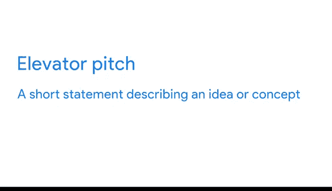
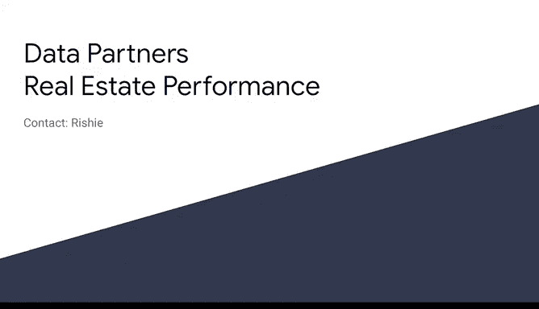

# 007：讨论您的作品集 📂


在本节课中，我们将学习如何利用您已完成的数据分析案例研究作品集，在求职面试中有效地展示您的技能。我们将重点介绍如何准备一个简洁有力的“电梯演讲”，并学习如何围绕作品集中的案例来阐述您的分析过程和解决问题的能力。

---

## 概述：作品集在求职中的力量

上一节我们介绍了如何创建案例研究并将其加入作品集。本节中，我们来看看如何在实际面试中运用这个作品集，给潜在雇主留下深刻印象。

将作品集链接放入简历能帮助您脱颖而出。然而，能够有效地利用作品集来突出您的技能，将使它在面试讨论中发挥更强大的作用。

---



## 什么是“电梯演讲”？ 🎤

在讨论作品集中的案例时，您需要准备一个“电梯演讲”，以便快速向面试官传达您工作的核心内容。

基本上，“电梯演讲”就是一个描述某个想法或概念的简短陈述。它应该只有几句话，简短到足以在乘坐电梯的短时间内向某人解释清楚。

**公式：电梯演讲 ≈ 2-3句话的精华总结**

提前准备您的电梯演讲总是一个好主意。这样，一旦面试官对您的案例有了高层次的理解，您就可以给出具体的例子，说明您在数据分析中处理问题和解决问题的过程。



---

## 如何构建您的电梯演讲

以下是构建电梯演讲的关键步骤。您可以从案例研究的执行摘要和核心业务任务出发。

例如，回顾我们之前讨论过的房地产公司案例研究。其执行摘要侧重于回答业务问题，这可以帮助我们构建电梯演讲。我们只需要将其浓缩成几句话。

您也可以回想案例研究所基于的业务任务，以帮助您决定哪些背景信息最重要。

**示例电梯演讲：**
> “在这个案例研究中，我利用一家房地产公司的数据来评估转售业绩、确定市场趋势并推测其成因。基于这些发现，我最终制定了一份行动计划。”

如果面试官有兴趣了解更多细节，您就可以在此基础上展开。这时，您可以分享更多关于您如何得出结论以及您给公司的建议。

---

## 有效展示技能：关注过程而非结果 🛠️

最有效地展示技能的方法是记住您的听众以及他们感兴趣的内容。

潜在雇主和招聘人员希望了解您的思维过程和解决问题的方法。这意味着在讨论作品集中的案例时，**关注您的分析过程而不仅仅是最终结果**，会非常有用。

让我们回想之前的例子：面试官要求我们谈谈清理数据的方法。他们可能不需要知道我们对数据执行的确切函数，但他们可能感兴趣的是，我们如何选择正确的工具，以及我们采取了哪些步骤来确保数据干净、可用。

这能让他们更深入地了解我们的清理流程，以及我们如何看待数据清理这件事。

**代码示例（思路）：**
```python
# 重点不是展示具体的清洗代码，而是解释选择这些步骤的原因
# 例如：“我首先识别了缺失值和异常值，然后根据业务逻辑决定是填充、删除还是修正...”
```

---

## 总结与练习建议

本节课中，我们一起学习了如何利用数据分析案例研究作品集来提升面试表现。我们介绍了“电梯演讲”的概念及其构建方法，并强调了在讨论中关注分析过程的重要性。

您的案例研究是增强简历的有力工具。同时，您也可以借助它们来勾勒您的思维过程和分析方法。为案例研究准备电梯演讲，并用它们向潜在雇主展示您作为数据分析师的技能，可以帮助您更有效地与面试官讨论您的工作。

就像您学到的其他所有技能一样，这件事练习得越多就越容易。提前练习是一个好主意。可以尝试向朋友演练您的电梯演讲，或者与信任的同事练习讲解您的分析过程。您很快就能熟练掌握。


接下来，您将有机会练习在模拟面试中分享您的作品集。下次见。