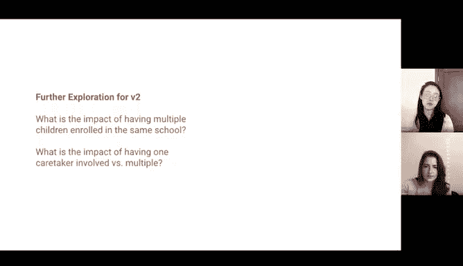

# 009：场景视频案例研究解析 🎬

在本节课中，我们将通过一个具体的视频案例，学习如何运用数据分析思维解决一个实际问题。我们将跟随一位分析师（Sally）的汇报，看她如何为虚构的“Creekreekside中学”设计一个改善家校沟通的应用程序，并理解其分析思路与汇报结构。

---

## 概述：案例背景与目标

视频展示了一个虚构的场景：一所中学需要改善与家长之间的沟通。分析师的任务是提出核心见解，以解决这个问题。

分析师Sally的解决方案是帮助学校设计一款应用程序，让家长能及时了解学校新闻以及孩子的课程与活动情况。她的分析主要围绕两个目标展开：
1.  **分析“原因”**：为什么要创建这款应用？量化家长参与度对学生成绩的影响。
2.  **分析“方法”**：一旦决定创建应用，家长对什么内容感兴趣？应用应如何设计？

---

## 第一部分：分析“原因”——为何需要这款应用？

上一节我们介绍了案例的背景和目标，本节中我们来看看Sally如何分析创建应用的深层原因。

她的核心发现是：**家长参与度与学生考试成绩高度相关**。

以下是她的具体分析过程：

*   **发现趋势**：数据显示，自2004年以来，学生的考试成绩呈下降趋势。
*   **关联分析**：与此同时，家长参与度也在2004年后开始下降。
*   **量化影响**：数据表明，有家长参与的学生，其考试成绩比没有家长参与的学生平均高出**14个百分点**。
*   **得出结论**：由于成绩下降与家长参与度下降在时间上高度吻合，且参与度对成绩有显著正面影响，因此有理由认为，**家长参与度不足是导致成绩下降的主要原因**。

**公式化核心结论**：
`学生成绩提升` **与** `家长参与度提高` **呈正相关**。

因此，为了提高学生成绩，必须首先提升家长参与度，而创建沟通应用是达成此目标的关键手段。

---

## 第二部分：分析“方法”——应用应如何设计？

在明确了“为什么”需要应用之后，接下来我们探讨“如何”设计这款应用以满足家长需求。

Sally通过调查数据来了解家长可能感兴趣的内容。以下是她的分析要点：

*   **活动分类**：通过调查学生参与的课外活动，发现大多数活动可归为三类：**体育运动、学术活动、课外俱乐部**。
*   **通知分析**：分析当前已发布的学校新闻通知，并按年级（六年级、七年级、八年级）进行细分。
*   **关键洞察**：数据显示，**七年级学生收到的通知数量最少**。

基于以上数据，Sally提出了两条具体的设计建议：

1.  **应用结构**：在应用中创建三个标签页或分类，分别对应上述三类活动，方便家长浏览。
2.  **发布策略**：在应用的测试和初期推广阶段，应**优先针对七年级学生的家长**，因为他们目前获得的信息最少，针对性地改善沟通能带来最大的影响。

---

## 第三部分：总结建议与后续步骤

综合以上分析，Sally为项目提出了清晰的总结和后续行动计划。

**分析总结**：
*   **原因**：创建应用是为了提升家长参与度，因为数据证明家长参与度与更高的学生成绩**高度相关**。
*   **方法**：应用应设计三个活动分类标签页，并在首次发布时优先针对七年级学生家长进行测试和推广。

**项目时间线建议**：
以下是Sally建议的项目推进阶段：
*   前两周：数据分析。
*   当前：汇报分析结果（即本演示）。
*   后续主要时段：应用程序开发。
*   测试与迭代阶段：重点收集七年级学生家长的反馈。
*   最终：正式发布并面向所有年级开放。

**后续步骤建议**：
当被问及下一步建议时，Sally提出了两点：
1.  将分析洞察分享给应用程序开发团队，指导他们按照三个活动分类来构建应用。
2.  在测试阶段，坚定执行优先针对七年级的策略。

**未来探索方向**：
对于应用未来的版本（如2.0版），可以探索更多问题，例如：
*   同一所学校中有多个孩子就读，是否会进一步帮助提高成绩？
*   一位家长参与与多位家长参与，其影响有何不同？

---

## 总结

本节课中，我们一起学习了一个完整的数据分析案例。我们看到了如何从明确业务目标开始，通过分析数据趋势和关联性来定位核心问题（家长参与度低导致成绩下滑），并利用细分数据（活动分类、年级差异）来指导具体的产品设计决策（应用结构、发布策略）。最后，分析师给出了清晰的总结、可操作的建议以及未来的迭代方向。这个案例展示了数据分析如何将模糊的业务需求转化为具体、可执行的解决方案。