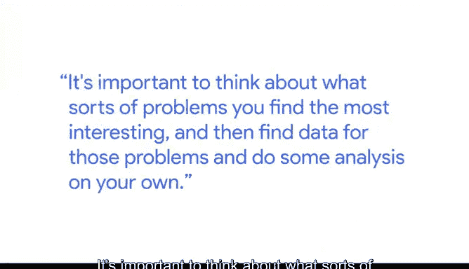

# 012：给退伍军人的建议

在本节课中，我们将跟随谷歌首席数据分析师Nathan，了解他如何通过VetNet组织帮助退伍军人转型，并探讨退伍军人在数据分析领域的独特优势与挑战。Nathan将分享简历优化技巧、职业转换建议以及数据分析师所需的核心素质。

---

大家好，我是Nathan。我是谷歌信任与安全部门的首席数据分析师。同时，我也是VetNet组织的一员。VetNet是一个员工资源小组，面向退伍军人以及希望支持退伍军人的谷歌员工。

我们每年回馈社区最喜爱的方式之一，就是举办年度简历评审研讨会。在这个研讨会中，无论是线上还是线下，我们会邀请退伍军人或其配偶来到办公室或通过视频会议交流。我们会逐一审阅他们的简历，重点聚焦于他们所做过的有影响力的事情，并探讨如何让他们的成就脱颖而出，充分展现他们的优秀之处。

---

上一节我们介绍了VetNet组织及其活动。本节中，我们来看看退伍军人在将军旅经验转化为有效的民用简历时，可能面临的一些独特挑战。

以下是三个主要挑战：
*   **去除军事专用术语**：简历中应使用民用领域能理解的通用语言。
*   **勇于为个人成就争取应得的认可**：退伍军人常常倾向于将成就完全归功于团队。
*   **为简历中展示的活动找到良好的影响力衡量标准**：需要用具体、可量化的结果来体现工作价值。

---

正如军人需要清晰沟通、团队协作和高度注重细节一样，这些素质在数据分析工作中也至关重要。你无法知晓一切，因此与跨职能部门的利益相关者在高度协作的环境中工作非常重要。

此外，如果你无法清晰地传达建议并影响利益相关者采纳它们，那么世界上最好的分析也毫无价值。当然，如果你忽略了一些重要细节，也可能破坏你的分析结果以及你在利益相关者眼中的可信度。因此，注重细节至关重要。

---

上一节我们讨论了数据分析所需的软技能。本节中，我们来探讨如何为数据分析职业道路做好准备。

获取一些培训当然很重要。数据分析师证书是一套很棒的培训课程。同时，你也可以学习其他关于你感兴趣的工具的课程。

更重要的是，思考你对哪些类型的问题最感兴趣，然后为这些问题寻找数据，并自己进行一些分析。这是一种高影响力的方式，能让你自己获得宝贵的经验，从而在面试甚至与社交网络中的人进行非正式交流时进行谈论。

---

退伍军人应该考虑数据分析职业的原因在于，他们已经具备了在保持谦逊的同时又能坚持不懈的坚实基础。这对于数据分析师来说非常重要，因为如果你的自我意识失控，就会产生巨大的盲点，导致你在分析中犯错。

我至今仍认为最好的一条建议是：**“宁可收到超速罚单，也不要收到停车罚单。”**

这句话对数据分析师的特别意义在于，有时你必须跳入那些你天生并不完全舒适的情境中。你需要通过学习和协作来找到出路。

---

在本节课中，我们一起学习了Nathan通过VetNet帮助退伍军人的经历，探讨了退伍军人转型民用领域（特别是数据分析）时在简历撰写和心态调整上面临的挑战。我们明确了数据分析师所需的**清晰沟通、团队协作和注重细节**等核心素质，并了解了通过**获取培训、进行自主项目分析**来积累经验的方法。最后，Nathan分享了“宁可超速，不要停车”的宝贵建议，鼓励我们在职业发展中勇于接受挑战，在行动中学习和成长。