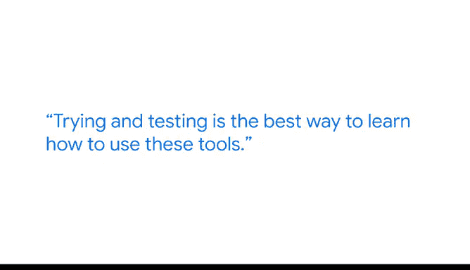

# 013：利用人工智能在工作场所推动影响

在本节课中，我们将跟随谷歌数据工程师迈尔斯的分享，了解人工智能如何在实际工作中提升数据分析的效率和影响力。我们将探讨AI在数据处理、文档生成和日常任务自动化中的应用，并学习如何有效利用这些工具。

---

大家好，我是迈尔斯，是谷歌的一名数据工程师。我的主要工作是维护大型数据库，也就是我们常说的数据湖。这些数据库包含了我们海量的财务信息，从资本性支出到运营性支出，再到收入数据。我的职责是向利益相关者提供这些数据。

我非常热爱数据分析师这份工作。它不仅仅是处理数字，很大程度上也关乎如何“讲故事”。能够创建吸引人且视觉上引人入胜的内容，并呈现给你的业务伙伴，这是一项非常独特的技能，许多其他职业并不具备这种经验。数据是我们所做一切工作的“被遗忘的支柱”，没有数据，我们就无法像现在这样准确地做出任何决策。

人工智能是一个非常重要的领域，我们认为它是下一个前沿。如果我们把数据分析看作第一步，那么人工智能就是第二步。在我的日常工作中，我每天都会使用AI，它让我和我的同事们变得更高效、更有生产力。更不用说，它还能让我们自动化那些我们不喜欢做的、重复性或繁琐的任务。

最近我在谷歌工作中使用AI的一个例子是，我们需要围绕数据访问创建文档。我们基本上需要整合大约10种不同的访问权限，并为我们的业务伙伴创建文档，让他们知道在何时何地申请访问权限。我们这样做是因为我们维护着大量财务数据，众所周知，这些数据非常机密且需要严格控制知情范围。因此，创建易于阅读和易于应用的文档，对于在谷歌担任数据分析师至关重要。

我每天都会使用这个新工具，或者说Gemini的总结功能。无论是处理电子邮件、长文档还是解析代码，它都能真正帮助你更快地触及你想找到的核心要点。

对于刚开始学习数据分析并希望利用AI来达成目标的人，我给出的建议是：尝试和测试是学习如何使用这些工具、以及理解你需要提供什么才能获得你想要的结果的最佳方式。把它当作一个游乐场，尽情玩耍，搞砸一些东西，给它假问题，给它真问题。尽你所能去真正理解它会给出什么样的输出，这样当你真正需要高效完成某项工作时，就能更好地利用它。

一个有趣的小技巧是，你实际上可以用AI来教你使用AI。你甚至可以要求聊天机器人教你如何使用它自己。基本上，AI会给你一个输出，然后你可以问它，它认为这个输出在多大程度上满足了我的输入需求。

使用这些新技术令人非常兴奋。这几乎就像在你工作时，有一个私人助理就在你身边。无论是向工具提出问题和想法，还是向它输入数据以帮助你更快地完成某事，它不仅能节省你的时间，还能教会你很多东西。

---

在本节课中，我们一起学习了人工智能在数据分析工作中的实际应用。我们了解到，AI不仅是处理数字的工具，更是提升效率、自动化繁琐任务和增强沟通能力的强大助手。通过将AI视为一个可以探索和学习的“游乐场”，我们可以更好地掌握它，从而在数据驱动的决策过程中发挥更大的影响力。