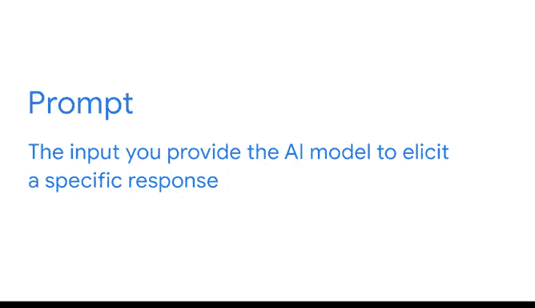
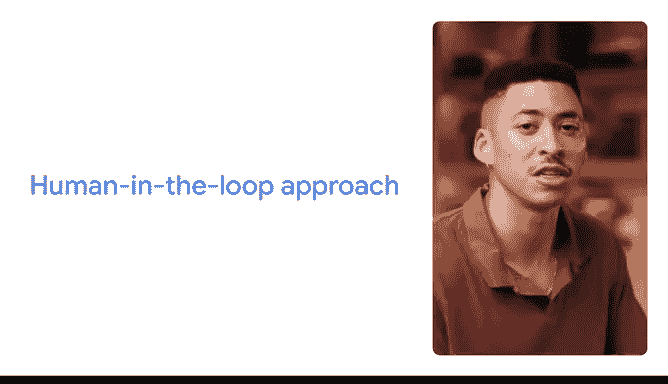

# 014：借助人工智能提升您的数据分析技能 🚀

在本节课中，我们将学习如何利用人工智能来提升数据分析工作的效率与创造力。我们将重点介绍如何构建有效的提示词，并探讨如何将AI作为人类技能的补充，负责任地应用于数据清理、可视化及分析构思等场景。

---

人工智能正在改变我们在工作和生活中处理日常任务的方式。使用人工智能可以帮助你更快地完成常规性工作，从而让你能将更多时间投入到能产生最大影响力的领域。

回想一下你典型的工作日。如果它和我的情况类似，你会有很多事情要做，但时间总是不够。有时，你的待办事项清单似乎永无止境。但试想一下，如果AI能提供帮助呢？作为一名数据专业人士，我将分享几个AI可以帮助你更智能、更高效工作的场景，并展示具体操作方法。你将了解如何加速数据清理过程、创建引人入胜的数据可视化图表、构思数据分析问题等。

我叫Miles，是谷歌收入系统团队的一名数据工程师。我的团队处理与谷歌财务相关的数据。具体来说，我维护着被称为“数据湖”的大型结构化或非结构化数据库，其中包含我们的财务数据。我经常自动化收入生成项目的数据报告，并协助利益相关者进行分析，以帮助我们的产品和项目增长。AI帮助我更高效、更有创意地工作，因此我很高兴分享我的使用经验。

为了充分利用生成式人工智能，写出有效的提示词至关重要。提示词是你提供给AI模型以引发特定回应的输入内容。

一个优秀的提示词遵循一个简单的框架：**任务、背景、参考、评估与迭代**，即 **T-C-R-E-I**。如果你记不住步骤，只需记住：**深思熟虑地创造真正优秀的输入**。

**首先是任务**。你需要明确希望模型做什么，这相对简单直接。我们可以将任务分解为**角色**和**格式**。
*   **角色**指的是你希望生成式AI工具借鉴何种专业知识。你可以要求工具扮演一个角色，例如专业的演讲撰稿人或拥有15年经验的营销主管，也可以要求它为特定受众（如客户或你的经理）创建输出。在任务中添加角色描述时，你可以尽可能详细。
*   **格式**指的是你希望输出以何种形式呈现。无论是项目符号列表、短句还是表格。请记住，任务描述应清晰、具体地说明你希望模型做什么。

**接下来，你需要提供背景信息**。这些是必要的细节，有助于生成式AI工具理解你的需求。例如，“给我一些30美元以下的生日礼物创意”和“给我5个生日礼物创意。我的预算是30美元。礼物是送给一位29岁、热爱冬季运动、最近刚从单板滑雪转向双板滑雪的人”这两者之间存在显著差异。

**第三，有时你需要添加参考信息**供AI工具在创建输出时使用。例如，如果你要求生成式AI工具提供生日礼物创意，那么添加你过去送过的生日礼物作为参考，AI工具就能给出更有用的输出。请记住，并非总有明确的参考信息，尤其是在处理更抽象的任务或寻找灵感和创意时。关键在于指令要清晰、具体。使用自然语言，就像与另一个人交谈一样，表达完整的想法。

好了，现在你已经在提示词中包含了任务、背景和参考信息。一旦获得输出，就到了**评估**阶段。问问自己，你提供的输入是否得到了你需要的输出。这引出了框架的最后一部分：**迭代**。如果你评估输出后，发现没有得到所需内容，可以尝试添加更多信息或修改你的提示词，然后重试。这是有效提示的关键环节。

关于框架还有一点需要注意：构建有效提示词的方法有很多。提示词的构建顺序不如其内容本身重要。只要你是在“深思熟虑地创造真正优秀的输入”，你的输出就应该会很棒。

在我们探索如何在数据分析中使用AI时，请记住，**AI只有作为我们独特人类技能和能力的补充时，才能发挥最佳作用**。你应该始终通过应用“人在回路”的方法来负责任地使用AI。AI是帮助你完成任务的有用工具，但它需要人类的参与。没有任何AI工具拥有我们人类所具备的深厚经验、实践知识和互动技能。

这就是为什么“人在回路”方法是负责任使用AI的关键。它结合了机器和人类的智能来训练、使用、验证和完善AI结果。实际上，这意味着要留意你输入AI工具的内容，并始终评估和验证其输出。当你使用AI工具时，请仔细考虑是否需要使用机密或敏感信息来执行任务，并务必首先查阅你所在组织的规则或政策。即使在工作之外使用AI工具，你也应避免输入个人或机密信息，并始终检查你输入的数据可能被如何使用。

最后一点，市面上有很多生成式AI工具。我将使用Gemini来演示如何进行提示，但你将学到的所有技巧和最佳实践都可以应用于其他生成式AI工具，如ChatGPT、Copilot或Claude。

像我们这样的数据分析师常常被数据清理和整理等耗时任务所困扰。我从未遇到过有人说这是他们工作中最喜欢的部分。真正的兴奋点在于从数据中发现新知、深入挖掘洞察，并与团队合作将这些洞察转化为决策。AI工具可以赋能我们数据专业人士，让我们在为团队或组织发掘机遇方面发挥更大的作用。

现在，让我们开始吧。

---

本节课中，我们一起学习了如何利用人工智能提升数据分析效率。我们掌握了构建有效提示词的T-C-R-E-I框架，理解了“人在回路”对于负责任使用AI的重要性，并认识到AI是增强而非替代人类专业技能的强大工具。通过将AI应用于数据清理、可视化等环节，数据分析师可以将更多精力投入到更具战略价值的洞察发现和决策支持工作中。