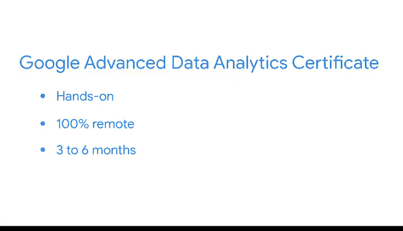

# 023：探索职业机会 🚀

在本节课中，我们将学习如何将你已获得的数据分析技能应用于职业发展，并探索由Google和Coursera提供的后续学习路径与职业资源。

---

我们希望你享受了证书课程的学习过程，并对自己的成长感到兴奋。恭喜你。😊

现在，是时候将所学知识分享给世界了。

请查看证书完成清单末尾的职业资源以开始行动，你一定不想错过。在那里，你将找到帮助你发现并为下一个工作机会做准备的资源。

请花时间查看清单，并充分利用这些独家资源。

我们特别推荐注册清单中链接的职位平台并创建个人资料，重点展示你获得的新证书和掌握的技能。

---

你好。

恭喜你完成了Google数据分析师证书课程。作为下一步，请考虑通过注册Google商业智能证书课程来继续你的商业智能学习之旅。

我是Anita，Google的高级商业智能分析师，也是该证书课程的讲师之一。

Google商业智能证书课程教授学习者如何创建流程和信息渠道，将数据转化为可指导商业决策的可行见解。

例如，我经常与合作伙伴一起创建有效的仪表板，帮助他们掌握业务中的趋势和异常情况。我也花大量时间设计数据管道，将分散的业务数据整合为一种用户友好的格式。

该课程由像我这样在该领域的专家Google员工设计和教授。这个高级课程基于你刚刚完成的Google数据分析师证书的基础，帮助你使用行业领先工具（包括BigQuery、Tableau和SQL）提升技术技能。

Google商业智能证书课程是实践性的、完全在线的，可以在1到2个月的兼职学习中完成。

如果你已准备好投身商业智能领域的职业，当你准备好时，我很乐意帮助你指导下一步。

再次恭喜你。😊

---

你好。

恭喜你完成了Google数据分析师证书课程。作为下一步，请考虑通过注册Google高级数据分析证书课程来继续你的数据分析学习之旅。

我是Adrian，Google的客户工程师和数据分析师，也是该证书课程的讲师之一。

Google高级数据分析证书课程将教你如何使用机器学习、预测建模和实验设计来收集和分析大量数据。😊

根据我的经验，我曾运用这些技能来帮助预测每日股价、欺诈性信用卡交易，甚至在体育比赛中预测运动员何时会达到疲劳或受伤的临界点。

该课程由像我这样在该领域的专家Google员工设计和教授。这个高级课程基于Google数据分析师证书的基础，帮助你使用行业领先工具（包括Jupyter Notebook、Python和TensorFlow）提升技术技能。

Google高级数据分析证书课程是实践性的、完全在线的，可以在3到6个月的兼职学习中完成。😊

如果你已准备好迈出数据分析之旅的下一步，我很乐意为你提供指导。

再次恭喜你。继续努力。😊

---

此外，请务必密切关注你的收件箱，以获取来自Coursera和Google未来的职业资源与机会。

祝你前程似锦。我们为你感到无比兴奋。

---

## 总结

本节课中，我们一起学习了完成Google数据分析师证书后的职业发展步骤。主要内容包括：
1.  利用证书完成清单中的职业资源来寻找工作机会。
2.  介绍了**Google商业智能证书**作为深化技能的一个路径，其核心工具包括 `BigQuery`、`Tableau` 和 `SQL`。
3.  介绍了**Google高级数据分析证书**作为另一个进阶路径，其涉及机器学习与预测建模，核心工具包括 `Jupyter Notebook`、`Python` 和 `TensorFlow`。
4.  提醒关注后续由平台提供的职业机会。

希望你能利用这些资源，在数据分析领域不断成长和探索。