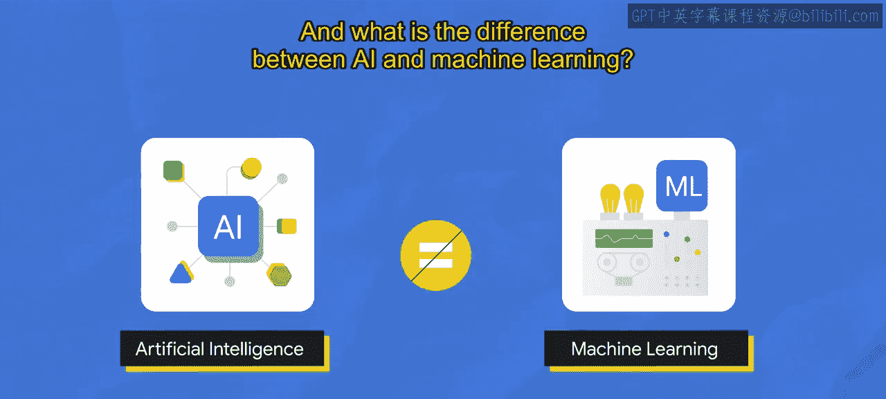

#  001：生成式AI简介

## 概述

在本课程中，我们将学习生成式人工智能的基础知识。我们将从定义生成式AI开始，解释其工作原理，描述不同类型的生成式AI模型，并探讨其应用场景。课程内容设计简单直白，旨在帮助初学者建立清晰的理解。

---

## 什么是生成式AI？

生成式AI已成为一个流行词汇，但它究竟是什么？**生成式AI是一种人工智能技术，能够生成各种类型的内容，包括文本、图像、音频和合成数据。**

为了深入理解生成式AI，我们首先需要了解其背景。两个常见的问题是：什么是人工智能？AI与机器学习有何区别？

---

## 人工智能与机器学习

一种理解方式是，**AI是一门学科**，就像物理学是科学的一个分支。AI是计算机科学的一个分支，致力于创造能够推理、学习和自主行动的智能代理和系统。本质上，AI涉及构建能够像人类一样思考和行动的机器的理论和方法。

**机器学习是AI的一个子领域**。它是一个程序或系统，能够从输入数据中训练模型。训练好的模型可以从用于训练模型的同一分布中抽取的、前所未见的新数据中做出有用的预测。这意味着机器学习使计算机能够在没有明确编程的情况下进行学习。

---

## 监督学习与无监督学习

机器学习模型最常见的两类是**无监督模型**和**监督模型**。两者的关键区别在于，监督模型使用**带标签的数据**。带标签的数据附有标签，如名称、类型或数字。无标签的数据则没有标签。

以下是两种模型解决的问题示例：

*   **监督学习模型**：例如，你是一家餐厅的老板，拥有历史账单金额数据，以及基于订单类型（自取或外卖）的不同顾客的小费金额。在监督学习中，模型从过去的例子中学习，以预测未来的小费金额。
*   **无监督学习模型**：例如，你想查看员工的在职时间和收入，然后对员工进行分组或聚类，以识别哪些人处于快速晋升通道。无监督问题关乎发现，即查看原始数据，看其是否自然形成不同的组群。

为了更直观地展示这种差异，我们来看看监督学习的过程：测试数据值 **X** 作为模型的输入，模型输出一个预测值，并将其与用于训练模型的训练数据进行比较。如果预测的测试数据值与实际的训练数据值相差甚远，这被称为**误差**。模型会尝试减少这种误差，直到预测值和实际值更接近。这是一个经典的优化问题。

---

## 深度学习与生成式AI

到目前为止，我们已经探讨了人工智能与机器学习、监督学习与无监督学习的区别。接下来，我们简要了解一下**深度学习**作为机器学习方法的一个子集，然后我们将开始讨论生成式AI。

机器学习是一个涵盖多种技术的广泛领域，而**深度学习是一种使用人工神经网络的机器学习**，使其能够处理比传统机器学习更复杂的模式。人工神经网络受人脑启发，由许多相互连接的节点或神经元组成，可以通过处理数据和做出预测来学习执行任务。

深度学习模型通常具有许多神经元层，这使它们能够学习比传统机器学习模型更复杂的模式。神经网络可以同时使用带标签和不带标签的数据，这被称为**半监督学习**。在半监督学习中，神经网络在少量带标签数据和大量无标签数据上进行训练。带标签数据帮助神经网络学习任务的基本概念，而无标签数据帮助神经网络泛化到新的例子。

现在，我们终于可以讨论**生成式AI**在这个AI学科中的位置了。**生成式AI是深度学习的一个子集**，这意味着它使用人工神经网络，能够通过监督、无监督和半监督方法处理带标签和不带标签的数据。大语言模型也是深度学习的一个子集。

---

## 生成式模型与判别式模型

深度学习模型或广义的机器学习模型可以分为两种类型：**生成式**和**判别式**。

*   **判别式模型**用于对数据点进行分类或预测标签。它们通常在带标签的数据集上训练，学习数据点特征与标签之间的关系。一旦训练完成，判别式模型可用于预测新数据点的标签。
*   **生成式模型**基于现有数据学习到的概率分布生成新的数据实例。生成式模型生成**新内容**。

让我们看一个例子：
*   判别式模型学习**条件概率分布** `P(Y|X)`，即给定输入 **X**（一张图片），输出 **Y**（标签“狗”）的概率。它将其分类为狗而不是猫。
*   生成式模型学习**联合概率分布** `P(X, Y)`，并预测条件概率。它不仅能判断这是一只狗，还能**生成一张狗的图片**。

**总结来说，生成式模型可以生成新的数据实例，而判别式模型则区分不同类型的数据实例。**

另一个快速示例：
*   上图展示了传统的机器学习模型，它试图学习数据与标签（或你想要预测的内容）之间的关系。
*   下图展示了生成式AI模型，它试图学习内容的模式，以便能够生成新的内容。

---

## 如何区分生成式AI？

如果有人挑战你玩“这是否是生成式AI”的游戏，这里有一个很好的区分方法：
*   当输出（**Y** 或标签）是一个**数字、类别**（例如，垃圾邮件/非垃圾邮件）或**概率**时，它**不是**生成式AI。
*   当输出是**自然语言**（如语音或文本）、**音频**或**图像**时，它**是**生成式AI。

让我们用一点数学来真正展示这种差异。可视化地看，数学上可以表示为 `Y = f(X)`。这个方程根据不同的输入计算一个过程的因变量输出。**Y** 代表模型输出，**f** 体现计算或模型中使用的函数，**X** 代表公式中使用的输入。输入是数据，如CSV文件、文本文件、音频文件或图像文件。因此，模型输出是所有输入的函数。
*   如果 **Y** 是一个数字（如预测销售额），它**不是**生成式AI。
*   如果 **Y** 是一个句子（如“定义销售额”），它**是**生成式AI，因为这个问题会引发基于模型已训练的海量数据的文本响应。

---

## 生成式AI的工作原理

传统的机器学习监督学习过程使用训练代码和带标签数据来构建模型。根据用例或问题，该模型可以给你一个预测、对某物进行分类或对某物进行聚类。

现在，让我们看看相比之下生成式AI过程有多么强大。生成式AI过程可以接受所有数据类型的训练代码、带标签数据和无标签数据，并构建一个**基础模型**。然后，基础模型可以生成新的内容，如文本、代码、图像、音频、视频等。

我们从传统编程、神经网络发展到生成式模型：
1.  **传统编程**：我们必须硬编码区分猫的规则（类型：动物，腿：四条，耳朵：两只，毛皮：有……）。
2.  **神经网络浪潮**：我们可以给网络提供猫和狗的图片，并问“这是猫吗？”，它会预测是或不是。
3.  **生成式浪潮**：作为用户，我们可以生成自己的内容，无论是文本、图像、音频、视频还是其他。例如，像PaLM或LaMDA这样的大语言模型从互联网上的多个来源摄取海量数据，构建基础语言模型。我们只需通过提问（无论是输入提示还是口头说出提示）即可使用它们。当你问“什么是猫？”时，它可以给出它学到的关于猫的一切。

---

## 生成式AI的正式定义

**生成式AI是一种人工智能，它基于从现有内容中学到的东西创建新内容。** 从现有内容中学习的过程称为**训练**，并导致创建一个**统计模型**。当给定一个提示时，生成式AI使用统计模型来预测可能的预期响应，从而生成新内容。它学习数据的底层结构，然后可以生成与训练数据相似的新样本。

正如前面提到的，生成式语言模型可以从它被展示的例子中学习，并基于这些信息创造出全新的东西。这就是我们使用“生成式”这个词的原因。但是，大语言模型只是生成式AI的一种类型，它们以听起来自然的语言形式生成新颖的文本组合。

---

## 生成式模型的类型

生成式AI在很大程度上依赖于你输入的训练数据。它分析输入数据的模式和结构从而学习。通过基于浏览器的提示访问，你作为用户可以生成自己的内容。

让我们谈谈当文本是我们的输入时，可用的模型类型以及它们如何帮助解决问题。

以下是主要的模型类型：

*   **文本到文本**：文本到文本模型接收自然语言输入并产生文本输出。这些模型被训练来学习文本对之间的映射，例如，从一种语言翻译到其他语言。
*   **文本到图像**：文本到图像模型在大量图像集上训练，每张图像都配有一个简短的文本描述。扩散是用于实现此目的的一种方法。
*   **文本到视频和文本到3D**：文本到视频模型旨在从文本输入生成视频表示。输入文本可以是从单个句子到完整脚本的任何内容，输出是与输入文本相对应的视频。类似地，文本到3D模型生成与用户文本描述相对应的三维对象，用于游戏或其他3D世界。
*   **文本到任务**：文本到任务模型被训练来基于文本输入执行定义的任务或动作。这个任务可以是广泛的动作，例如回答问题、执行搜索、进行预测或采取某种行动。

---

## 基础模型

比上述模型更庞大的是**基础模型**。**基础模型是在海量数据上预训练的大型AI模型，旨在适应或微调以用于广泛的下游任务**，例如情感分析、图像描述和物体识别。基础模型有潜力彻底改变许多行业，包括医疗保健、金融和客户服务。它们甚至可用于检测欺诈和提供个性化的客户支持。

如果你正在寻找基础模型，Vertex AI提供了一个包含基础模型的**模型花园**。语言基础模型包括用于聊天和文本的PaLM API。视觉基础模型包括Stable Diffusion，它已被证明能有效地从文本描述生成高质量图像。

例如，如果你有一个用例需要收集客户对你的产品或服务的感受，你可以使用分类任务中的情感分析任务模型。视觉任务也是如此，如果你需要进行占用率分析，也有针对你用例的特定任务模型。

---

## 生成式AI的应用：代码生成

生成式AI能帮助你的应用程序编写代码吗？当然可以。以下是生成式AI的一些应用，可以看到有很多。

让我们看一个代码生成的例子。在这个例子中，我输入了一个代码文件转换问题：将Python转换为JSON。我使用Gemini并在提示框中插入：“我有一个pandas DataFrame，有两列，一列是文件名，一列是生成的小时。我试图将其转换为屏幕上所示格式的JSON文件。”Gemini返回了我需要执行此操作的步骤，并且我的输出是JSON格式。

这很酷，对吧？准备好，还有更棒的。我恰好使用谷歌免费的基于浏览器的Jupyter笔记本，可以简单地将Python代码导出到Google Colab。

**总结来说，像Gemini这样的代码生成工具可以帮助你：**
*   调试源代码行。
*   逐行向你解释代码。
*   为你的数据库编写SQL查询。
*   将代码从一种语言翻译到另一种语言。
*   为源代码生成文档和教程。

---

## 谷歌云如何助力生成式AI

我将告诉你谷歌云可以帮助你从生成式AI中获得更多价值的另外三种方式：

1.  **Vertex AI Studio**：Vertex AI Studio让你可以快速探索和定制生成式AI模型，以便在谷歌云上的应用程序中利用。它通过提供各种工具和资源帮助开发人员创建和部署生成式AI模型，例如预训练模型库、微调模型工具、部署模型到生产环境的工具，以及供开发人员分享想法和协作的社区论坛。
2.  **Vertex AI Search and Conversation**：这对于没有太多编码经验的你特别有帮助。你可以使用Vertex AI Search and Conversation（前身为GenAI App Builder）为客户和员工构建生成式AI搜索和对话功能。只需很少或无需编码，也无需先前的机器学习经验，即可创建自己的聊天机器人、数字助理、自定义搜索引擎、知识库、培训应用程序等。
3.  **PaLM API**：PaLM API让你可以测试和试验谷歌的大语言模型和生成式AI工具，使原型设计更快、更易访问。开发人员可以将PaLM API与Maker Suite集成，并使用图形用户界面访问API。该套件包括许多不同的工具，例如模型训练工具、模型部署工具和模型监控工具。

---

## Gemini：多模态AI模型

最后，还有**Gemini**，一个多模态AI模型。与传统的语言模型不同，它**不仅限于理解文本**，还可以分析图像、理解音频的细微差别，甚至解释编程代码。这使得Gemini能够执行以前AI不可能完成的复杂任务。由于其先进的架构，Gemini具有极强的适应性和可扩展性，适用于多样化的应用。模型花园会持续更新以包含新模型。

---

## 总结

在本课程中，我们一起学习了生成式AI的基础知识。我们从定义生成式AI开始，探讨了它与人工智能、机器学习及深度学习的关系。我们区分了生成式模型与判别式模型，并了解了生成式AI如何工作以及它的不同类型（如文本到文本、文本到图像等）。我们还介绍了强大的基础模型，并看到了生成式AI在代码生成等领域的实际应用。最后，我们了解了谷歌云提供的工具（如Vertex AI Studio、PaLM API）和多模态模型Gemini如何帮助我们利用生成式AI。现在，你已经掌握了生成式AI的基本概念，为进一步探索这个令人兴奋的领域打下了坚实的基础。