#  004：负责任AI原则课程介绍 🧭

在本课程中，我们将学习谷歌云关于负责任AI的实践。课程将探讨AI发展中的核心伦理考量、谷歌的AI原则，以及如何在组织内构建负责任的AI策略。

大家好，欢迎来到“谷歌云负责任AI原则”课程。本课程专注于负责任AI的实践。我是Marcuscus，我是Caitlin。我们将担任本课程的讲解员。

我们许多人已经与人工智能（AI）有日常互动，从交通和天气预测到推荐您接下来可能喜欢观看的电视节目。

随着AI，特别是生成式AI，变得越来越普遍，许多未启用AI的技术可能开始显得不足。如此强大且影响深远的技术，也引发了关于其开发和使用同样强大的问题。

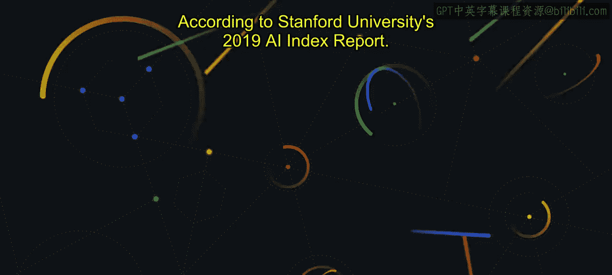

历史上，AI对普通人来说并不容易接触。绝大多数受过培训、有能力开发AI的人都是专业工程师，他们数量稀少且雇佣成本高昂。但进入门槛正在降低，允许更多人构建AI，甚至包括那些没有AI专业知识的人。

现在，AI系统使计算机能够以十年前难以想象的方式观察、理解和与世界互动。这些系统正以惊人的速度发展。

根据斯坦福大学2019年AI指数报告，在2012年之前，AI成果与摩尔定律紧密相关，计算能力每两年翻一番。报告指出，自2012年以来，计算能力大约每三个半月翻一番。

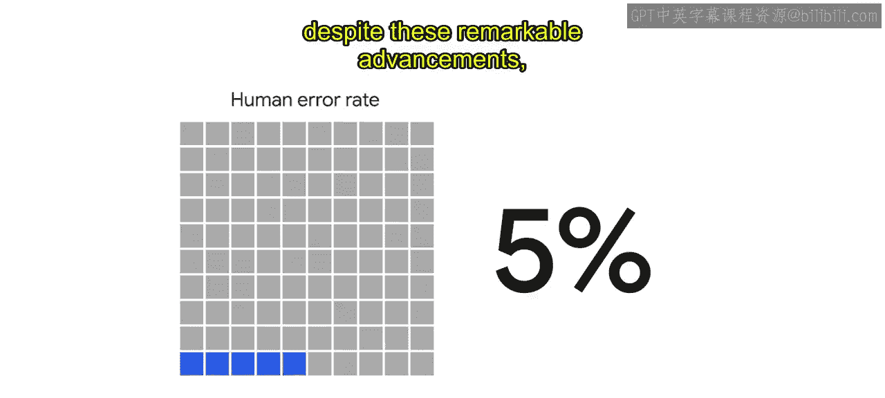

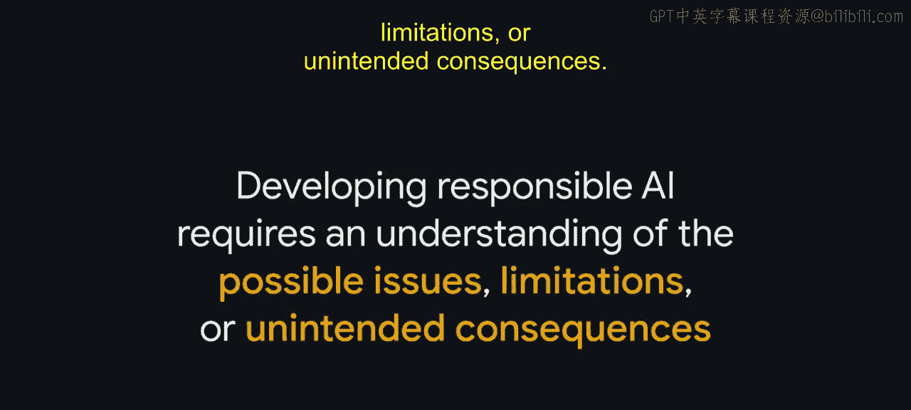

为了更直观地理解，在这段时间里，视觉AI技术只变得更加准确和强大。例如，ImageNet图像分类数据集的错误率显著下降。2011年，错误率为26%。到2020年，这个数字是2%。作为参考，人类执行相同任务的错误率是5%。

然而，尽管取得了这些显著进步，AI并非完美无缺。开发负责任的AI需要理解可能的问题、限制或意外后果。

技术是社会现状的反映，因此，如果没有良好的实践，AI可能会复制或放大社会中现有的问题或偏见。

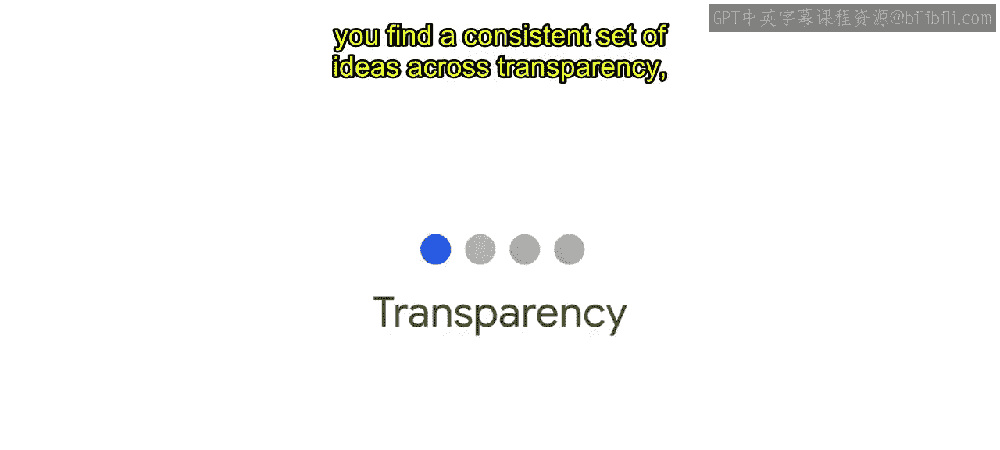

但并没有一个关于负责任AI的普适定义，也没有一个简单的清单或公式来定义应如何实施负责任的AI实践。

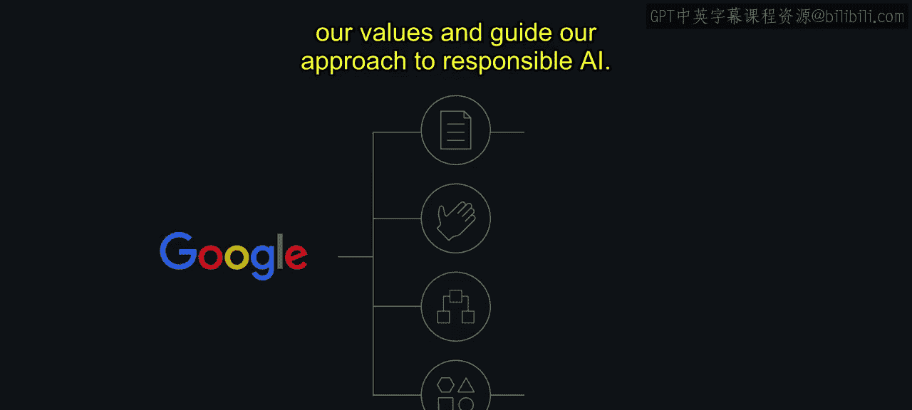

相反，各组织正在制定反映其使命和价值观的AI原则。虽然这些原则对每个组织都是独特的，但如果寻找共同主题，你会发现贯穿透明度、公平性、问责制和隐私的一致性理念。

在谷歌，我们负责任AI的方法植根于一项承诺：致力于构建为每个人服务的、负责任的、安全的、尊重隐私的、并由科学卓越性驱动的AI。我们制定了我们自己的AI原则、实践、治理流程和工具，它们共同体现了我们的价值观，并指导我们负责任AI的方法。

我们已经将“责任设计”融入到我们的产品中，更重要的是，融入到我们的组织中。像许多公司一样，我们使用我们的AI原则作为框架来指导负责任的决策。我们将在本课程后面详细探讨我们是如何做到这一点的。

这里需要强调的是，我们并不假装拥有所有答案。我们知道这项工作永无止境，我们希望分享我们正在学习的东西，以进行协作并帮助他人在他们自己的旅程中前行。

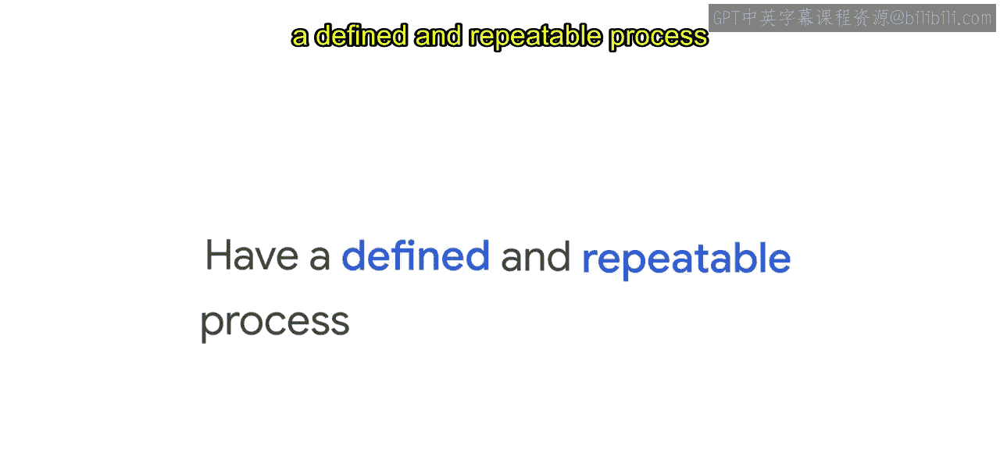

在负责任AI的应用方面，我们每个人都扮演着角色。无论您参与AI流程的哪个阶段，从设计到部署或应用，您所做的决定都会产生影响。您同样需要有一个定义明确且可重复的流程来负责任地使用AI。

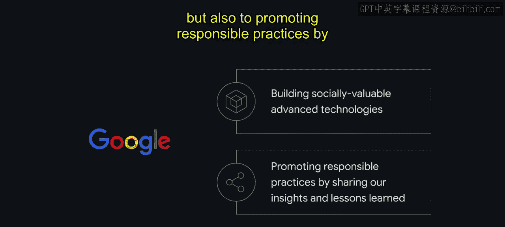

谷歌不仅致力于构建具有社会价值的先进技术，还致力于通过与更广泛的社区分享我们的见解和经验教训来推广负责任的实践。

本课程代表了这些努力的一部分。本课程的目标是提供一个了解谷歌，更具体地说是谷歌云在负责任地开发和使用AI方面旅程的窗口。

我们希望您能够获取我们分享的信息和资源，并用它们来帮助塑造您组织自己的负责任AI战略。

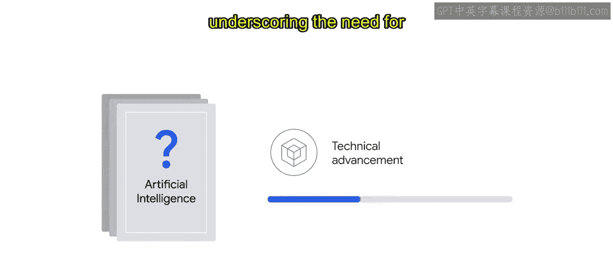

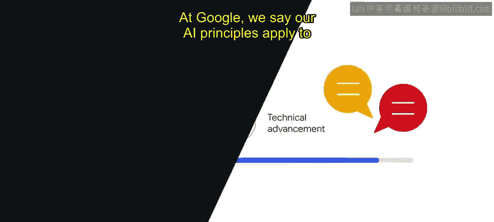

但在我们进一步深入之前，让我们先澄清一下当我们谈论AI时的含义。通常，人们想知道人工智能、机器学习和深度学习之间的区别。然而，对于AI并没有一个普遍认同的定义。

关键的是，这种关于AI应如何定义的共识缺乏并未阻止技术进步。这强调了需要就如何负责任地创建和使用这些系统进行持续对话。

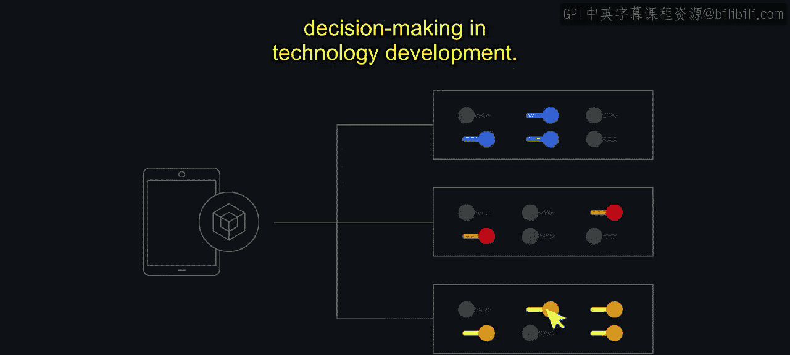

在谷歌，我们说我们的AI原则适用于先进技术开发，作为一个总括性术语来涵盖所有类型的技术。陷入语义争论可能会分散负责任开发技术这一核心目标。

因此，我们不会深入探讨这些技术的定义，而是将重点放在技术开发中人类决策的重要性上。

关于人工智能，存在一个常见的误解，即机器扮演着核心决策角色。实际上，是人们在设计和构建这些机器，并决定如何使用它们。人们参与AI开发的每个方面。他们收集或创建模型训练所用的数据。他们控制AI的部署以及它在特定环境中的应用方式。本质上，人类决策贯穿于我们的技术产品之中。

每当一个人做出决定时，他们实际上是在根据自己的价值观做出选择。无论是决定使用生成式AI而不是其他方法来解决问题，还是在机器学习生命周期的任何环节，他们都引入了自己的一套价值观。这意味着每个决策点都需要考虑和评估，以确保从概念到部署和维护的整个过程中，选择都是负责任地做出的。

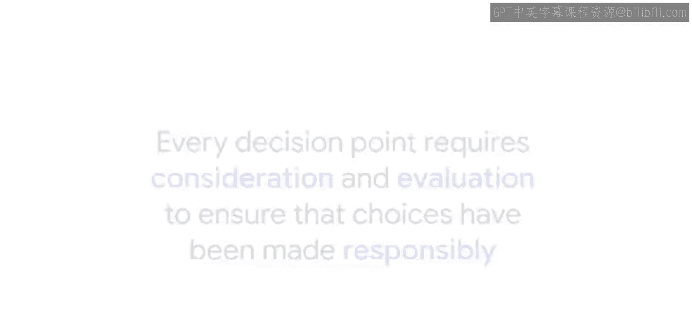

在本节课中，我们一起学习了负责任AI的重要性、其核心挑战以及谷歌的实践框架。我们明确了AI开发中人类决策的核心地位，并认识到建立明确的流程和原则对于确保技术向善至关重要。