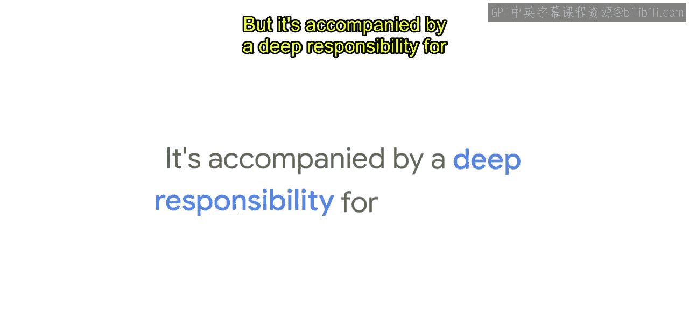
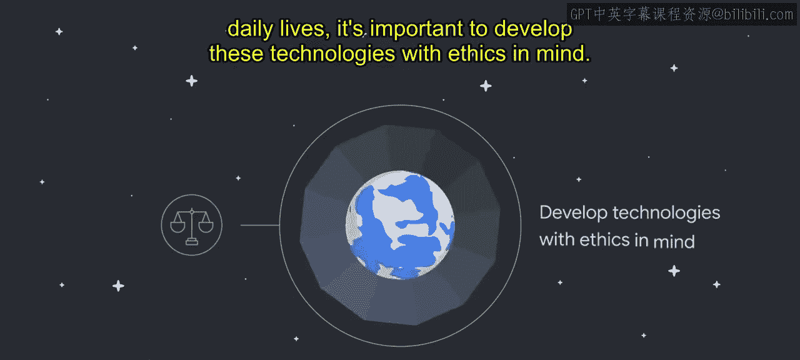
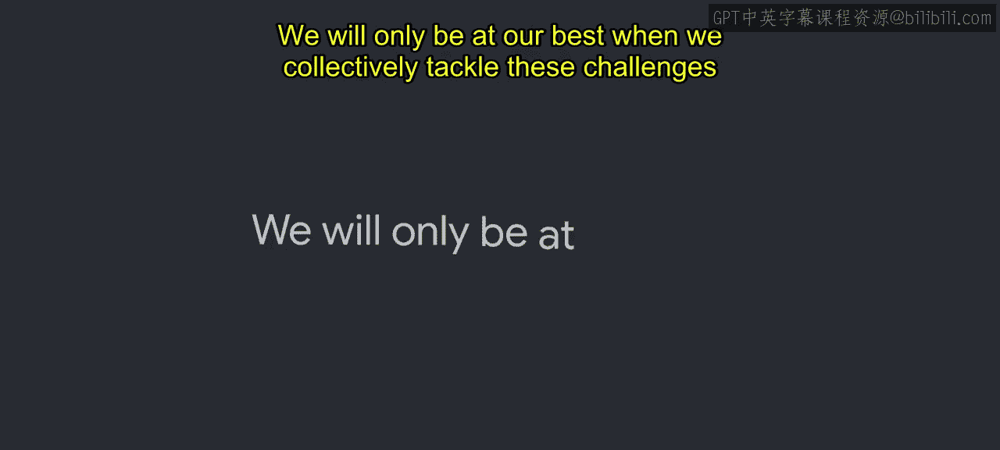

#  005：谷歌与负责任AI 🧭

在本节课中，我们将要学习谷歌在开发和应用人工智能时所秉持的“负责任AI”理念。我们将探讨为何这项技术需要伦理框架，以及谷歌如何通过具体流程和实践来确保其AI产品有益于社会。

---

我们许多人依赖技术创新来帮助过上幸福健康的生活。无论是规划最佳回家路线，还是在身体不适时寻找正确的信息，创新的机遇是巨大的。但与此同时，技术提供商也肩负着确保技术正确应用的重大责任。

当前，人们日益关注AI创新带来的一些非预期或不良影响。这些担忧包括机器学习公平性问题、历史偏见的大规模延续、AI驱动的失业对未来工作的影响，以及AI决策的问责与责任归属问题。我们将在课程后续部分更详细地探讨这些内容。

由于AI有潜力影响社会的许多领域，更不用说人们的日常生活，因此在开发这些技术时，将伦理纳入考量至关重要。

负责任AI并不仅仅关注那些明显存在争议的用例。如果没有负责任的AI实践，即使是看似无害或出于好意的AI用例，仍可能引发伦理问题、产生非预期结果，或者无法发挥其应有的益处。

伦理和责任之所以重要，不仅因为它们代表了正确的行事方式，还因为它们可以指导AI设计，使其更能造福人们的生活。在谷歌，我们认识到，将责任融入任何AI部署中，能打造出更好的模型，并与我们的客户乃至客户的客户建立信任。一旦这种信任被打破，我们将面临AI部署停滞、失败，甚至对相关利益方造成伤害的风险。

这符合谷歌的信念：**负责任AI = 成功AI**。

我们通过一系列评估和审查来做出关于AI的产品和业务决策。这些流程确保了我们在不同产品领域和地区的方法具有严谨性和一致性。这些评估和审查始于确保任何项目都符合我们的AI原则。

在本课程中，你将看到我们如何在谷歌，特别是在谷歌云内部构建负责任AI流程。有时你可能会想，你们资源雄厚、人才济济，做起来当然容易。我们团队规模小，资源有限。你可能也会因为需要处理棘手的新哲学和实践问题而感到不知所措或畏惧。

我们在此向你保证，无论你的组织规模如何，本课程都将为你提供指导。负责任AI是一种迭代实践，它需要奉献精神、纪律性，以及长期学习和调整的意愿。

事实是，这并不容易，但做对至关重要。因此，开启这段旅程，即使从小步骤开始，也是关键。无论你已经在践行负责任AI，还是刚刚起步，定期花时间反思公司的价值观以及你希望通过产品产生的影响，都将对负责任地构建AI大有裨益。

最后，在深入之前，我们希望明确一点：在谷歌，我们知道我们只是AI用户和开发者社区中的一个声音。😊

我们在开发和部署这项强大技术时认识到，我们并不了解也无法了解所有需要知道和理解的事情。只有当我们共同应对这些挑战时，我们才能做到最好。

确保AI得到负责任开发和使用的真正要素是**社区**。我们希望这门课程能成为我们在这个重要议题上展开合作的起点。

虽然AI原则有助于一个团队基于共同的承诺开展工作，但并非每个人都会认同每一个决策以及产品应如何负责任地设计。这就是为什么建立人们可以信任的稳健流程非常重要，这样即使他们不同意最终决定，也会信任驱动该决策的过程。

简而言之，根据我们的经验，必须存在一种基于集体价值观体系、并接纳健康讨论的文化，才能指导负责任AI的发展。通过完成本课程，你本人也正在为这种文化做出贡献，因为随着AI持续经历惊人的普及和创新，你正在推进负责任AI开发的实践。

---

本节课中，我们一起学习了谷歌对负责任AI的承诺。我们探讨了AI伦理的重要性、潜在风险，以及通过原则、流程和社区协作来构建可信、有益AI系统的必要性。记住，**负责任AI = 成功AI**，而迈出第一步，无论步伐大小，都是构建更美好技术未来的关键。