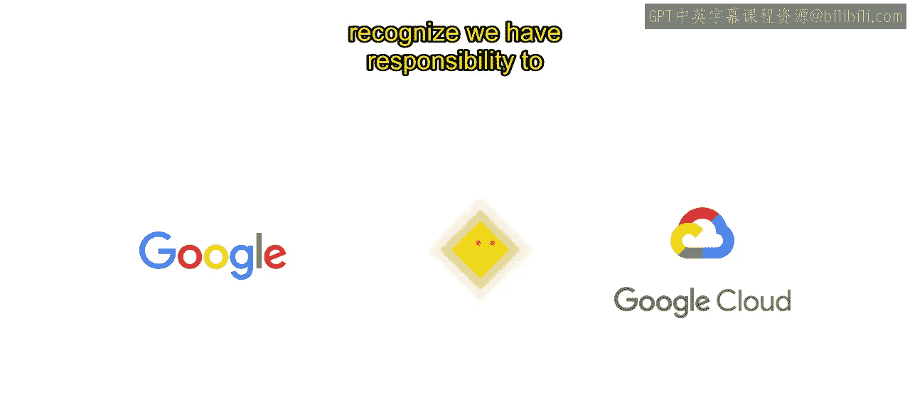
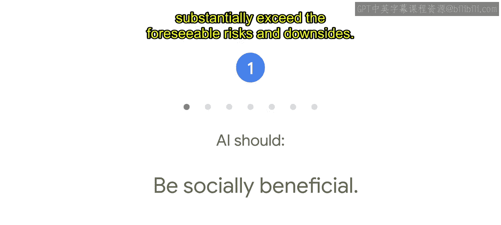
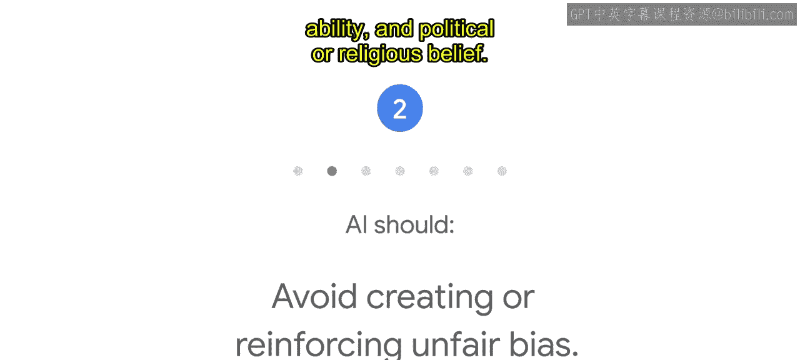
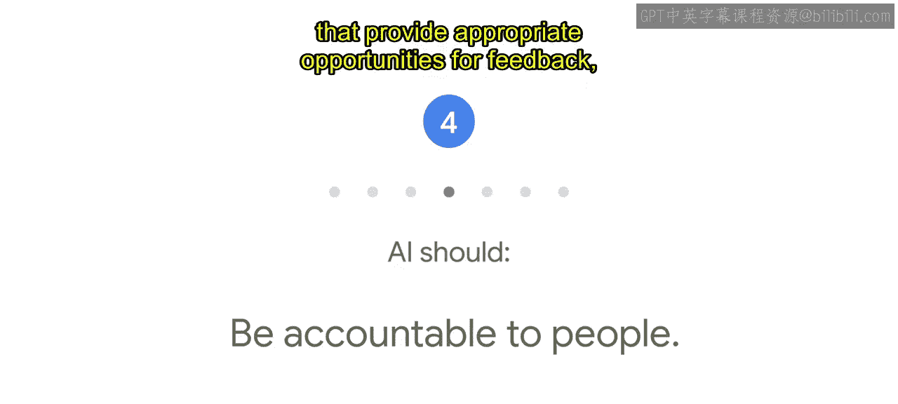
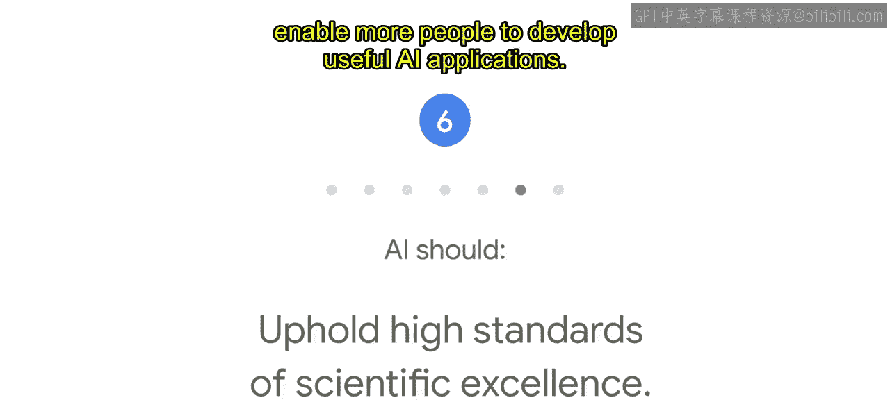
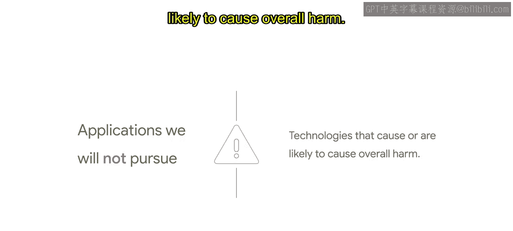
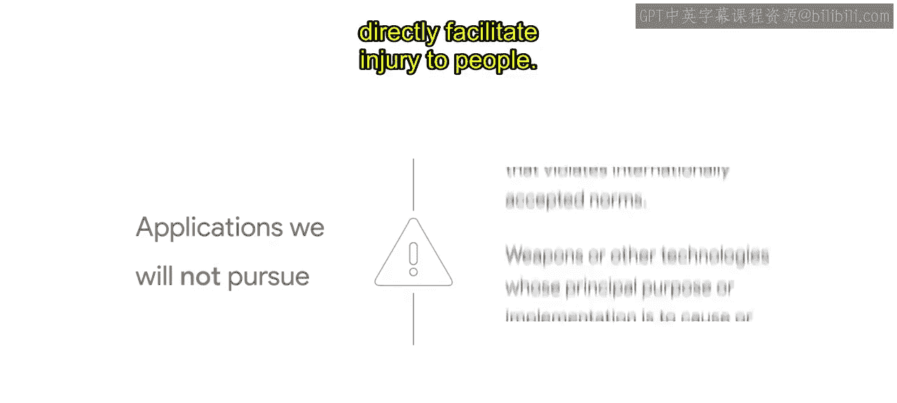
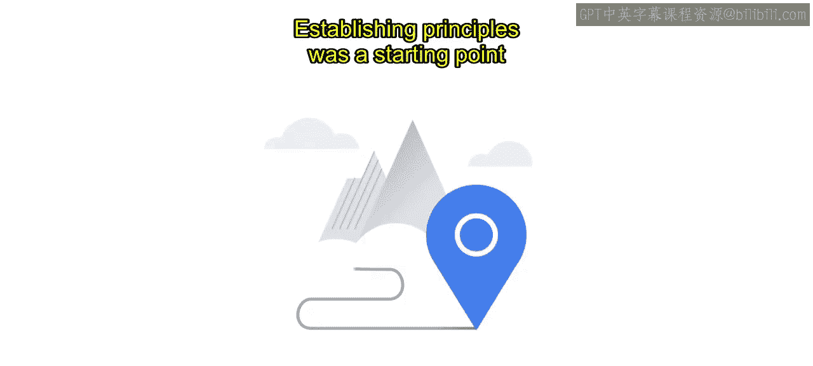
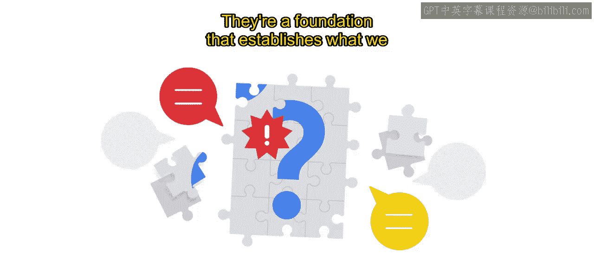

#  006：Google的AI原则介绍 🧭

在本节课中，我们将要学习谷歌作为人工智能领域的领导者，如何定义其开发和使用AI的核心原则。这些原则旨在确保AI技术对社会产生积极影响，并指导负责任的AI实践。

---

人工智能的开发和运用将在未来许多年对社会产生深远影响。作为AI领域的领导者，谷歌和谷歌云认识到自身有责任妥善并正确地履行这一职责。

2018年6月，我们宣布了七项指导工作的原则。这些是具体的标准，积极管理着我们的研究和产品开发，并影响着我们的商业决策。

在本课程后续部分，我们将更深入地探讨这些原则及其制定过程。现在，我们先对每一项原则进行概述。

以下是谷歌AI的七项核心原则：

1.  **AI应有益于社会**。任何项目都应考虑广泛的社会和经济因素，并且只在我们确信总体可能的收益远超可预见的风险和弊端时才会推进。

2.  **AI应避免制造或加剧不公平偏见**。我们力求避免对人们造成不公正的影响，特别是与敏感特征相关的影响，例如种族、民族、性别、国籍、收入、性取向、能力以及政治或宗教信仰。

3.  **AI的构建和测试应确保安全**。我们将持续开发并应用强有力的安全实践，以避免产生可能造成伤害风险的意外结果。

4.  **AI应对人负责**。我们将设计能提供适当反馈机会、相关解释和申诉渠道的AI系统。

5.  **AI应融入隐私设计原则**。我们将提供告知和同意的机会，鼓励采用具有隐私保护措施的架构，并对数据使用提供适当的透明度和控制权。

6.  **AI应坚持高标准的科学卓越性**。我们将与多方利益相关者合作，在此领域促进深思熟虑的领导力，借鉴科学严谨且多学科的方法。我们将负责任地分享AI知识，通过发布教育材料、最佳实践和研究，使更多人能够开发有用的AI应用。

7.  **AI的应用应符合这些原则**。许多技术具有多种用途，因此我们将努力限制潜在有害或滥用的应用。

除了这七项原则，还有一些特定的AI应用是我们不会追求的。

我们不会在以下四个应用领域设计或部署AI：

*   **可能造成整体伤害的技术**。

*   **主要目的或实施方式是造成或直接助长人身伤害的武器或其他技术**。

*   **收集或使用信息进行违反国际公认规范的监控的技术**。

*   **目的违背国际法和人权广泛接受原则的技术**。

制定原则是一个起点，而非终点。

实际情况是，我们的AI原则很少直接给出关于如何构建产品的答案。

它们不能也不应让我们回避艰难的对话。它们是一个基础，确立了我们的立场、我们构建什么以及为何构建，并且它们是我们企业AI产品成功的关键。

在课程后面，我们将提供一些建议，帮助您在组织内部制定一套自己的AI原则。

---

本节课中，我们一起学习了谷歌AI的七项核心原则以及四个明确避免的应用领域。这些原则强调了AI的社会效益、公平性、安全性、问责制、隐私保护、科学卓越性和合规使用，为负责任的AI发展提供了基本框架。理解这些原则是迈向开发合乎伦理且对社会有益的AI系统的重要一步。