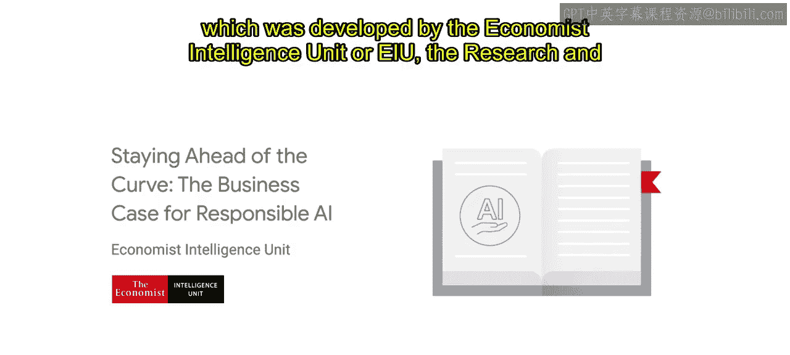

#  007：负责任AI的商业价值 📈

在本节课中，我们将学习一份由经济学人智库（EIU）撰写的报告，该报告深入探讨了负责任AI实践如何为企业带来战略优势和商业价值。

---

普华永道的一项主要预测表明，到2030年，AI可能推动全球GDP增长14%，即高达**15.7万亿美元**。在谷歌，我们相信负责任、包容和公平的AI部署是实现这一预测的关键因素。简而言之，我们认为**负责任AI**等同于能够长期获得信任并成功部署的AI。

我们还相信，负责任的AI项目和实践能为企业领导者带来战略和竞争优势。

为了深入探讨负责任AI的商业利益，我们赞助了一份原创报告，名为《保持领先：负责任AI的商业案例》。该报告由经济学人集团旗下的研究和分析部门——经济学人智库（EIU）编制。

上一节我们了解了报告背景，本节中我们来看看报告的核心内容。这份报告展示了在日益由AI驱动的世界中，负责任AI实践的价值。它全面阐述了负责任AI对一个组织核心业务考量的影响。

需要强调的是，创建本报告所收集的数据来源于广泛的数据驱动研究、行业专家访谈以及一项高管调查项目。该报告反映了AI开发者、部署AI的行业领导者以及AI最终用户的观点。

我们将分享主要发现，并鼓励您阅读本课程资源部分提供的完整报告。我们希望您能利用这些要点，将您的业务目标与负责任AI计划联系起来，从而帮助您影响组织内的利益相关者。

接下来，我们将概述报告的结构。该报告细分为七个部分，包含的数据说明了负责任AI如何：

以下是报告涵盖的七个关键领域：
*   提升产品质量。
*   改善人才招聘、留任和参与度的前景。
*   有助于更好的数据管理、安全性和隐私保护。
*   为当前和未来的AI法规做好准备。
*   促进收入和利润的增长。
*   有助于加强与利益相关者和投资者的关系。
*   维持强大的信任和品牌声誉。

在下一个视频中，我们将详细探讨这七个部分。

---

本节课中，我们一起学习了负责任AI的巨大经济潜力及其为企业带来的多方面商业价值。报告指出，负责任AI不仅是道德要求，更是实现长期成功、获得竞争优势的战略核心。下一节我们将深入报告的各个具体发现。