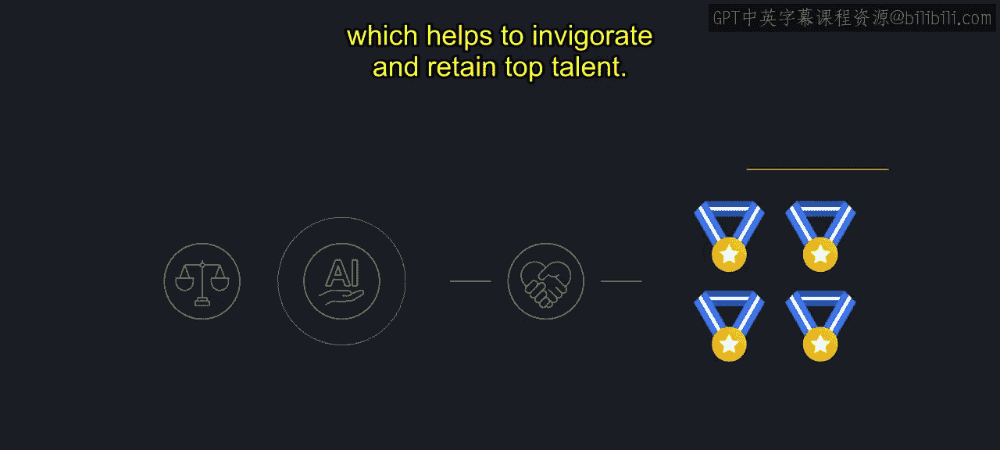
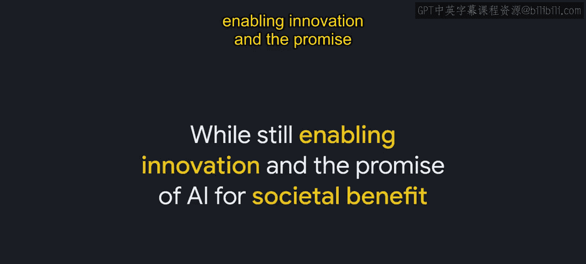
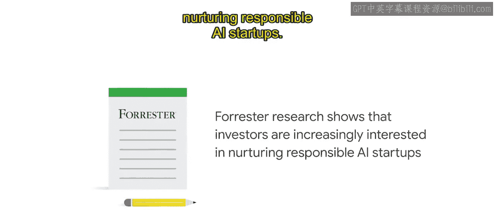
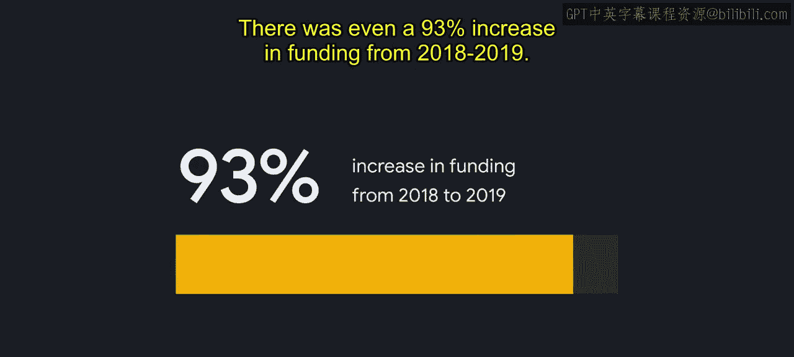
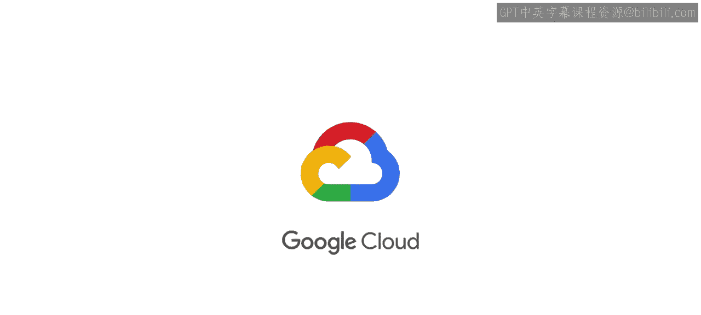

#  008：负责任创新的商业案例 📈

在本节课中，我们将学习《经济学人智库》报告《领先一步：负责任AI的商业案例》中提出的七个核心要点。我们将探讨为何负责任地开发和应用AI不仅是道德要求，更是明智的商业决策。

## 概述

上一节我们介绍了负责任AI的基本概念。本节中，我们将深入探讨其商业价值。报告指出，将负责任AI实践融入企业运营，能带来产品创新、人才吸引、数据安全、合规准备、收入增长、伙伴关系强化及品牌信任等多重商业利益。

## 报告七大要点详解

以下是《经济学人智库》报告中关于负责任AI商业价值的七个核心发现。

### 1. 对产品开发的明智投资 💡

报告的第一个要点指出，融入负责任AI实践是对产品开发的明智投资。

*   **伦理审查促进创新**：97%的受访者同意，伦理AI审查对产品创新至关重要。这类审查旨在评估新技术的潜在机遇与危害，使产品更符合负责任AI设计原则。审查会仔细检查数据集、模型在不同子群体中的表现，并考量预期与非预期结果的影响。
*   **规避风险与降低成本**：若企业不努力融入负责任AI实践，将面临多种风险，包括产品发布延迟、工作中断，甚至已上市产品被迫下架。通过早期融入负责任AI实践，并为识别和减轻危害留出空间，企业可以通过减少下游的伦理违规来降低开发成本。
*   **建立信任是关键**：根据CCS Insight 2019年的调查，**信任AI系统**仍是企业采用AI的最大障碍。凯捷咨询的一项研究显示，90%的组织报告遇到过伦理问题，其中40%的公司选择放弃AI项目而非解决问题。在许多案例中，AI因技术固有的现实风险而未能走出实验室进入生产环境。因此，已规模化应用AI的公司**有1.7倍的可能性**以负责任AI为指导。
*   **提升产品价值**：若实施得当，负责任AI能通过发现并努力减少不公平偏见可能造成的危害、提高透明度及增强安全性来优化产品。这些都是与产品利益相关者建立信任的关键要素，既能提升产品对用户的价值，也能增强企业的竞争优势。

### 2. 吸引并留住顶尖人才 🧠

报告的第二个要点表明，负责任AI的先行者能吸引并留住顶尖人才。

*   **人才竞争激烈**：当今顶尖人才寻求的远不止动态的工作和优厚的薪水。随着对科技人才的需求竞争日益激烈且成本高昂，研究表明找到合适的员工是值得的。一项研究发现，顶尖员工的生产力比普通技能人员高出**400%**，在软件开发等高度复杂的职业中甚至高出**800%**。
*   **留住人才成本高昂**：研究还表明，留住顶尖人才至关重要。更换初级技术员工的成本约为**3万美元**，而技术专家或领导者离职的成本则高达**31.2万美元**。
*   **伦理承诺增强忠诚度**：德勤全球千禧一代调查显示，员工对那些解决他们关心问题（尤其是伦理问题）的雇主忠诚度更高。建立共同承诺和负责任AI实践的组织，最能与员工建立信任和互动，从而有助于激励和留住顶尖人才。

### 3. 守护数据的承诺 🔒

报告的第三个要点强调了保障数据安全的重要性。

*   **数据是采用AI的主要障碍**：根据《经济学人智库》的高管调查，网络安全和数据隐私问题是采用AI的最大障碍。组织需要非常仔细地思考如何收集、使用和保护数据。如今，超过**90%**的消费者如果担心其数据使用方式，就不会从该公司购买产品。
*   **数据泄露代价巨大**：数据泄露对企业而言成本极高。IBM和波耐蒙研究所报告称，全球范围内，平均每次数据泄露涉及**25,575条记录**，平均成本为**392万美元**，其中美国的平均成本最高，达**819万美元**。研究还发现，业务损失是数据泄露中财务危害最大的方面，占总平均成本的**36%**。
*   **信任带来商业价值**：消费者也更可能将数据泄露归咎于公司而非黑客本身，这突显了保障数据对客户参与度的影响。企业客户也需要确信公司本身是其数据的可信赖托管方。当组织能够被信任处理数据时，可以获得更大、更多样化的数据集，从而改善AI成果。思科研究报告称，企业在加强数据隐私上每投入**1美元**，平均将获得**2.70美元**的回报。这些发现清楚地表明，使用负责任AI实践来解决数据问题，将带来AI技术更广泛的采用和更大的商业价值。

### 4. 为AI监管提前做好准备 ⚖️

报告的第四个要点强调了在AI监管出台前做好准备的重要性。

*   **监管呼声日益高涨**：随着AI技术进步，来自社会、商界乃至科技行业内部对其监管的全球呼声也日益高涨。政府已意识到AI监管的重要性，并开始着手实施。例如，为确保欧洲AI以人为本和合乎伦理的发展，欧洲议会成员已批准了针对AI系统的新透明度和风险管理规则。一旦通过，这将成为世界上首部人工智能规则。
*   **企业需主动作为**：然而，在全球范围内建立稳健成熟的AI监管仍需大量时间和努力。《经济学人智库》高管调查数据显示，来自五个受调查行业的**92%**的美国企业高管认为，在缺乏官方AI监管的情况下，科技公司必须主动确保负责任的AI实践。
*   **先行者优势**：开发负责任AI的组织有望在新法规生效时获得显著优势。这可能意味着在监管生效时降低不合规风险，甚至能够有效地参与监管讨论，以确保监管范围适当。挑战在于制定监管的方式要适度，以降低风险并促进可靠可信的AI应用，同时仍能实现AI造福社会的创新承诺。
*   **以GDPR为鉴**：以欧盟的《通用数据保护条例》为例，该法规首次通过时，只有**31%**的企业认为其组织在法律颁布前已符合GDPR要求。不合规的成本被发现是合规成本的**2.71倍**。尽管监管处罚是不合规的众所周知的风险，但其仅占总不合规成本的**13%**，而业务运营中断占**34%**，其次是生产力损失和收入损失。对此经验的反思促使许多组织开始提前规划应对AI监管。

### 5. 促进收入增长 📊

报告的第五个要点指出，负责任AI可以改善收入增长。

*   **扩大目标市场**：对于AI供应商而言，负责任AI可以带来更大的目标市场、竞争优势以及与现有客户关系的改善。
*   **采购决策中的伦理考量**：在《经济学人智库》调查的高管中，**91%**表示伦理考量是其公司招标流程的一部分。同样有**91%**表示，如果供应商能提供关于负责任使用AI的指导，他们将更愿意与之合作。此外，**66%**的高管表示，其组织曾因伦理问题决定不与某AI供应商合作。
*   **伦理与财务绩效正相关**：越来越多的证据表明，组织的伦理行为与其核心财务绩效之间存在正相关关系。例如，投资于环境、社会和公司治理措施的公司，在股市上表现更好。近期数据显示，全球最具伦理道德的公司五年内表现超越大盘指数**14.4%**。
*   **消费者愿意为伦理付费**：客户行为也受伦理影响。尼尔森一项涵盖60个国家**3万名**消费者的调查发现，**66%**的受访者愿意为可持续、对社会负责和符合伦理设计的产品和服务支付更高价格。

### 6. 赋能合作伙伴关系 🤝

接下来，报告的第六个要点强调，负责任AI正在赋能合作伙伴关系。

*   **投资价值观趋同**：投资者越来越倾向于使其投资组合与个人价值观保持一致，这反映了对可持续、长期投资的兴趣。利益相关者关系可以影响组织的企业战略和财务绩效。
*   **ESG投资趋势**：可持续投资最广泛的定义包括任何筛选掉不良投资或明确考虑ESG因素和风险的投资。尽管ESG评估标准传统上不包括负责任AI，但这种投资于社会责任企业的趋势表明，资金将重新分配给优先考虑负责任AI的公司。
*   **资本流向负责任AI**：一家英国投资公司在其报告中明确指出，它根据一套负责任AI原则评估被投资公司。更近的研究显示了基本相同的趋势。弗雷斯特研究显示，投资者对培育负责任AI初创企业的兴趣日益浓厚。2013年，负责任AI初创企业的融资额为**800万美元**，到2020年增长至**3.35亿美元**。从2018年到2019年，融资额甚至增长了**93%**。

### 7. 维护强大的信任与品牌 🛡️

报告的最后一个要点涉及维护强大的信任与品牌。

*   **信任与品牌紧密相连**：正如缺乏负责任AI实践会削弱客户信任和忠诚度一样，证据证实，在负责任AI方面领先的组织有望在公众舆论、信任和品牌方面获得回报。对于科技公司而言，信任与品牌之间的联系从未如此紧密。
*   **缺乏监督的风险**：专家表示，若没有对AI的强有力监督，开发或实施AI的公司将面临风险，包括不利的公众舆论、品牌侵蚀和负面新闻循环。品牌侵蚀的影响不会止于犯错公司的门槛。
*   **负责任AI是风险缓释剂**：组织可以通过实施负责任AI实践来缓解这类信任和品牌风险，这些实践有潜力提升与其相关的组织和品牌。

## 总结

本节课中，我们一起学习了《经济学人智库》报告提出的负责任AI的七大商业价值要点。报告强调，负责任AI为企业带来不可否认的价值，同时也伴随着明确的道德要求。尽管不可能识别不负责任的AI实践可能导致的全部负面结果，但企业今天拥有独特的机会做出决策，以防止未来这些结果的发生。我们希望本视频提供的数据和论点，能帮助您在与业务利益相关者和客户沟通时使用，并作为推广负责任AI实践的工具，助您构建自身的投资商业案例。