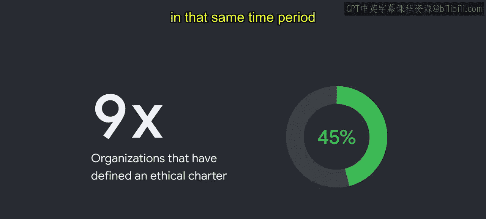

#  009：AI的技术考虑与伦理问题

在本节课中，我们将要学习人工智能，特别是生成式AI所面临的技术考虑与伦理挑战。我们将探讨什么是伦理困境，以及为何在开发AI时，将伦理置于首要位置至关重要。

## 什么是伦理困境？🤔

上一节我们介绍了课程主题，本节中我们来看看什么是伦理困境。

想象一个场景：你有一个从小一起长大的挚友，如今也是你的同事。有一天，与你关系同样密切的经理向你透露，你的这位童年好友即将被解雇，并要求你暂时保密。稍后，你的朋友打电话给你，兴奋地分享他计划购买新房的消息。😊，哦，不。你该怎么办？

伦理困境是一种必须在不同行动方案之间做出艰难选择的处境，而每种方案都意味着违背某一项道德原则。不做出决定，等同于决定什么都不做。伦理困境充满不确定性和复杂性，需要仔细审视你的价值观才能解决。

需要明确的是，伦理困境不同于道德诱惑。诱惑是在正确与错误之间做选择，特别是当做错事对你有好处时。想象一下，你看完一场电影离开影院时，发现另一部你想看的电影正要开场，周围没人检票。你会进去看吗？😊，这不会被视作伦理困境，而是一种道德诱惑。

那么，在我们最初的场景中，你是违背经理的要求将信息告知朋友，还是假装不知情以维护经理的信任，抑或寻找其他不越界的警告方式？不同的观点都有其合理性，并且根据询问对象的不同，都可能被认为是合乎伦理的。尽管没有标准答案，但必须做出艰难的选择。

## 为何AI伦理至关重要？⚖️

理解了伦理困境的概念后，我们来看看为何在构建AI时，伦理考量必须处于最前沿。

构建AI时，由于AI可能对社会产生的巨大影响，开发者可能会面临许多伦理困境。这就是为什么在AI领域，对伦理的关注必须始终保持在前沿。

请思考以下新闻标题：
*   建立数字信任对AI工具的采用至关重要。
*   前景广阔，但潜藏危机。
*   随着AI在更多行业中承担更大的决策角色，伦理担忧日益加剧。
*   2021年，负责任的人工智能变得至关重要。

这些标题凸显了负责任AI对公司和社会的重要性。根据凯捷咨询2020年的一份报告，来自内部和外部的广泛利益相关者越来越要求公司建立更健全的伦理价值观、流程、专业知识、企业文化和领导力。

## 伦理是什么？📜

在深入探讨AI伦理之前，我们需要明确“伦理”本身的含义。

广义而言，伦理是一个持续的过程，包括阐明价值观，并基于这些价值观（通常涉及权利、义务、社会利益或特定美德）来质疑和证明决策的合理性。

最终，伦理是让社会中的每个人都能共同繁荣发展的基石。这并不是说其中没有需要承认和面对的主观性和文化相对性因素。审视世界各地的伦理框架和理论时，各种方法常常相互矛盾，但无论你认同哪种方法，**伦理都是与他人和谐共处的艺术**。因此，伦理审议必须借鉴多样化的视角和经验，这一点至关重要。

然而，伦理并不适合简单地用规则或清单来框定，尤其是在试图解决前所未有的道德挑战时，比如那些由突破性技术所创造的挑战。解决新的道德挑战需要一定的独创性。它要求谦逊、愿意面对难题，以及在新证据和有效反对意见面前改变观点的意愿。

同样重要的是要理解，伦理不应被视为法律或政策。伦理反映了我们彼此之间的价值观和期望，其中大部分并未被书面记录下来或由正式系统强制执行。虽然法律和政策常常从伦理中汲取见解，但许多不道德的行为是合法的，而一些合乎道德的行为却是非法的。例如，大多数类型的撒谎、违背承诺或欺骗通常被认为是不道德的，但往往是合法的。而一些最英勇的公民不服从行为在当时却是非法的。

归根结底，定义伦理对你的组织意味着什么，应该促使你思考：你希望通过所做的工作，与用户、团队以及更广泛的社会建立怎样的信任纽带。没有这种信任，牢固的客户关系将不复存在。

## 负责任AI的兴起🚀

认识到伦理的重要性后，我们来看看业界对负责任AI的响应。

各组织正迅速认识到对负责任AI的需求。随着21世纪技术的社会、政治和环境影响迅速扩大，先进技术带来的挑战也在成倍增加。使用AI的技术有可能以惊人的速度和规模无意中复制伤害，这使得采取深思熟虑、谨慎的方法变得更加重要。

凯捷咨询2020年的“AI与伦理困境”调查显示，意识到AI相关问题的企业高管数量是2019年的两倍。在同一时期，制定了为AI开发提供指导方针的伦理章程的组织比例从5%增加到了45%。

## 总结

本节课中，我们一起学习了AI伦理的核心概念。我们首先通过一个具体场景理解了**伦理困境**与道德诱惑的区别。接着，我们探讨了为何AI的巨大影响力使得伦理考量至关重要。然后，我们定义了**伦理**的本质——它是一个基于价值观进行决策的持续过程，是“与他人和谐共处的艺术”，并区别于法律。最后，我们看到了业界对**负责任AI**日益增长的重视和实际推动。理解这些基础，是后续深入探讨具体AI伦理原则和实践的第一步。