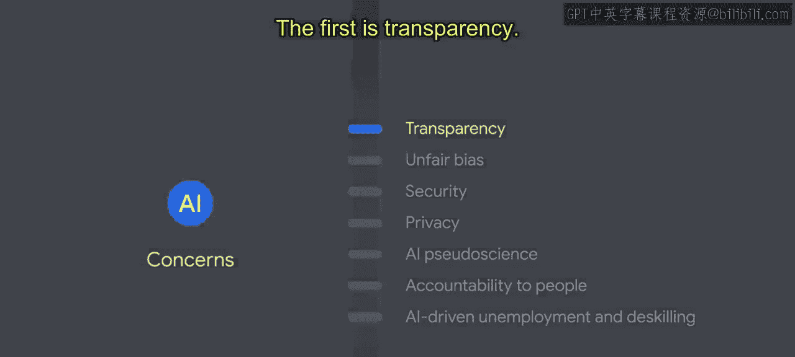
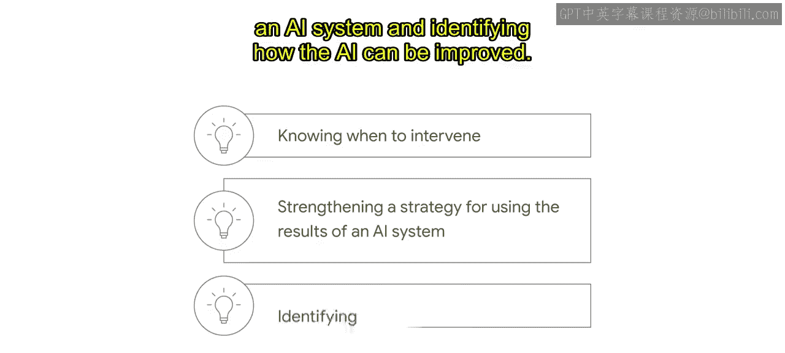
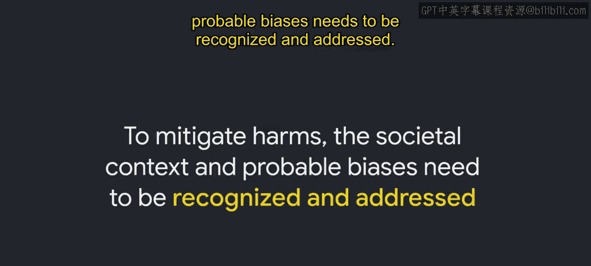
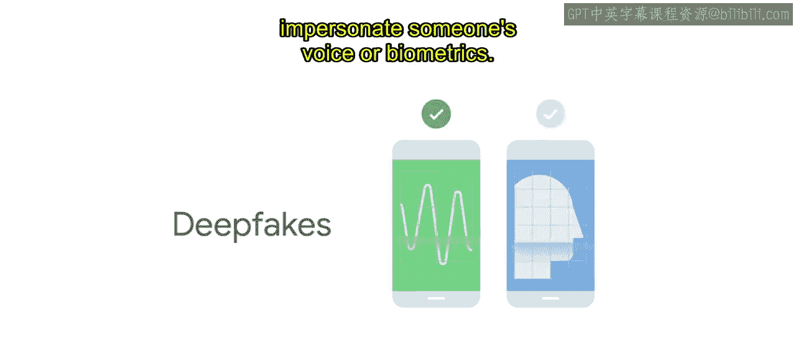
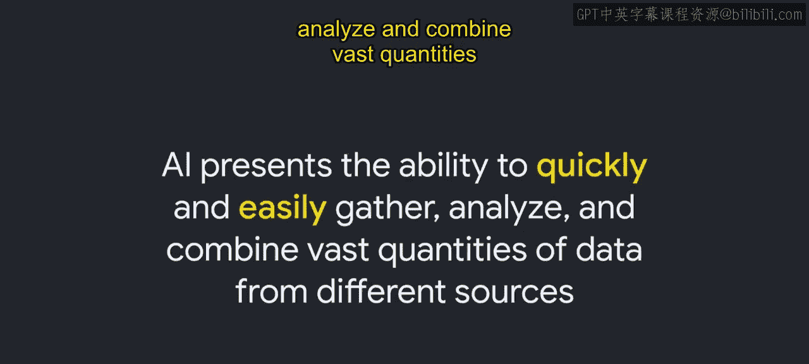
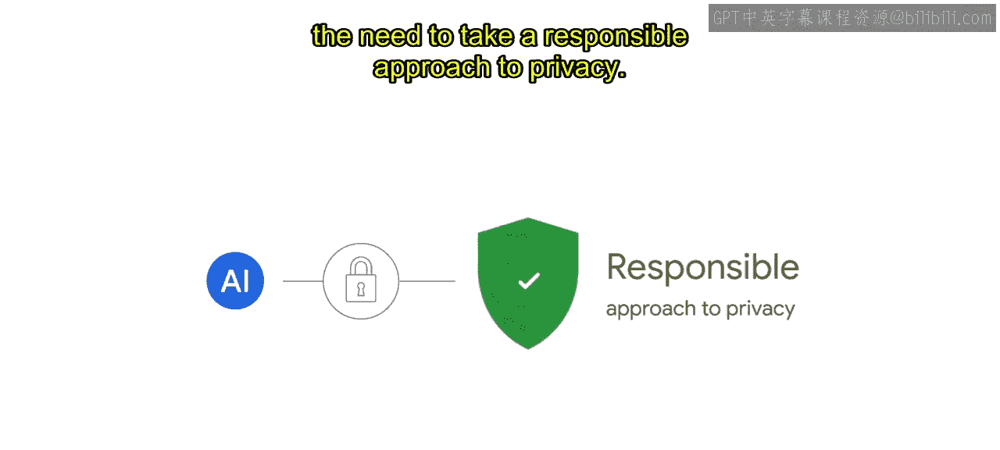
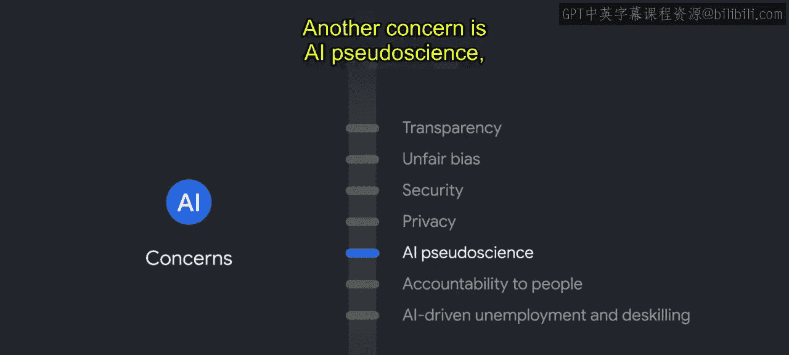
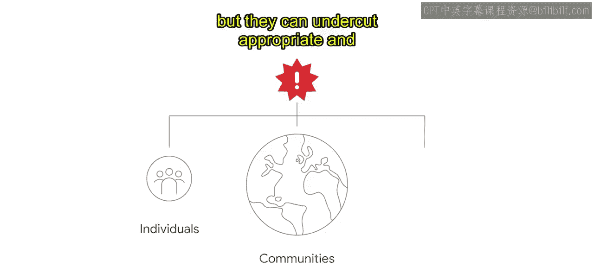
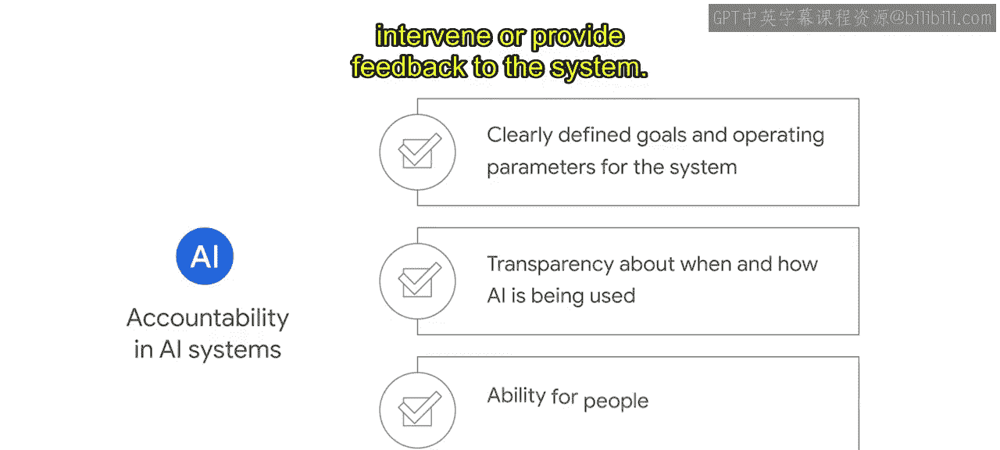
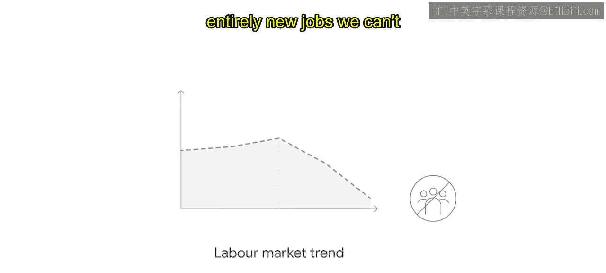

#  010：对人工智能的担忧 🤖

在本节课中，我们将深入探讨人工智能，特别是生成式AI，所引发的一系列伦理担忧。我们将从宏观的伦理原则转向具体的技术挑战，了解当前讨论最广泛的几个核心问题，并思考如何通过负责任的实践来应对这些挑战。

上一节我们从宏观层面探讨了人工智能的伦理。然而，随着AI技术日益先进，一些伦理问题变得尤为突出。本节我们将审视在讨论AI伦理时备受关注的几个主题。每个AI应用场景都带来独特的挑战，整个行业必须提高对这些问题的认识，以便共同制定解决方案。

那么，当前被提出的主要AI担忧有哪些呢？以下是七个关键方面：

## 1. 透明度 🪟

随着AI系统变得越来越复杂，建立足够的透明度以让人们理解AI如何做出决策，正变得日益困难。在许多情况下，理解AI系统的工作原理对于终端用户的自主权或做出知情选择的能力至关重要。缺乏透明度也会使开发者更难预测这些系统何时以及如何失效或造成意外伤害。

允许人类理解决策影响因素的模型，可以帮助AI系统的利益相关者更好地与AI协作。这可能意味着知道在AI表现不佳时何时进行干预、加强使用AI结果的策略，以及确定如何改进AI。

## 2. 不公平偏见 ⚖️

AI本身不会制造不公平的偏见，它揭示并放大了现有社会系统中存在的偏见。AI的一个主要陷阱在于，其规模化能力会强化和延续不公平的偏见，从而导致进一步的意外伤害。塑造社会的不公平偏见也影响着AI的每个阶段，从数据集和问题定义，到模型创建和验证。AI是其设计和部署的社会背景的直接反映。为了减轻伤害，需要识别并解决社会背景和潜在的偏见。

例如，视觉系统正被应用于公共安全和物理安防的关键领域，以监控建筑活动或公共示威。在这里，偏见可能导致监控系统更有可能将边缘化群体误认为罪犯。这些挑战源于许多根本原因，例如训练数据中某些群体的代表性不足而其他群体过度代表、缺乏充分理解系统影响所需的关键数据，或产品开发中缺乏社会背景考量。

## 3. 安全性 🔐

与任何计算机系统一样，恶意行为者有可能利用AI系统中的漏洞进行恶意攻击。随着AI系统嵌入社会的关键组成部分，这些攻击代表着可能严重影响安全与安保的漏洞。

安全可靠的AI既涉及传统的信息安全问题，也涉及新的问题。AI的数据驱动特性使得训练数据对窃取者更具价值，同时AI也可能使攻击的规模和速度变得更大更快。我们还看到了AI特有的新型操纵技术，例如**深度伪造**，它可以模仿某人的声音或生物特征。

## 4. 隐私 🛡️

AI具备快速、轻松地收集、分析和整合来自不同来源的海量数据的能力。

AI对隐私的潜在影响是巨大的，可能导致数据利用、非自愿的身份识别与追踪、侵入性的语音和面部识别以及用户画像等风险。AI的广泛应用伴随着采取负责任隐私方法的需求。

## 5. AI伪科学 🧪

另一个担忧是AI伪科学，即AI从业者推广缺乏科学基础的系统。

例子包括声称能够根据面部特征以及头部形状和大小来测量一个人犯罪倾向的面部分析算法，或用于情绪检测以根据面部表情判断某人是否可信的模型。科学界认为这些做法不科学且无效，并可能造成伤害。然而，它们被用AI重新包装，使得伪科学看起来更可信。这些AI的伪科学用途不仅伤害个人和社区，还可能破坏AI恰当且有益的应用场景。

## 6. 对人的问责制 👥

AI系统的设计应确保满足各类人群的需求和目标，同时允许适当的人类指导和控制。

我们通过多种方式努力实现AI系统的问责制：为系统设定明确的目标和运行参数、透明化AI的使用时间和方式，以及允许人们对系统进行干预或提供反馈。

## 7. AI驱动的失业与技能退化 📉

虽然AI为常见任务带来了效率和速度，但更普遍的担忧是AI会导致失业和技能退化。此外，人们还担心随着对技术的依赖加深，人类能力会下降。

社会在过去经历过技术创新，我们也相应地进行了调整，例如汽车取代了马匹，但也创造了以前无法想象的新产业和工作。今天，创新和技术进步的速度和规模都不同于以往。如果生成式AI兑现其承诺的能力，劳动力市场可能面临重大颠覆。然而，就像在任何重大技术进步期间一样，工作岗位会发生转变。例如，在商业航空旅行出现之前，谁能想象出空乘人员这个职业？虽然许多工作可能会得到生成式AI的辅助，但我们也将会创造出今天无法想象的崭新工作。

这一挑战也伴随着机遇。我们需要共同努力，制定帮助人们谋生并在工作中找到意义的计划，直面挑战并抓住机遇。

除了通用AI应用和模型的担忧列表之外，生成式AI还有其独特的担忧。作为广为人知的一类生成式AI，大语言模型能以听起来自然的语言形式生成富有创意的文本组合。

大语言模型主要有三个担忧：**幻觉**、**事实性**和**拟人化**。在生成式AI中，幻觉指的是AI模型生成了不切实际、虚构或完全捏造的内容。事实性关系到生成式AI模型所产生信息的准确性或真实性。拟人化指的是将类似人类的品质、特征或行为赋予非人类实体，如机器或AI模型。

以上只是与AI及生成式AI开发和部署相关的一些常见担忧的精选。你对这些独特技术挑战的认识，可以指导你在制定应对方法时有所侧重。

那么，是什么导致了这些担忧呢？凯捷咨询的一项调查中，高管受访者列举了导致这些伦理问题的若干原因：缺乏专门用于伦理AI系统的资源（资金、人员和技术）；开发AI系统时缺乏多元化的团队（涉及种族、性别和地域）；以及缺乏伦理AI行为准则或评估偏离该准则的能力。

在该报告中，高管们还将“急于实施AI的压力”列为AI使用引发伦理问题的首要原因。这种压力可能源于获得先发优势的紧迫性、需要通过AI的创新应用获得竞争优势，或者仅仅是利用AI所能提供好处的压力。同样值得注意的是，33%的受访者表示，他们在构建AI系统时实际上并未考虑伦理问题，这本身就令人担忧。

但伦理不仅仅关乎我们不想做或不应该做的事情。AI和新兴技术有许多有益社会的用途，可以为生活和社会做出积极贡献。AI和新技术可以通过改进材料、设计和流程来帮助解决复杂问题；开发新的医学和科学突破；实现对复杂动态系统更可靠的预测；以及提供更实惠的商品和服务，并将人们从常规或重复性任务中解放出来。即使对于这些极具社会效益的解决方案，负责任的AI对于确保这些益处惠及所有人，而不仅仅是少数利益相关者，也至关重要。

在一个组织中，伦理实践的关键益处在于有助于避免对客户、用户和整个社会造成伤害。伦理实践促进人类的繁荣。这正是我们最需要关注的。在谷歌，我们AI治理的目标是试图解决这些引发伦理问题的担忧，而负责任的AI实践有助于实现这一目标。在你的业务中实施你自己的负责任AI治理和流程，可以帮助解决这些伦理问题。

本节课中，我们一起学习了人工智能领域当前面临的七大核心伦理担忧：透明度、不公平偏见、安全性、隐私、AI伪科学、对人的问责制以及AI驱动的失业与技能退化。我们还特别探讨了生成式AI（如大语言模型）特有的幻觉、事实性和拟人化问题。理解这些挑战的根源，并积极采取负责任的AI实践，对于确保技术发展真正造福全人类至关重要。