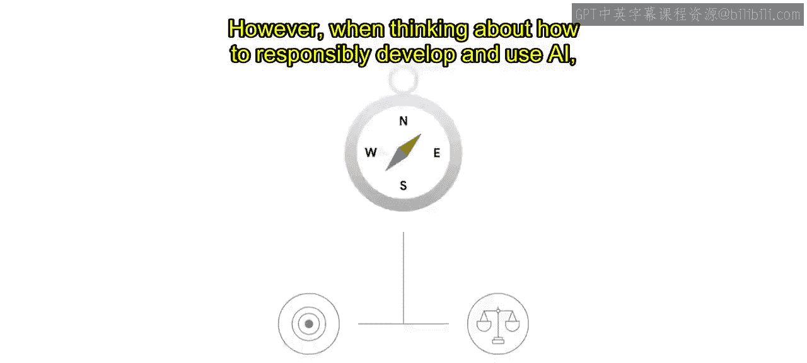
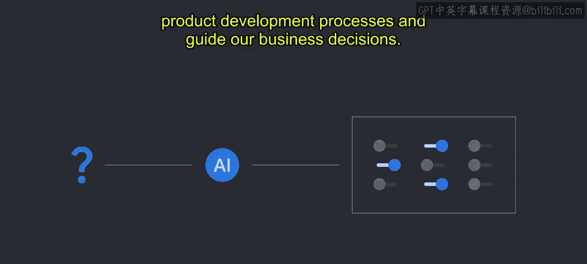
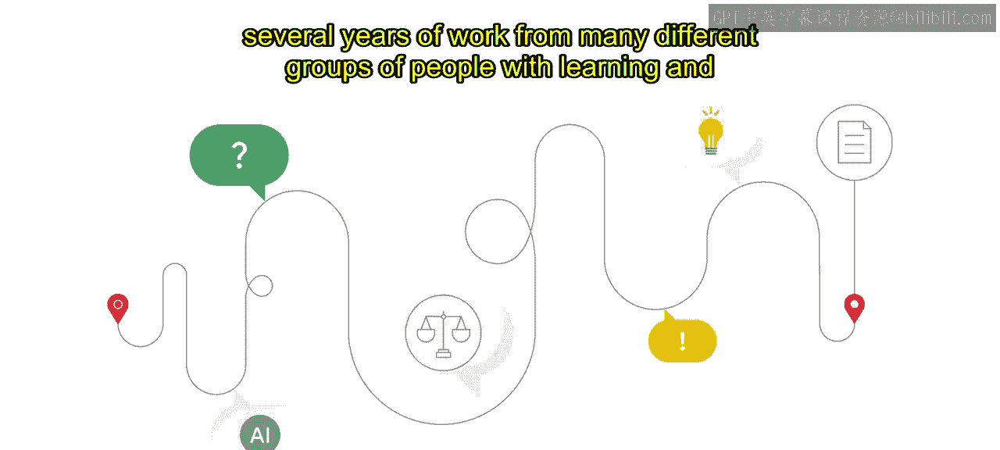
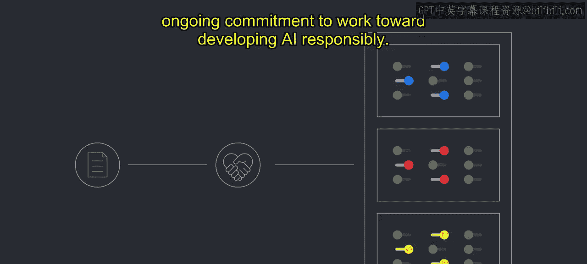
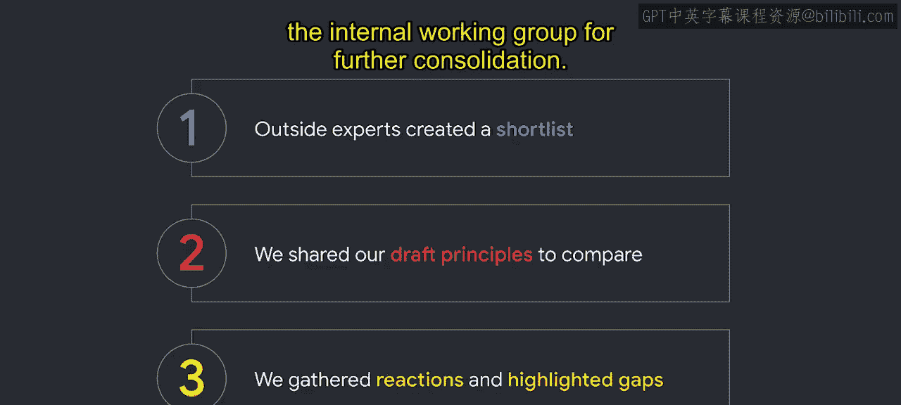

#  011：Google的AI原则制定过程 🧭

在本节课中，我们将学习Google如何制定其AI原则。我们将了解这一过程的背景、核心步骤以及从中汲取的经验教训，为你所在的组织制定自己的AI原则提供参考。

---

Google的使命和价值观多年来一直是我们的指导原则。然而，在思考如何负责任地开发和使用AI时，我们需要设计一套AI原则，以主动管理我们的研究和产品开发流程，并指导我们的业务决策。

## 背景与动机

当我们着手制定AI原则时，该领域已有一些先驱者，但当时并没有太多行业指导来帮助设定方向。自那时起，情况发生了很大变化，制定了负责任使用AI指南的组织名单已大幅增加。

例如，Berkman Klein Centre的报告《有原则的人工智能》显示，许多组织都已定义了自己的AI原则。而根据凯捷咨询的研究，这一数字在2019年至2020年间增长了40%。凯捷还发现，合乎道德的AI需要一个强大的基础，包括领导力、治理以及围绕审计、培训和伦理实践操作化的内部实践。

## 制定过程的分享

在你所在的组织中创建AI原则时，我们希望分享我们创建这些原则的过程。我们承认，我们并非唯一实施AI原则的组织。你应该进行研究，并从各种倡议中汲取最佳经验。我们希望你能从我们的过程、挑战和经验中学习，最终创建并使用你自己的AI原则，作为你开发流程的基础。

从最初定义的使命声明和价值观，到团队在伦理与合规、信任与安全以及隐私等主题上的持续工作，Google多年来有许多不同的倡议来负责任地指导我们的工作。

随着AI成为我们业务中更重要的组成部分，许多团队通过日益认识到机器学习公平性的重要性，倡导负责任的AI方法。但我们当时缺乏一个正式且全面的方法，来应对所有Google员工都能支持的、更广泛的负责任AI目标。

## 核心制定流程

Google的AI原则工作始于2017年夏天，当时我们的CEO桑达尔·皮查伊将Google定位为一家“AI优先”的公司。以这一全公司范围的愿景为基础，我们着手为Google的未来技术设计一份AI伦理章程。这项努力后来演变为我们的AI原则。需要指出的是，这段旅程并非一帆风顺，它是多年来许多不同团队共同努力、不断学习和迭代的结果。

我们理解这是一个复杂且不断发展的主题，我们将在后续模块中分享一些经验教训。但事实证明，负责任地开发AI需要持续的承诺。

现在和未来，我们完全期望随着我们的学习和该领域的发展，继续迭代我们的方法和解释。我们相信，除了个人的道德价值观外，当存在每个人都参与履行的共同道德承诺时，组织和社区才能蓬勃发展。拥有一套共享且成文的AI原则，除了我们各自持有的价值观外，还能让我们被一个共同的目标所激励。

## 组建跨职能团队

Google认识到，不仅需要关注技术开发和创新，还要确保开发与我们的使命和价值观保持一致。我们组建了一个跨职能的专家小组，以确定需要哪些指导方针来解决AI提出的重要挑战。

在创建团队时，我们不仅仅依赖人工智能方面的职能专长。相反，我们选择了代表Google内部不同技能、背景和人口统计特征的个体。从技能角度看，我们为核心小组寻找具有用户研究、法律、公共政策、隐私、在线安全、可持续性和非营利组织背景的人员。我们还征求了AI、人权和民权领域的专家，以及未严格属于核心工作组的产品专家的意见。

我们纳入了广泛多元的声音，包括来自不同国家、性别、种族、民族和年龄组的人。我们还为那些不直接在工作组中的人开发了发声渠道。例如，我们要求每位成员从其他团队和外部专家那里征求讨论和反馈，并将想法带回核心小组。让一个小型团队负责根据尽可能多的利益相关者的意见采取行动，是我们成功的关键。

在创建AI原则时纳入广泛的声音，可以使原则更具包容性，并在此过程中建立信任。

## 研究与草案制定

团队首先进行了研究。我们想要记录人们对AI有哪些担忧。人们认为什么是不负责任的AI？团队从广泛的来源梳理了用户和学术研究，并分析了媒体如何描述AI。我们甚至研究了文化和流行文化中的AI参考，例如AI在电视节目和科幻书籍中是如何被描绘的，以更好地理解消费者可能如何看待AI。所有这些研究都有助于我们发现我们希望指导工作的标准。

之后，团队开始了一个迭代过程，起草一套旨在解决研究中发现的主要关切和主题的原则。我们首先将所有研究汇总并组织成类别，这产生了一份长长的潜在原则清单。

为了完善这份清单，我们首先请AI政策、法律和公民社会领域的外部专家（在未看到我们的草案原则的情况下）提出他们自己的简短清单。然后，我们分享了根据研究创建的草案原则进行比较。最后，我们收集了他们的反馈并指出了差距，带回内部工作组进行进一步整合。

我们进行了持续的反馈和完善过程，以进一步整合原则清单，同时保持广泛的覆盖范围，并认识到我们可能忽略的任何方面。

最终成果是Google的AI原则，包括AI应用的七项目标（指导我们的AI愿景），以及一份我们不会追求的四种AI应用清单。确定我们不会追求的AI应用的目标，是为我们不会在整个业务范围内设计的高度敏感的AI应用领域提供明确的护栏。承认我们明确不会构建什么，与概述我们将构建什么同样关键。

## 发布与实施

这项工作在Google于2018年6月发布我们的AI原则时达到高潮。作为一家公司，我们始终致力于每天将这些原则付诸实践。它们被纳入日常对话中，构成了产品开发过程中机会与危害审查的基础，最重要的是，它们为所有Google员工在决策时提供了共同的道德承诺。

我们在此描述的是Google在负责任AI领域尚处于早期阶段时，将我们的原则成文化的历程。自那时起，关于AI伦理要求、标准和实践的研究主体已经增长了很多，尤其要感谢有色人种学者和倡导者社区的开创性工作。AI社区在AI原则应包含哪些内容才能发挥作用方面，已经出现了相对的趋同。

## 对你的组织的启示

虽然你公司的使命、价值观、地理分布和组织目标会影响你的方法，使得某些原则与你特定的业务环境更相关，但有一系列明确的主题适用于所有用途和行业，可以帮助你入门。

例如，如果你的公司专门从事为客户支持创建聊天机器人，虽然可能存在核心主题，但你的一些AI原则可能看起来不同，或者比那些为不同客户涉及非常广泛用例的咨询公司的原则更具体于你的环境。

我们希望对我们方法的这种洞察对你的组织有所帮助，提供一个可以在此基础上构建的框架。你面临的挑战和你组织的价值观将定义你识别和创建自己的AI原则的过程，这些原则既要传达你组织的精神特质，又要作为你AI治理的基础。

---

**总结**

本节课中，我们一起学习了Google制定其AI原则的完整过程。我们了解到，这一过程始于明确的需求，通过组建多元化的跨职能团队、进行广泛研究、迭代起草并整合外部反馈，最终形成了一套指导实践的原则。关键在于将原则融入日常运营，并保持持续的承诺与迭代。对于任何希望负责任地开发和应用AI的组织而言，制定清晰、包容且与自身价值观相符的AI原则，是构建可信赖AI系统的重要基石。