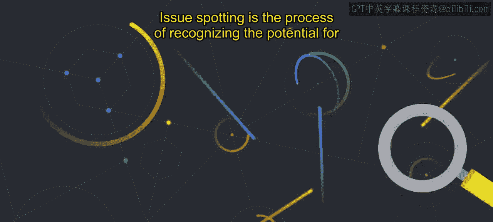
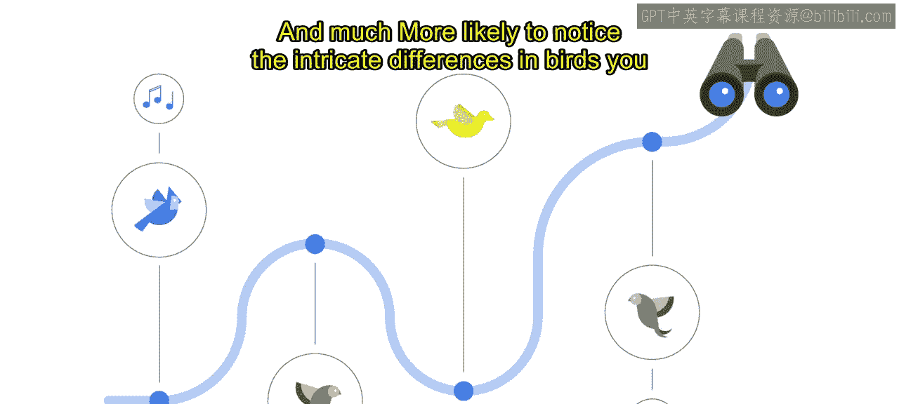

#  012：伦理问题发现 🕵️

在本节课中，我们将要学习人工智能治理中的一个核心环节：**伦理问题发现**。我们将了解什么是问题发现，为什么简单的清单方法行不通，以及如何通过实践和工具来提升我们发现潜在伦理问题的能力。

---

## 什么是伦理问题发现？

AI治理的一个核心部分是建立一套稳健的**问题发现**实践。

问题发现是一个识别AI项目中潜在伦理关切的过程。我们首先需要识别出这些伦理问题，才能着手解决它们。

---

## 为什么清单方法行不通？

组织制定的AI原则可以作为发现这些问题的指南。我们可能会试图通过清单或为每条原则划定可行与不可行的范围来提高这个过程的效率。

我们知道这很诱人，因为我们尝试过。我们曾试图创建决策树和清单，以确保我们的技术符合伦理。但这行不通。

现实情况是，我们需要处理的伦理问题，不仅存在于熟悉的产品或应用场景中，还包括识别出由新技术带来的、我们前所未见的新风险。每个应用场景、客户和社会背景都是独特的。在一个背景下符合我们AI原则的工具或解决方案，在另一个背景下可能就不符合。

我们从未想象过的技术正在以极快的速度和规模发展，这需要一个**适应性的过程**，而不是僵化的、规定性的“是”或“否”的答案。期望为每个应用场景创建一个简单的清单来满足AI原则是不可行的。我们认识到，没有什么可以替代对每个案例事实的仔细审查。

---

## 一个有用的类比：观鸟 🐦

一个有用的类比是将伦理问题想象成**鸟**。它们无处不在，却常常不被察觉。它们在某些区域出现的频率更高，并且大小不一，从普通到奇特都有。通过练习，发现它们会变得更容易。

在上班的路上，你可能经过了很多鸟，但你很可能并没有真正注意到它们。现在，想象你是一位训练有素的观鸟者。你会对你沿途遇到的物种更加敏感，也更有可能注意到你每天经过的鸟之间错综复杂的差异。

同样，在问题发现中，目标是变得**更加敏感**，能够快速准确地识别和分类伦理问题与风险。

---

## 如何提升问题发现能力？

与观鸟一样，团队合作能看到更多。因此，让多名审查者参与是有帮助的。没有哪一个人能看到所有东西，而且存在一些特殊工具可以增强发现能力。

在伦理问题发现方面，道德哲学家们花费了数千年时间开发了各种“透镜”来帮助识别伦理问题。你可能会看着各种哲学透镜，想知道应该选择哪一种来遵循。但我们发现，这并非在所有场景下都要选择一种方法而放弃另一种。

在实践中，利用**伦理透镜**提供了一种结构化的方式，从多个角度和视角来考虑问题，以确保我们审视并服务于那些重要的考量因素。

学习何时以及如何使用这些透镜，可以让你在评估决策的后果、它们对人权和责任的影响，以及它们与“拥有美德品格”的含义是否一致之间进行切换。

如果你想了解更多关于伦理透镜的知识，可以参考**马库拉应用伦理学中心**的材料。

---

## 总结

本节课中，我们一起学习了AI伦理治理中的关键实践——**问题发现**。我们了解到，僵化的清单无法应对复杂多变的现实，而需要通过持续的实践、团队协作以及借助哲学“透镜”等工具，来培养我们识别和分类潜在伦理问题的敏感性与能力。这就像成为一名训练有素的观鸟者，需要耐心、练习和合适的工具，才能看见那些原本容易被忽视的细节。