#  013：谷歌AI原则的伦理目标 🎯

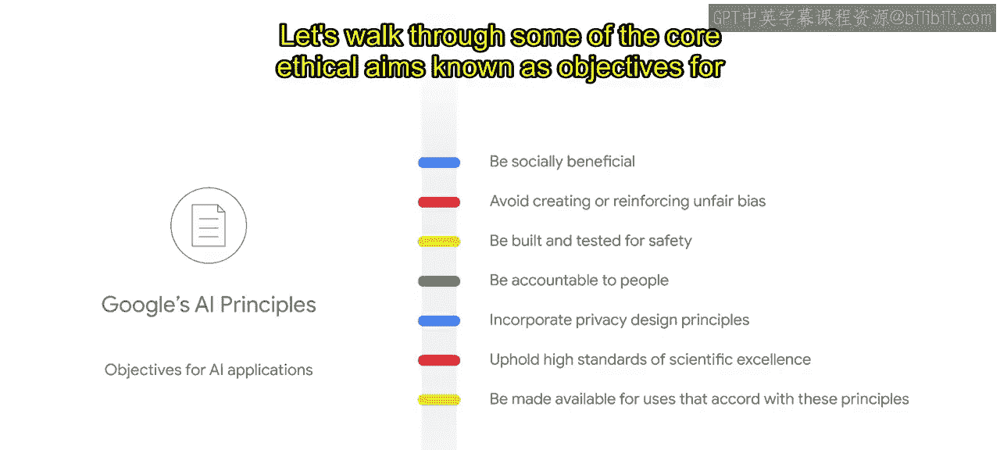

在本节课中，我们将深入探讨谷歌AI原则背后的核心伦理目标。这些目标不仅解释了每条原则的精神内涵，也为我们在实践中一致地评估和遵循这些原则提供了指引。

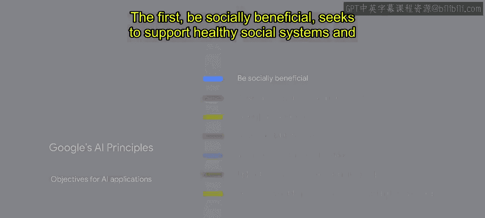

## 概述

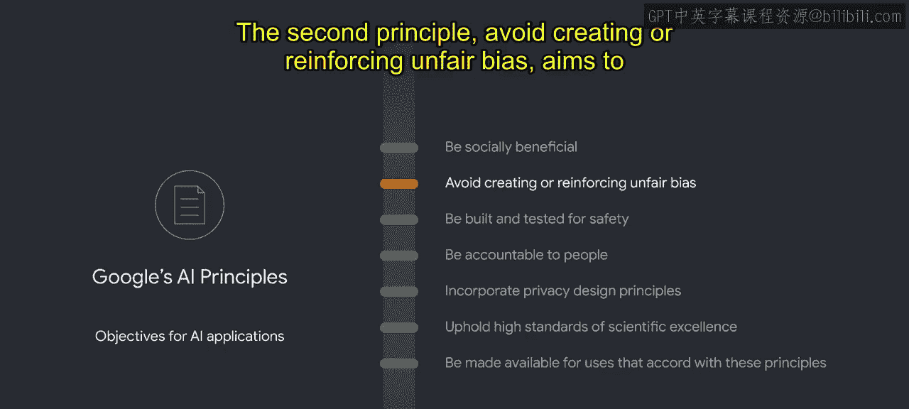

谷歌制定了一系列核心伦理目标，它们可以被视为对每项AI原则背后理念的阐释。这些伦理目标帮助我们以一致的方式评估项目是否符合原则。它们能指导我们发现可能存在的伦理问题，但本身并非一份简单的核对清单。接下来，我们将逐一审视构成谷歌AI原则的这些核心伦理目标，即AI应用的目标。

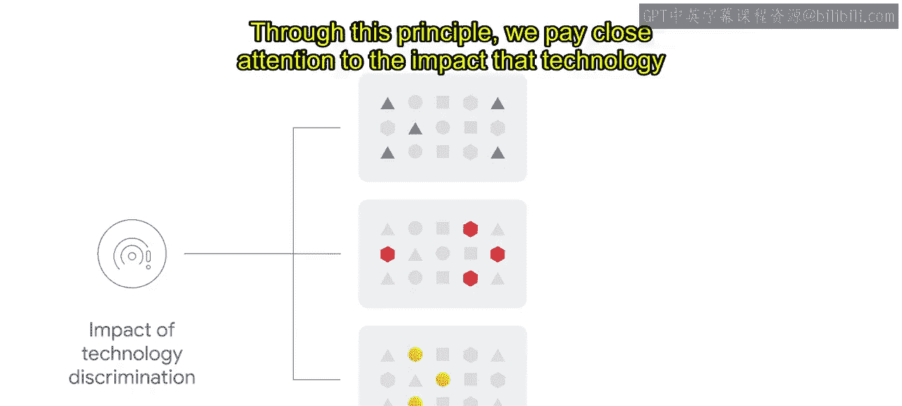

## 核心伦理目标详解

上一节我们概述了伦理目标的作用，本节中我们来看看具体有哪些目标。

以下是构成谷歌AI原则的七项核心伦理目标：

**1. 对社会有益** 🤝
此目标旨在支持健康的社会体系和制度。例如，这意味着要防止自动化系统不公平地剥夺人们福祉所必需的服务，如就业、住房、保险或教育。该原则还致力于从数量、严重性、可能性和范围上降低社会危害的风险，减少对弱势群体的风险，并降低非预期伤害的风险。

**2. 避免制造或加剧不公平偏见** ⚖️
此目标旨在推动创造对个人和群体公平、公正、平等待遇的AI。它应限制训练数据中针对边缘化群体的历史偏见的影响，这种偏见既存在于已包含的数据中，也存在于因历史排斥而缺失或不可见的数据中。通过这项原则，我们密切关注技术歧视可能对所有用户产品有用性产生的影响。

为了更好地理解偏见如何产生，我们可以看一个例子。假设有人在搜索“婚礼”图片。一个基于有偏见数据训练的AI图像分类器，可能只会将“婚礼”标签应用于穿着传统西方婚礼服饰的情侣图片。然而，一对穿着其他文化传统婚礼服饰的情侣图片，可能只会被标记为“人”而非“婚礼”。这表明该图像分类器可能无法识别来自世界不同地区或文化的婚礼图片。这不是我们希望看到的标签和区分方式，这是一个数据集未能反映我们全球用户基础的例子。正如本例所示，代表性不足是有害的。

认识到这一点，谷歌致力于构建旨在为所有人服务的全球性产品。为了在更广泛的多样性范围内实现更好的代表性，谷歌曾举办竞赛，邀请全球公民将他们的图像添加到一个扩展数据集中。因为训练数据必须能够如实地代表社会，而不是像有限的数据集那样代表它们。

重要的是要认识到，不公平可能在机器学习生命周期的任何一点进入系统：从最初如何定义问题，到如何收集和准备数据，再到模型如何训练和评估，直至模型如何集成和使用。在这个流程的每个阶段，开发者都面临不同的负责任AI问题和考量。在生命周期内，我们采样数据的方式、标记数据的方式、模型的训练方式，以及目标是否遗漏了特定用户群体，所有这些因素都可能共同作用，产生偏见。你很少能找出这些问题的单一原因或单一解决方案。机器学习公平性的工作就是理清这些根本原因和相互作用，并找到尽可能公平的前进方案。

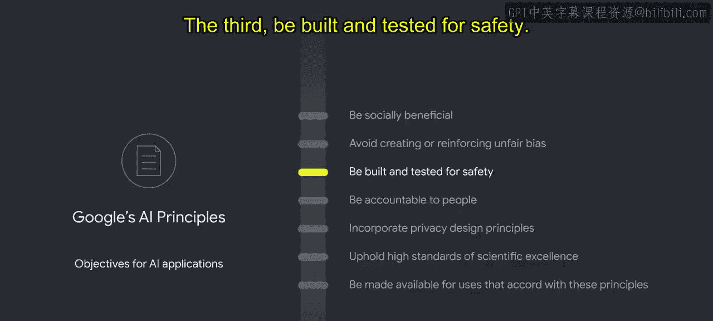

我们如何做到这一点？通过明确在生命周期每个阶段需要回答的问题，例如：
*   模型将解决什么问题？
*   目标用户是谁？
*   可能影响哪些其他群体？
*   哪些群体在今天是不可见的？
*   训练数据是如何收集、采样和标记的？
*   训练数据是否存在偏差？
*   模型是如何测试和验证的？
*   模型的行为是否符合预期？

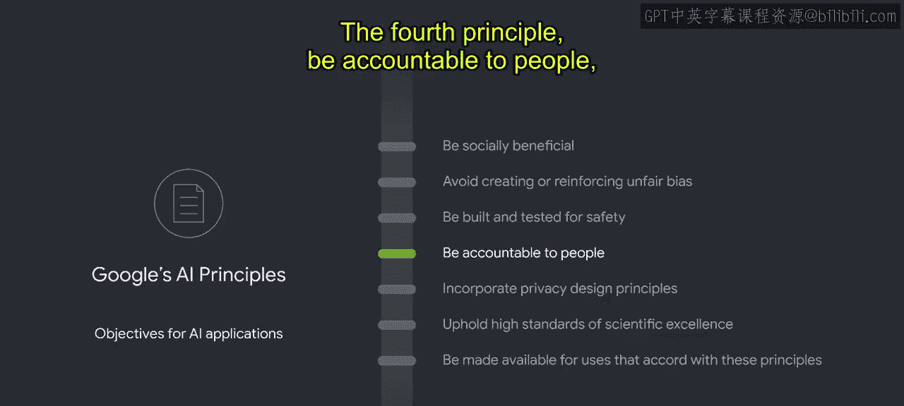

虽然这并非一份详尽的清单，但我们发现，在每个阶段提出类似的问题，有助于指导我们的调查并识别可能的不公平偏见。尽管这些问题可能难以回答，并且需要一系列社会技术层面的投入，但有一些基础工具可以帮助完成这个过程。其中一些通过TensorFlow生态系统开源，另一些是谷歌云提供的托管产品。我们在此不重点介绍工具，但你可以查看资源部分获取相关链接。

这些问题对数据集和模型的开发方式有着巨大影响。其中一些问题看似简单，但实际上常常被低估，这可能导致项目在最后阶段进行重大修改，甚至完全取消项目。负责任地进行AI工作的核心，在于提出这些困难的问题。

**3. 为安全而构建和测试** 🛡️
此目标旨在促进人与社区的安全（包括身体完整性和整体健康），以及场所、系统、财产和基础设施免受攻击或破坏的安全。该原则还旨在确保对安全关键型应用进行有效的监督和测试，确保对AI系统行为的控制，并限制对机器智能的依赖。

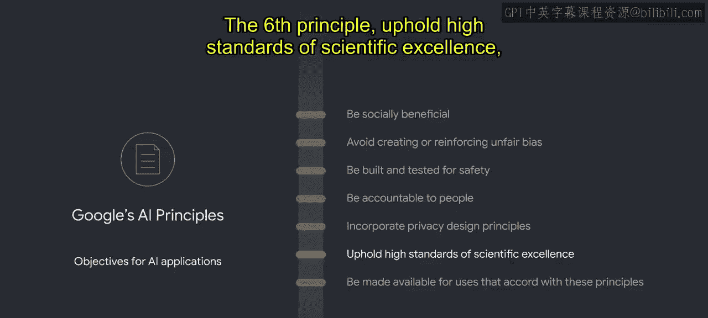

**4. 对人负责** 👥
此目标旨在尊重人的权利和自主性。这意味着限制权力不平等，并限制人们无法选择退出AI交互的情况。该原则旨在促进知情用户同意，并寻求确保存在报告和解决滥用、不公正使用或故障的途径。目标是实现对AI系统的有意义的人类控制和监督，以促进可解释和可信赖的AI决策。

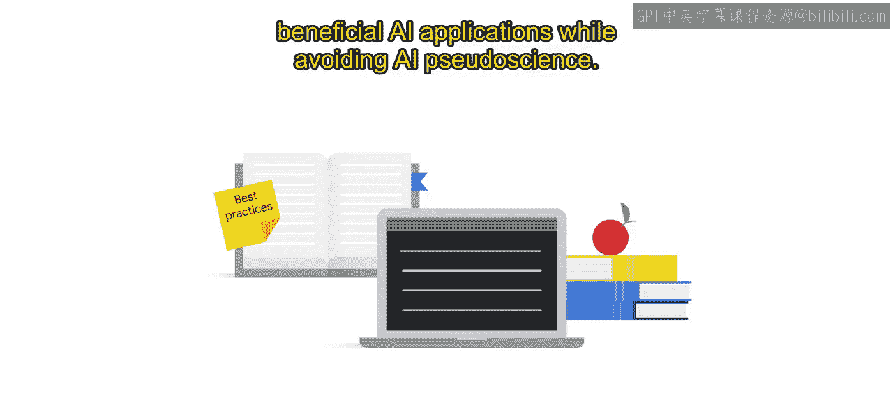

**5. 融入隐私设计原则** 🔒
此目标旨在保护个人和群体的隐私与安全。为此，我们希望确保通过强大的安全措施，特别谨慎地处理个人身份信息和敏感数据。该原则的目标还包括确保用户对数据将如何被使用有清晰的预期，并且他们感到知情并有能力对该使用给予同意。

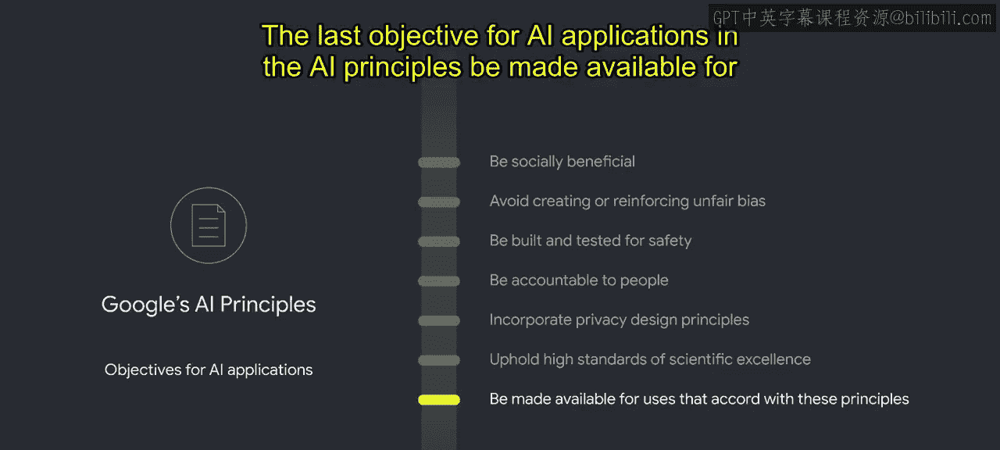

**6. 坚持高标准的科学卓越性** 🧪
此目标旨在推动AI领域的知识进步。这意味着遵循科学严谨的方法，并确保功能声明具有科学可信度。该原则旨在通过致力于开放探究、学术严谨、诚信和协作来实现这一点。通过发布教育材料、最佳实践和研究来负责任地分享AI知识，使更多人能够开发有用且有益的AI应用，同时避免AI伪科学。

**7. 提供符合这些原则的用途** ✅
这是AI原则中AI应用的最后一个目标，旨在为谷歌对社会的独特影响承担责任。许多技术都有多种用途。该原则旨在限制潜在有害或滥用的应用。这包括技术解决方案与有害用途的关联程度或适应程度。该原则旨在实现我们有益AI技术最广泛的可用性和影响力，同时阻止有害或滥用的AI应用。它考虑到谷歌不仅为自己使用而构建和控制技术，还使该技术可供他人使用。谷歌希望确保不仅是我们拥有和运营的技术符合我们的AI原则，我们提供给客户和合作伙伴的技术也应如此。我们使用各种因素来准确定义我们对特定AI应用的责任范围。

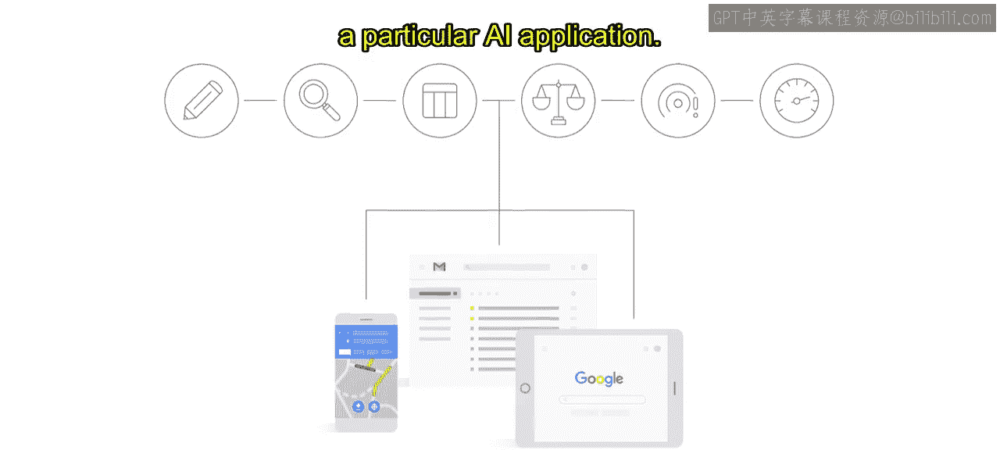

除了这七项代表我们如何负责任地使用AI的承诺的伦理目标外，谷歌还概述了我们将不会追求的四个AI应用领域：
*   可能造成整体伤害的AI应用。
*   武器或其他主要目的是造成人身伤害的技术。
*   违反国际公认规范的监控技术。
*   目的违反国际法和人权的技术。

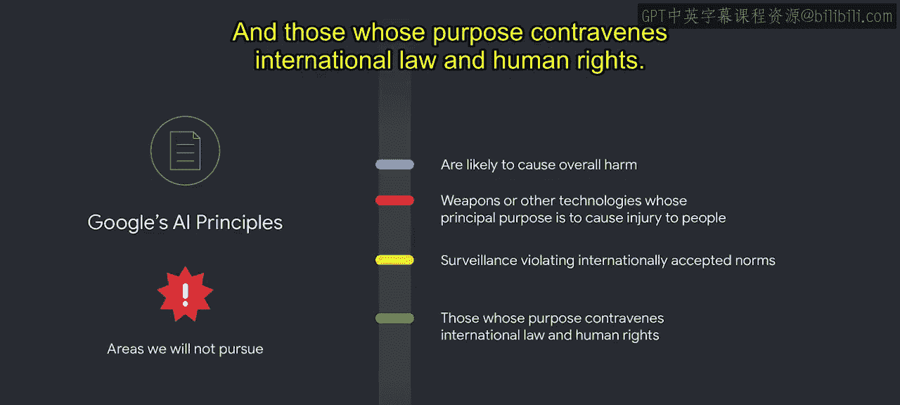

这七项目标和四个领域共同构成了谷歌的AI原则，并简洁地传达了我们在开发先进技术时的价值观。我们相信这些原则是我们公司及AI未来发展的正确基础；然而，制定AI原则只是第一步。要运用这些原则来解释问题和做出决策，需要一个过程。负责任的AI决策需要仔细考虑AI原则应如何应用、当原则发生冲突时如何权衡取舍，以及如何针对特定情况降低风险。为了将AI原则付诸实践，我们建立了一个正式的审查流程和治理结构，以评估新项目、产品和交易中出现的多方面伦理问题。我们还有几个相关的计划和倡议。这就是AI原则如何被付诸实践的方式。

## 总结

本节课中，我们一起学习了构成谷歌AI原则的七项核心伦理目标：**对社会有益**、**避免不公平偏见**、**为安全而构建**、**对人负责**、**融入隐私设计**、**坚持科学卓越性**以及**提供符合原则的用途**。这些目标为评估和指导AI开发提供了具体的伦理框架。同时，我们也了解了谷歌明确不会涉足的四个应用领域，以划定技术发展的伦理边界。理解这些原则和目标，是负责任地开发和应用AI技术的重要基础。