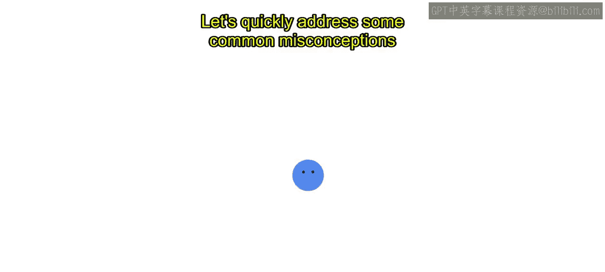
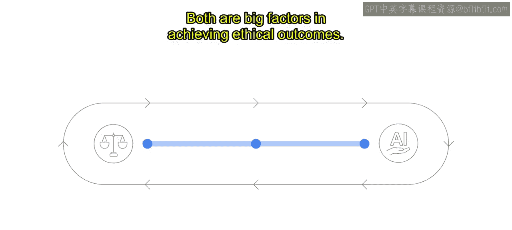
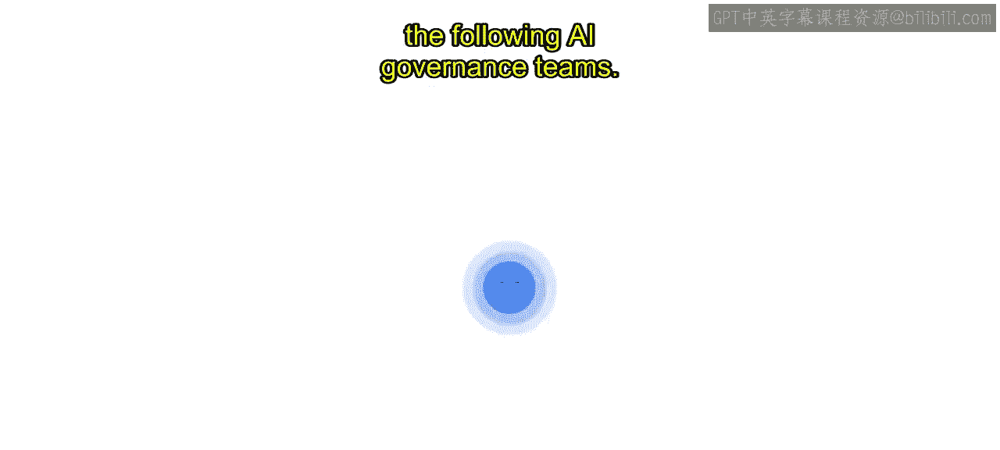

#  014：Google的AI治理实践 🏛️

在本节课中，我们将学习在定义了AI原则之后，如何建立有效的AI治理体系。我们将探讨治理流程的重要性，澄清常见的误解，并深入了解Google如何通过具体的委员会结构将AI原则付诸实践。

## 建立AI治理流程

上一节我们介绍了制定AI原则的重要性，本节中我们来看看如何通过建立审查流程来实践这些原则。

仅仅拥有AI原则作为指导，并不能立即解答所有关于AI伦理的疑问，也无法免除进行艰难对话的必要性。这些原则提供的是一个起点，用于确立你所秉持的价值观，以及评估技术开发时需要考量的内容。应用这些AI原则需要持续且协同的努力。

虽然负责任AI的技术工具对于检查特定机器学习模型的性能很有帮助，但建立稳健的AI治理流程是明确目标的关键第一步。只有在拥有清晰的责任目标时，技术工具才能发挥作用。一个专门的流程能促进负责任AI的文化，而这在传统的产品开发生命周期中常常是缺失的。

## 澄清关于AI治理的常见误解

在深入探讨具体流程之前，有必要先澄清一些关于负责任AI治理的常见误解。

以下是两个普遍存在的误解：

*   **误解一：雇佣有道德的人就能保证AI产品的道德性。**
    现实情况是，两个被认为道德感很强的人，可能会基于各自的经历和背景，对同一情况或AI解决方案得出截然不同的结论。世界经济论坛报告《Ethics by design》中的研究表明，即使是最有道德的人也可能存在道德盲点。因此，围绕道德决策建立实践流程，并为道德审议留出空间至关重要，这两点都是实现道德结果的重要因素。

*   **误解二：可以为负责任AI创建一个检查清单。**
    检查清单或决策树可能让人感到安心，但根据我们的经验，对于如此新兴的技术，检查清单在治理方面是无效的。对于每个产品，其技术细节和使用背景都是独特的，需要独立的评估。遵循检查清单可能会限制批判性思维，并导致道德盲点。

## AI治理的核心：程序与实践

AI治理的核心在于建立支持技术审查的程序和实践。这些程序能让你的团队运用**道德想象力**，即在特定情境中设想各种可能性以解决道德挑战。它也鼓励人们建立发现问题点的实践能力，这是预设的检查清单和更僵化的规则所无法实现的。

## Google的AI治理委员会结构

那么，让我们详细了解如何将审查流程操作化。Google创建了一个正式的审查委员会结构，用于评估新项目、产品及交易是否符合我们的AI原则。

该委员会结构由以下AI治理团队组成：

*   **核心负责任创新团队**：为Google不同产品领域实施AI原则审查的团队提供指导，建立对AI原则的共同解读，并确保全公司决策的一致性。他们处理日常运营和初步评估。这个团队包括用户研究员、社会科学家、伦理学家、人权专家、政策与隐私顾问以及法律专家等，确保了视角和学科的多样性。

*   **高级专家团队**：由来自Google各学科领域的高级专家组成，提供技术、功能和应用程序方面的专业知识。这些专家为新兴技术和主题制定战略和指南，并在需要时就审查提供咨询。

*   **高级执行官理事会**：由高级执行官组成的理事会，处理最复杂和困难的问题，包括影响多个产品和技术的决策。他们作为升级处理机构，做出复杂的、具有先例意义的决策，并在公司最高层面提供问责。

*   **定制化AI治理与审查委员会**：最后，在某些产品领域内嵌入了定制的AI治理与审查委员会，它们与负责任创新团队紧密合作。这些委员会会考虑其在技术、用例、训练数据、社会背景以及AI如何集成到生产环境等方面的独特情况。

## 最佳实践与总结

所有团队在审查中的一个最佳实践是寻求来自多元化人群的参与，这确保了基于审议的、稳健且可信的结果。需要营造一个心理安全的环境，才能使这种讨论和辩论取得成功。

为了让你更好地了解Google Cloud如何实践负责任AI，我们将在下一节介绍我们定制的AI治理流程。

**本节课中我们一起学习了**：在确立AI原则后，建立正式治理流程是将其付诸实践的关键。我们澄清了“仅靠道德员工”和“依赖检查清单”这两种常见误解，认识到需要依靠结构化的程序和多元化的视角。最后，我们深入了解了Google采用的层级式AI治理委员会结构，它通过核心团队、专家团队、高管理事会和定制委员会的组合，确保了对AI产品全面、审慎且负责任的评估。