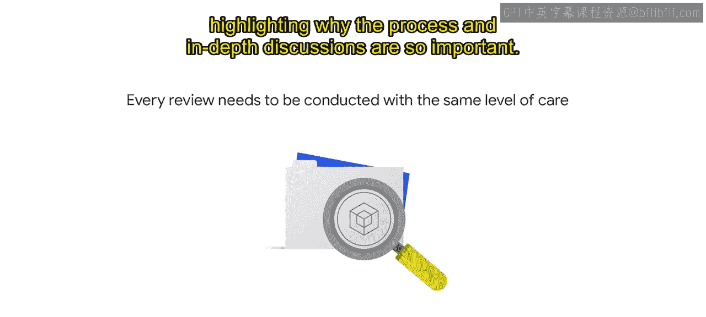

**生成式AI学习路径：P15：Google Cloud的AI审核流程** 🛡️

在本节课中，我们将学习Google Cloud为确保其人工智能技术负责任地开发与应用，所建立的两套核心审核流程。我们将详细了解客户AI项目审核与云AI产品开发审核的具体步骤与目标。

---

Google Cloud为企业开发和实施AI提供了广泛的技术，包括我们的AI平台、Vertex AI、MLOps能力、API以及端到端解决方案。

Google Cloud已经实施了自定义的AI原则审核流程。我们认为，对所创造产品的影响进行伦理评估，对于建立信任和取得成功至关重要。

Google Cloud内部存在两个相互关联但刻意独立的审核机构，以确保AI的开发是负责任的：**客户AI项目审核**和**云AI产品开发审核**。

上一节我们介绍了审核流程的必要性，本节中我们来看看这两个审核机构的具体职责。

**客户AI项目审核**着眼于早期阶段的客户项目。这些项目涉及超出我们通用产品的定制工作，旨在确定提议的用例是否与我们的AI原则相冲突。

**云AI产品开发审核**则侧重于我们如何评估范围、构建和管理Google Cloud使用先进技术创建的产品，以确保在产品公开发布前符合标准。

这些审核流程旨在回答两个核心问题：
1.  提议的用例是否符合我们的AI原则？
2.  如果符合，我们应如何设计和集成此解决方案，以确保实现预期效益并减轻潜在危害？

即使是最具社会效益的用例，也需要遵循负责任的设计实践，否则可能无法实现其预期效益。

---

### **客户AI项目审核流程详解**

那么，Google Cloud的审核流程在实践中是如何运作的呢？让我们从客户AI项目审核开始。其目标是在项目推进前，识别任何可能不符合我们原则的用例风险。

该审核分为几个阶段。以下是各阶段概述：

**1. 销售项目提交**
这是审核的入口流程，可通过两种方式确保覆盖范围：
*   现场销售代表经过培训，会提交其AI客户机会以供审核。
*   此外，一个自动化流程会在我们公司范围的销售工具中标记需要审核的项目。

**2. 初步审查**
在此阶段，云AI原则团队的成员在中心负责任创新团队的协助下，审查通过入口流程提交的项目，并确定哪些需要更深入审查。
*   他们应用任何相关的历史先例。
*   讨论和辩论潜在的AI原则风险。
*   并在需要时请求补充信息。

此分析为**AI原则项目审核委员会**设定了审查议程，该委员会是直接负责做出最终决策的小组。

**3. 评审、讨论与决策**
项目审核委员会召开会议讨论客户项目。该委员会由组织中跨多个职能的领导者组成，例如产品、政策、销售、AI伦理和法律部门。
*   委员会仔细考量AI原则如何适用于具体的项目和用例。
*   并决定该项目是否可以继续进行。

该小组做出的决策范围包括：
*   **批准推进**
*   **不予推进**
*   **在满足特定条件或指标前暂不推进**
*   **将决策升级**

此处的决策基于共识达成。如果无法达成明确决定，项目审核委员会可以将决策升级至高级执行委员会。

---

### **云AI产品开发审核流程详解**

现在，让我们了解云AI产品开发审核。它同样包含几个不同的阶段。

**1. 管道开发**
云AI原则团队跟踪产品管道并规划审核，以便在产品开发生命周期的早期进行审核。这在寻求确保“设计即伦理”的开发方法时至关重要，意味着将负责任的AI考量融入产品设计之中，而非事后补救。

**2. 初步审查**
团队根据产品发布时间线，优先确定需要审核的AI产品，除非某个特定用例被认为风险更高。在健康的产品管道下，我们目标是每两周进行一次深度评审。

**3. 评审简报准备**
在评审会议之前，云AI原则团队的成员会评估产品并起草评审简报。他们与产品经理、工程师、云AI原则团队的其他成员以及公平性专家密切合作，深入理解并界定产品评审的范围。

评审简报通常包含以下核心内容：
*   产品的预期目标和社会效益。
*   产品将解决的业务问题。
*   所使用的数据。
*   模型的训练和监控方式。
*   产品将被集成的社会背景。
*   其潜在风险和危害。

在此评估中，团队协作思考受AI系统影响的每一个利益相关者群体。他们讨论在决定采取某一行动方案而非另一方案时存在的伦理困境和价值冲突。

最后，评审简报的一个关键方面是提出**对齐计划**，通过解决潜在危害，使产品开发与AI原则保持一致。这份评审简报是评审会议的基础。

**4. 讨论与对齐**
团队实际召开会议，从负责任AI的角度评审AI产品。这些深入的实时产品评审是我们审核流程的关键组成部分。它使我们能够作为一个团队发现并讨论额外的伦理问题，并将负责任的AI融入产品设计、开发和未来路线图的决策中。随着时间的推移，这些评审有效地规范了关于风险技术的艰难对话，并防止了潜在的不良后果。

**5. 批准与执行**
评审会议结束后，AI原则团队会综合评审简报中的相关内容，并添加评审会议中提出的新问题、缓解措施或决策，以更新并最终确定对齐计划。在对齐计划发送给委员会和产品负责人签署批准后，该计划将被纳入产品开发路线图，并由AI原则团队跟踪其执行和完成情况。

对齐计划对每个产品或解决方案都是独特的。重要的是，并非所有前进路径都涉及技术解决方案或修复。伦理风险和危害并非总是技术失误的结果，也可能是产品集成环境所致。

前进路径可能包括（但不限于）：
*   **缩小技术应用范围。**
*   **通过允许名单发布**，即产品不普遍可用，使用前需经过客户项目审核。
*   **随产品附带教育材料发布**，例如相关的模型卡或实施指南，提供关于负责任使用解决方案的信息。

---

### **流程演进与经验总结**

随着时间的推移，评审具有类似问题的产品揭示了一些可跨多次评审利用的发现。这使得创建某些通用政策成为可能，这些政策随后成为先例，简化了产品团队的流程。

然而，每次评审都需要以同等程度的谨慎进行，因为每个新案例都会带来新的考量，这也凸显了流程和深入讨论如此重要的原因。

我们实践AI原则的过程已经随着时间的推移而成长和演变，我们预计这一趋势将持续下去。

当您考虑制定自己的AI治理流程时，我们希望这能作为一个有用的框架，您可以进行调整以适应您组织的使命、价值观和目标。在课程后面，我们将探讨更多使我们Google的评审更有效的经验教训。

---

**本节课总结**
本节课中，我们一起学习了Google Cloud为确保AI技术负责任发展而建立的两套核心审核机制：**客户AI项目审核**与**云AI产品开发审核**。我们详细拆解了从项目提交、初步审查、深入讨论到最终批准与执行的全过程，并了解了“对齐计划”等关键概念。这些流程强调了将伦理考量前置化、融入产品设计生命周期的重要性，为构建可信、有益的AI系统提供了实践框架。