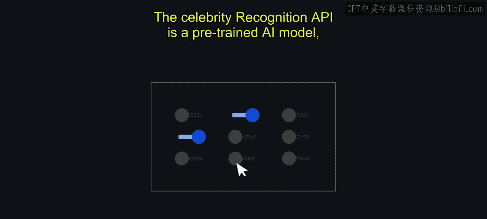
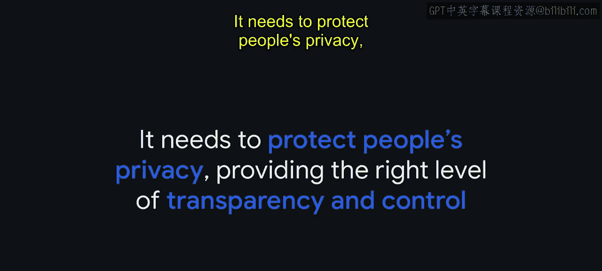
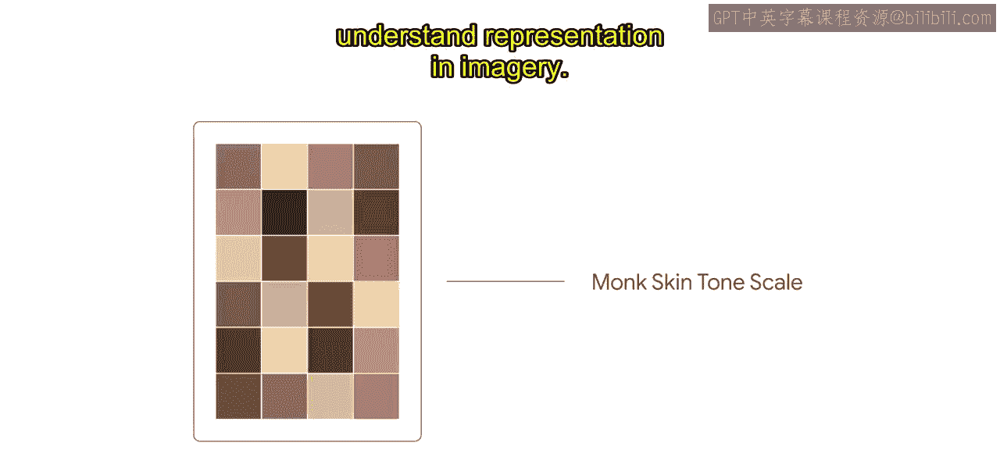

#  016：名人识别案例研究 🎬

在本节课中，我们将通过一个具体的案例研究，了解谷歌云如何将AI原则和审查流程应用于实际产品开发，特别是面部识别技术领域。我们将看到，负责任的AI开发如何引导出一个既满足商业需求又符合伦理标准的产品。

## 概述

本案例研究概述了谷歌云的AI原则和审查流程如何塑造了其在面部识别技术上的策略。我们将从产品成果开始，回溯其开发过程，并重点探讨为确保技术公平、负责而采取的关键步骤。

## 产品成果：名人识别API

上一节我们了解了AI原则的重要性，本节中我们来看看这些原则如何落地为一个具体产品。

2019年，谷歌云面向媒体和娱乐行业的客户，推出了“名人识别”API。这是一个功能范围严格限定的API，旨在帮助客户在其拥有专业授权的媒体内容中标记名人。

在没有昂贵的人工标记流程的情况下，搜索视频内容一直是一项困难且耗时的工作。这使得内容创作者难以有效组织其内容并提供个性化体验。

名人识别API是一个预训练的AI模型，这意味着它不可定制。该模型能够基于授权图像，识别全球数千名受欢迎的演员和运动员。这是谷歌云首个包含面部识别功能的企业级产品。😊

## 开发背景与原则审查

那么，谷歌是如何走到这一步的呢？面部识别技术因其潜在的不公平偏见风险而被视为一个关键关切点。

早在2016年，云业务领导层就决定，尽管这是客户的强烈需求，面部识别将不会成为云视觉API产品的一部分。为了深入探讨此问题，我们通过早期版本的AI原则审查流程对面部识别技术进行了评估。

这些审查为我们提供了一个开放的论坛和时间，让我们能够批判性地思考该技术的研究背景、社会背景及其挑战。

我们看到了与面部相关的各种技术对个人和整个社会有多么有用。它们可以使产品更安全，例如使用面部认证来控制对敏感信息的访问。也存在具有巨大社会效益的用途，例如非营利组织利用面部识别技术打击人口贩卖。

但重要的是，这些技术必须以深思熟虑和负责任的方式开发。谷歌认同关于面部识别技术被滥用的广泛担忧，具体而言：

*   **技术需要公平**：不应强化或放大现有偏见，尤其是在可能影响代表性不足群体的情况下。
    
*   **不应用于违反国际公认规范的监控**。
*   **需要保护个人隐私**：提供适当水平的透明度和控制权。
    

为了减少潜在的滥用风险，并使该技术能够用于符合我们AI原则的企业用例，谷歌决定开发一个功能范围严格限定的面部识别应用——名人识别。

## 外部专家评估与人权影响评估

为了准备名人识别API的发布，除了我们内部的审查流程，我们还寻求了外部专家和民权领袖的帮助。

我们认识到，我们的生活经验不一定与受影响人群的生活经验一致，我们需要帮助将这些经验和关切纳入我们的审查中。考虑到产品的预期用途，社会中黑人和少数族裔演员的系统性代表不足是我们评估的一个关键因素。

为了更深入地关注潜在影响，我们聘请了一家名为“商务社会责任国际协会”的外部人权咨询公司，进行深入的人权影响评估。

与BSR的合作在塑造API的功能和政策方面发挥了至关重要的作用，将人权考量整合到产品开发生命周期的全过程。它也揭示了解决方案在哪些方面需要额外的监督，并验证了我们之前不提供通用面部识别API的决定。他们的完整报告已公开，可在本课程的资源部分找到。

基于BSR的建议，谷歌实施了一系列保障措施，以下是关键措施列表：

*   **允许名单机制**：名人识别API仅对符合条件且位于允许名单上的客户开放。
*   **预定义名人库**：名人数据库经过精确定义，并限制在一个预定义的名单内。
*   **退出政策**：实施了退出政策，允许名人将自己从名单中移除。
*   **扩展服务条款**：适用于该API的扩展服务条款。

这些措施旨在避免和减轻潜在危害，并为谷歌提供了一个坚实的基础来降低人权风险。

## 公平性分析与技术优化

谷歌审查名人识别API的另一个关键步骤是一系列公平性分析。从根本上说，这些公平性测试旨在评估API在**召回率**和**精确率**方面的性能。

换句话说，我们不仅评估了API针对不同肤色和性别群体的性能，还评估了这些群体组合的性能，例如，肤色较深的女性或肤色较浅的男性。

在三次独立的公平性测试中，我们发现我们的训练数据集与一个基于肤色的基准数据集之间存在误差。这些误差让我们暂停下来，决定更深入地探究根本原因。

我们首先检查了数据集中肤色标签的准确性，发现对于中等和深色皮肤人群的标签并不完全准确。我们根据Fitzpatrick皮肤类型量表重新标注了肤色，该量表在Joy Buolamwini和Timnit Gebru的开创性研究“性别阴影”中被使用。😊 这项研究评估了自动面部分析算法和数据集中存在的与肤色和性别相关的偏见。

重新标注肤色降低了错误率，但我们发现了进一步的差异。一小部分演员在评估数据集中占据了总识别错误（missed IDs）的很大比例，尤其是对于深色皮肤的男性。了解到错误率主要影响少数特定演员后，我们查看了错误最多的演员，发现他们几乎有100%的误拒率。

由于名人识别API的范围有限，我们能够逐一检查测试集和图库，以确定问题所在。😊 我们发现，对于三位黑人演员，我们的名人图库中是他们成年后的图像，而训练集中则是他们年轻得多时的演员形象。我们的模型无法将成年演员识别为多年前他们扮演的年轻角色。

在这种情况下，我们通过扩展训练数据集来解决这个问题，纳入了名人职业生涯中不同时期和不同年龄的图像。这消除了错误率之间的差异。这次经历让我们深刻认识到，花时间审视解决方案的整体背景（即媒体中的代表性问题）的重要性。只有理解了这一背景，严格限定了解决方案范围，并经过严格的公平性测试和改进后，我们才有信心发布该API。😊

## 总结与后续发展

这个案例是为什么负责任的AI开发能促成AI成功整合的一个例证。

2020年中，鉴于对该技术更广泛的担忧，我们欢迎其他科技公司限制或退出其面部识别业务的消息。最终，我们的AI治理流程使我们能够研究并确定一个符合我们AI原则的产品范围。

今天，谷歌发布了Monk皮肤色调量表，这是一个更精细的肤色量表，将帮助我们更好地理解图像中的代表性。

在本节课中，我们一起学习了谷歌云名人识别API的完整开发历程。从最初的伦理关切和原则审查，到引入外部专家进行人权评估，再到深入的技术公平性测试与优化，整个过程展示了将负责任的AI理念贯穿产品生命周期的实践方法。这个案例表明，通过严谨的治理、透明的流程和对潜在社会影响的持续关注，企业可以在满足商业需求的同时，开发出符合高标准伦理规范的AI技术。