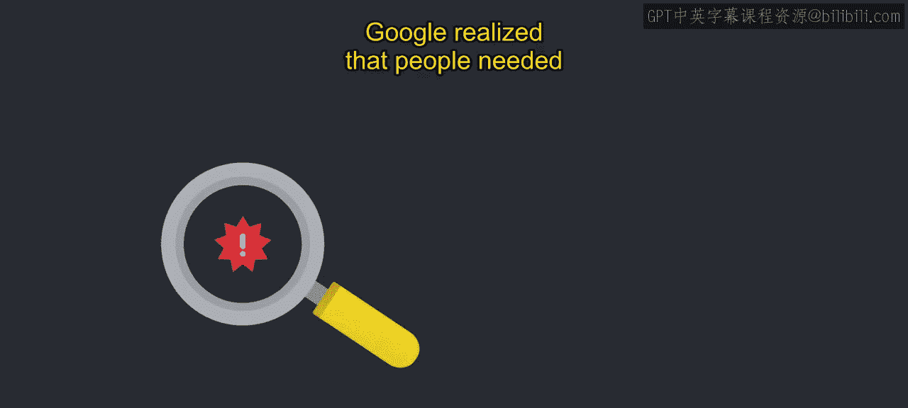
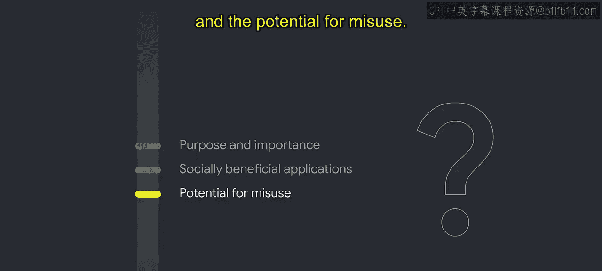

#  017：问题发现过程 🔍

在本节课中，我们将学习谷歌在实践其AI原则时采用的一个关键流程——问题发现过程。这是一个系统性地识别AI用例中潜在伦理问题的过程，是AI治理与审查的核心环节。

## 概述

上一节我们介绍了AI治理的框架，本节中我们来看看如何具体识别潜在问题。在谷歌，将AI原则付诸实践时，AI治理与审查流程的一个关键部分是问题发现。

这个过程旨在识别所讨论的AI用例中可能存在的伦理问题。谷歌意识到，人们需要一个指南来帮助发现伦理问题。

但这个指南不能是一个简单的清单，因为清单可能会阻碍批判性分析。相反，我们的问题发现方法基于提供一系列问题，要求人们对他们开发的技术进行批判性思考。

这些问题植根于成熟的伦理决策框架，这些框架强调寻找额外信息和考虑最佳与最坏情况的重要性。这有助于发现那些原本可能被忽视的潜在伦理问题。

## 问题涵盖的范围

以下是问题涵盖的主要主题类别：

*   **产品定义**：例如，正在解决什么问题？目标用户是谁？使用了什么数据？模型是如何训练和测试的？
*   **使用情境**：例如，用例的目的和重要性是什么？用例的社会有益应用有哪些？滥用的可能性有多大？

这些问题旨在强调设计决策可能产生的影响，这些影响可能会波及AI模型的公平和负责任使用。

## 审查流程与高风险领域

我们从假设所有用例都存在需要解决的问题开始评估所有AI用例，即使某个用例看起来显然具有社会效益。如果在这个批判性思考过程中出现了可能与AI原则的伦理目标相冲突的问题，就会进行更深入的审查。

在进行AI原则审查的过程中，我们认识到AI开发中的某些复杂领域值得进行更密切的伦理审查。识别与你的业务背景相关的用例的风险和危害领域至关重要。在构建这些领域的AI应用时应格外谨慎。例如，这些可能包括涉及监控或合成媒体等的用例。

对你业务而言的复杂领域在很大程度上取决于你的领域和客户。识别新出现的风险和社会危害领域是整个行业内积极讨论的一部分，我们可以期待该领域即将出台的标准和政策。

## 案例分析：ASD护理机器人

让我们通过一个假设的用例，使用问题发现问题来评估是否有任何AI原则正在或有可能受到侵犯。我们将审查一个名为“自闭症谱系障碍护理机器人”的虚构产品，该案例改编自圣克拉拉大学马库拉应用伦理学中心的研究。

ASD的成因存在广泛争议，但研究表明其患病率正在上升，并且早期诊断并提供关键服务的儿童更有可能充分发挥其潜力。一些学校在使用机器人帮助学生练习语言技能和社交互动方面取得了成功，但这目前还不是一种负担得起或广泛可用的资源。因此，并非所有学校都提供这种支持。

现在，假设一个AI产品团队提议构建一个面向学龄前儿童、旨在用于儿童家中的经济型ASD护理机器人。他们设想了一个基于云的AI聊天机器人，具备语音、手势、面部情感分析以及个性化学习模块，以加强积极的社交互动。

在问题发现中，首先识别出需要对该用例进行批判性思考的问题是有用的。例如：

*   这个产品的利益相关者是谁？
*   他们希望从中获得什么？
*   不同的利益相关者是否有不同的需求？
*   ASD护理机器人的开发和使用可能会如何实现或违反每一条AI原则？

你的AI原则审查可能会提出比你立即能回答的更多问题，但分析将揭示需要探索的领域，这些领域最终将影响你的团队如何推进。

以下是针对各AI原则的具体思考方向：

*   **社会效益**：该产品的目标是扩大一种治疗形式的可及性，目前并非所有能从中受益的人都能获得。然而，这是提供这种治疗的最佳或正确方式吗？ASD是否应该被视为需要这种干预的东西？
*   **避免偏见**：为避免制造或强化不公平偏见，你的团队可能会问：团队构成如何影响模型的公平性？在审查产品设计和集成时，应在何处密切考虑和评估公平性？我们是否获得了将直接受到护理机器人影响的人的必要意见？开发护理机器人基础模型的训练数据将从何处获取？这些数据将代表谁？是否有某些患有ASD的个人或群体可能没有得到很好的代表？
*   **安全性**：如果这个模型没有按预期运行，或随着时间的推移出现模型漂移或衰退，会发生什么？会危及人类安全吗？
*   **隐私**：家庭可以被视为一个高度敏感和共享的环境，甚至比教室更甚。这个护理机器人将收集什么样的数据？是否存在可能构成特殊隐私风险的数据集？哪些设计原则有助于确保为这个高度敏感的用例提供适当的隐私保护？
*   **问责制**：开发人员可能想知道如何确保对系统进行人工监督，并确定对于使用该系统的人来说，什么样的知情同意是合适的。例如，应该允许护理机器人将自己表现为朋友吗？有哪些可能的积极和消极影响需要考虑？
*   **科学卓越性**：这促使产品负责人评估他们是否具备开发此类工具所需的专业知识，或者是否应考虑与专门研究ASD或教育治疗的合作伙伴合作，以深入了解学生的需求。帮助确定这一点的问题包括：为确保其性能并带来预期效益，对此用例进行何种测试和审查是合适的？负责任地做到这一点的技术和科学标准是什么？
*   **可用性**：AI原则“应可供符合这些原则的用途使用”建议产品所有者思考该解决方案是否会广泛提供给用户，例如是否负担得起和易于获取。

通过提出问题发现问题，团队可以进行批判性思考，以评估用例的潜在益处和危害。只有经过彻底审查，才能形成对新的AI应用的负责任方法。

## 总结

本节课中我们一起学习了谷歌AI治理中的“问题发现过程”。我们了解到，这不是一个简单的检查清单，而是一个基于批判性提问的框架，旨在系统性地揭示AI用例中的潜在伦理风险。我们通过一个虚构的ASD护理机器人案例，具体分析了如何围绕社会效益、公平性、安全性、隐私、问责制、科学性和可用性等核心原则提出问题。这个过程是确保AI技术负责任开发和应用的关键第一步。