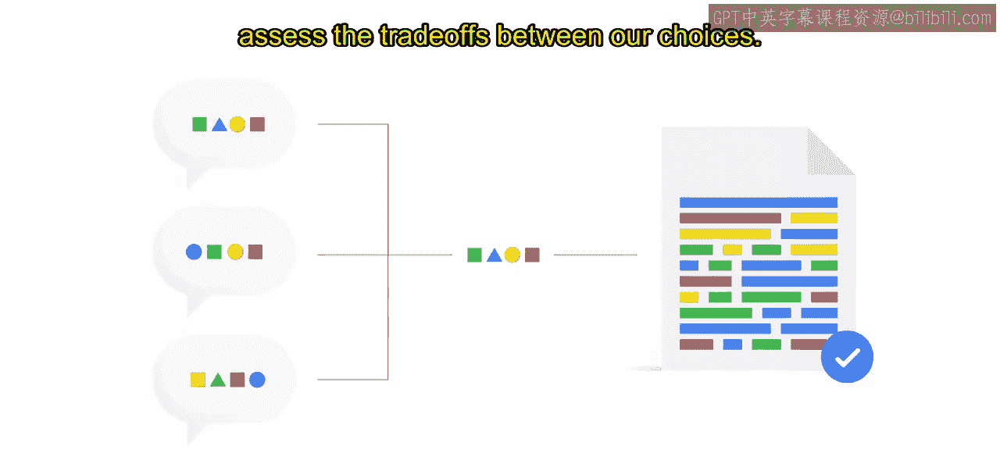
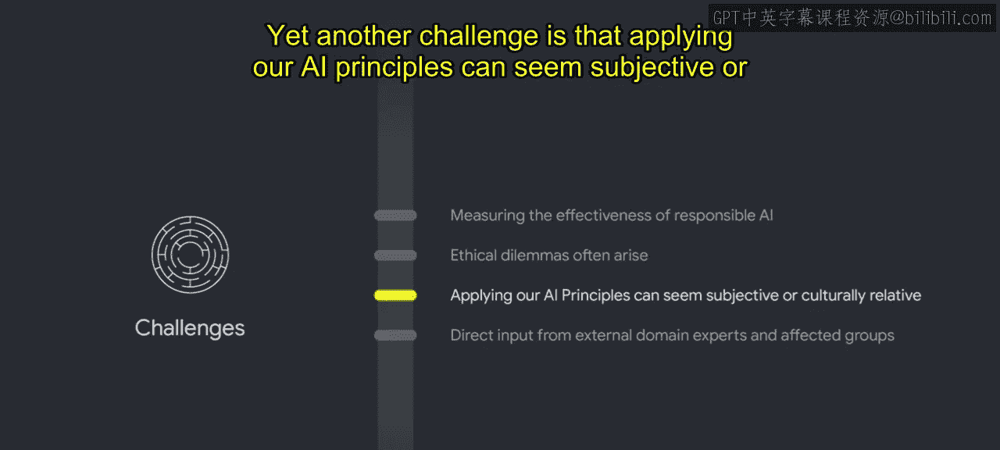
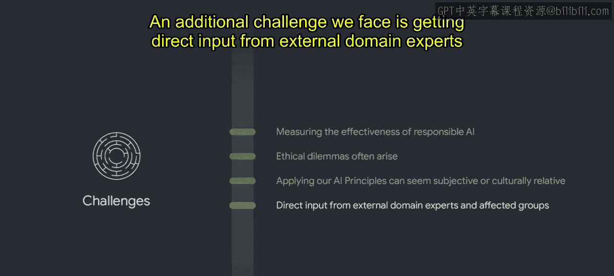
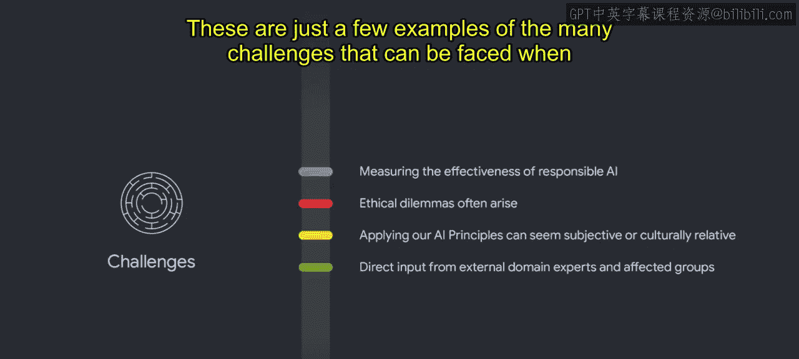

#  018：从实施AI原则中学到的挑战 🧩

在本节课中，我们将探讨谷歌在将AI原则付诸实践的过程中所遇到的一些关键挑战。这些挑战并非谷歌独有，任何致力于负责任AI创新的组织都可能面临。我们将逐一分析这些挑战，并了解谷歌为应对它们所采取的策略。

## 概述

将谷歌的AI原则付诸实践，需要众多团队的协作与不懈努力。我们在这个过程中，无论是成功还是挑战，都持续学习并积累经验。我们致力于不断迭代、演进并分享这些经验，以帮助您在自己的旅程中前行。接下来，我们将深入探讨在AI原则实施过程中经常遇到的一些挑战。

## 挑战一：衡量负责任AI的有效性 📊

上一节我们介绍了实施AI原则的整体过程，本节中我们来看看第一个具体挑战：如何衡量负责任AI工作的成效。

评估缓解措施如何解决伦理问题，通常比评估技术性能更为困难。在一个重视影响力指标和可量化结果的领域，衡量那些旨在防止潜在危害或问题发生的缓解措施的有效性，并非易事。

因此，指示负责任创新成功的指标，可能与传统的业务指标有所不同。以下是谷歌采用的一些衡量方式：

*   **跟踪问题与缓解措施**：我们追踪产品中出现的伦理问题、相关的缓解措施以及这些措施的实施情况。
*   **评估治理影响**：我们评估AI治理工作对建立客户信任和加速交易成功的影响。
*   **收集用户反馈**：通过调查和客户反馈，收集最终用户的体验和感知，是另一种衡量有效性的方式。

这些类型的指标有助于追踪影响、识别趋势并建立先例。

## 挑战二：处理伦理困境 ⚖️

在应用我们的原则时，经常出现的不是简单的对错抉择，而是伦理困境。审查委员会的成员们各自对AI原则有不同的解读、生活经验和专业知识，他们会将自己的价值观应用于伦理问题。这会在不同价值观之间产生张力，引发大量辩论。

重要的是要认识到，这些困境以及由此产生的审议过程，正是AI原则审查的核心目标之一。解决这些困境需要开放、坦诚的对话，并理解这些决定并不容易做出。这些对话最终有助于识别和评估我们不同选择之间的权衡。

## 挑战三：应对主观性与文化相对性 🌍

另一个挑战是，应用AI原则有时会显得主观或具有文化相对性。为了减少主观性，我们采取了以下几种方法：

*   **明确的审查流程**：建立一个定义清晰的AI原则审查和决策流程，以培养对该流程的信任。
*   **立足现实**：将审查建立在技术、研究和商业现实的基础上，使缓解措施与现实世界的问题相联系。
*   **记录决策过程**：记录决策是如何做出的，可以提供必要的透明度，并确保审查团队及其他相关方的问责。
*   **建立先例记录**：保存全面的先前案例记录，通过评估当前案例是否与过去案例有显著不同，来确保决策的一致性。

## 挑战四：获取外部专家与受影响群体的意见 👥

我们面临的另一个额外挑战是，如何获取外部领域专家和受影响群体的直接意见。这一点至关重要，但实现起来并不容易，我们承认这个过程可能充满困难。

没有一个人能够完全代表你试图代表的整个群体的观点。我们的目标是尽可能广泛地听取各种声音，以确保产品是为所有人而设计的。

## 总结

以上只是开发负责任AI过程中可能面临的众多挑战中的几个例子。在负责任AI的旅程中，问题和挑战将始终存在。认识到这一点，是努力最小化和缓解这些挑战的起点。

本节课中，我们一起学习了实施AI原则时遇到的四大核心挑战：**衡量有效性**的复杂性、处理**伦理困境**的必要性、应对**主观性与文化相对性**的策略，以及**获取外部意见**的重要性。理解这些挑战，是构建更可靠、更公平的AI系统的关键一步。