#  019：从实施AI原则中学到的最佳实践 🎯

在本节课中，我们将探讨谷歌在将其AI原则付诸实践的过程中所汲取的经验教训，以及这些经验如何催生出一套行之有效的最佳实践。这些实践旨在帮助组织负责任地开发和应用人工智能技术。

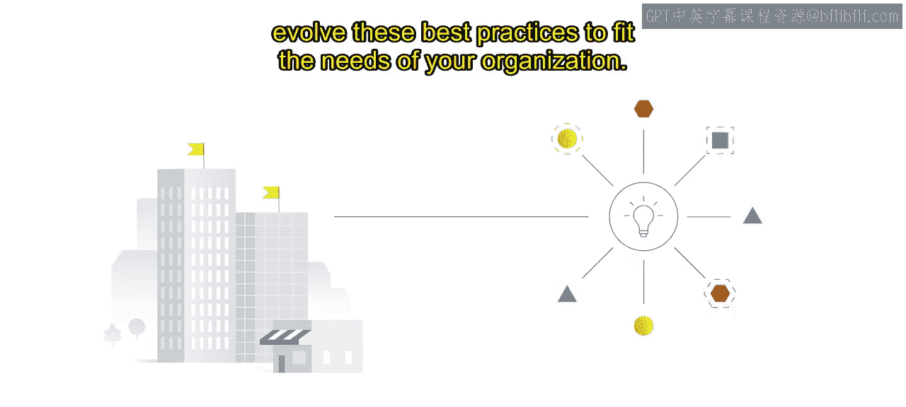

## 概述

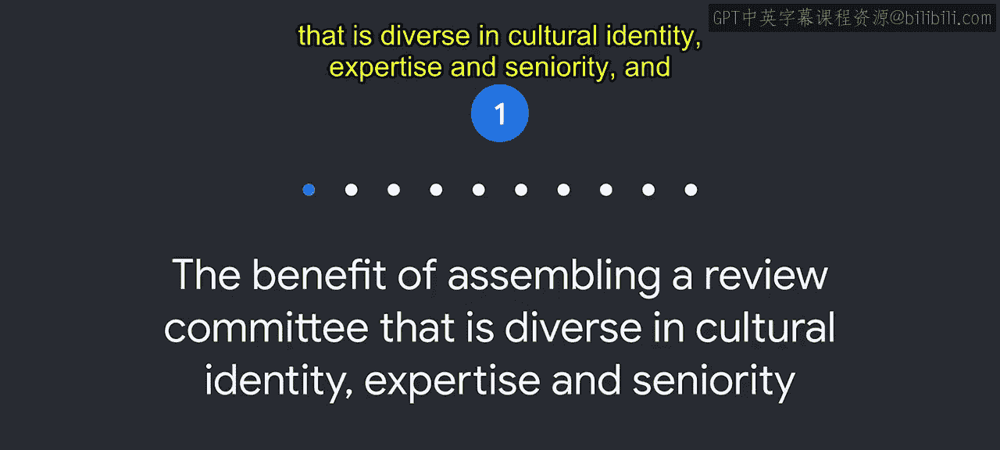

我们将深入探讨如何组建有效的审查委员会、如何获得组织内外的支持、如何通过教育推动文化变革，以及如何建立透明且可扩展的治理流程。这些实践的核心在于认识到：**负责任的AI等于成功的AI**。

---

### 组建多元化的审查委员会 👥

上一节我们介绍了AI原则的重要性，本节中我们来看看如何有效地实施这些原则。首先，建立一个能够对原则进行解读和应用的审查委员会至关重要。

研究表明，组建一个在文化背景、专业知识和资历层级上多元化的审查委员会大有裨益。在谷歌，我们发现这是成功的关键。

所有AI原则都需要解读，因此，组建一个能更贴近代表你当前或潜在用户群体的审查委员会非常重要。

以下是构建多学科团队时需要考虑的关键点：

*   **纳入多元化、公平性和包容性考量**：在构建多学科团队时，纳入多元化、公平性和包容性考量至关重要。
*   **汇集多元群体**：汇集一个多元化的群体有助于做出更明智的决策，从而产生更具可操作性和可行性的解决方案。

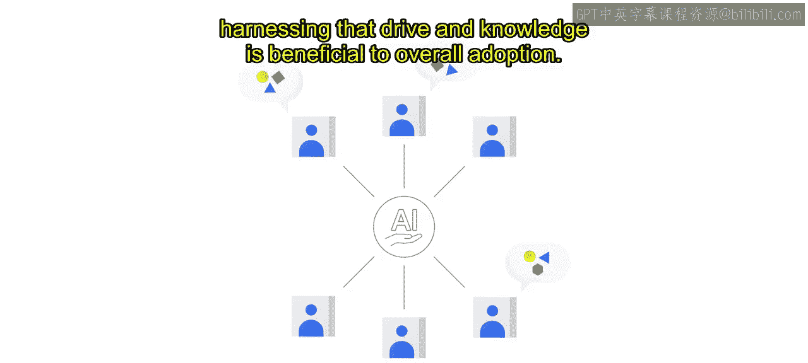

### 获取自上而下与自下而上的支持 🔄

关于AI原则的采纳，我们认识到同时获得自上而下和自下而上的支持与参与非常重要。

高层领导授权采纳AI原则是必要的，但这还不够。我们了解到，真正的文化变革需要整个组织的广泛采纳。

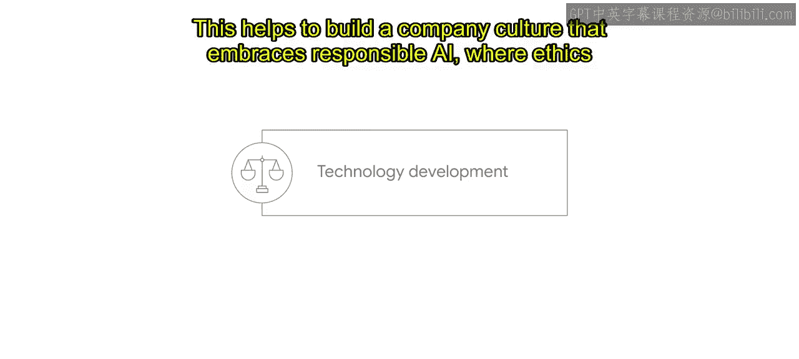

我们的经验是，团队自下而上的参与有助于使其常态化，是将负责任AI嵌入公司文化的关键一步。同样根据我们的经验，团队通常会对负责任AI这一主题非常感兴趣，并且往往对此有自己的见解和信念。利用这种驱动力和知识，有利于整体的采纳。

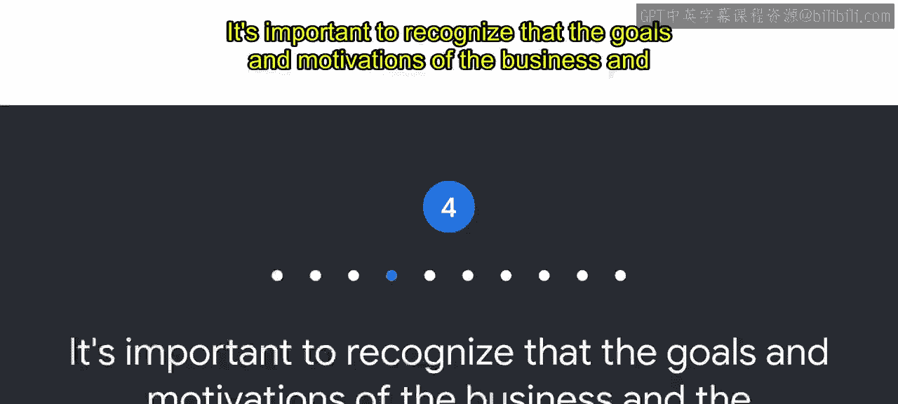

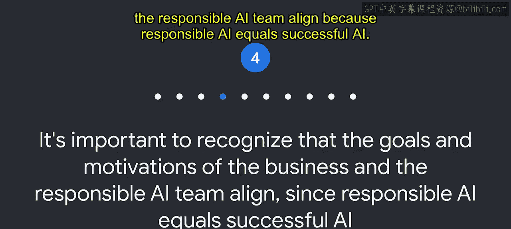

### 通过教育推动文化变革 📚

在谷歌，负责任AI的采纳源于对团队的教育。因此，我们建议您对产品和技术团队进行技术伦理培训，并鼓励非技术利益相关者理解AI的技术、商业和社会影响。

这有助于建立一种拥抱负责任AI的公司文化，将伦理道德直接与技术开发和产品卓越性联系起来。

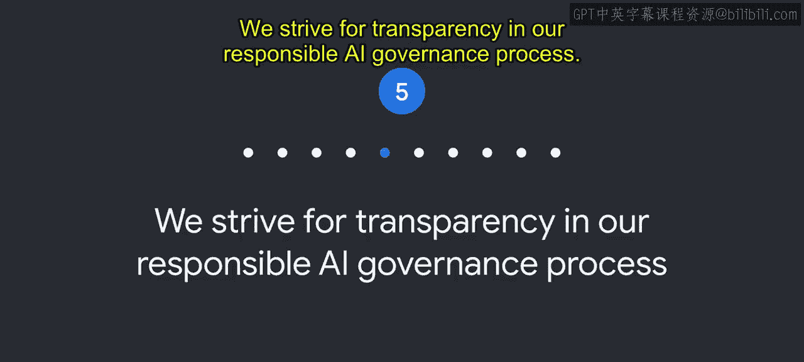

### 明确商业目标与伦理目标的一致性 🤝

认识到商业目标与负责任AI团队的目标和动机是一致的，这一点很重要，因为**负责任的AI = 成功的AI**。

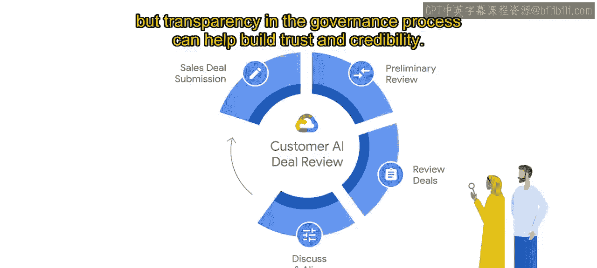

构建负责任的AI产品意味着直面伦理问题和困境，有时需要放慢脚步以找到正确的前进道路。在此，商业动机和负责任AI的动机可能看似冲突，但实际上，发布一个对所有人都运行良好的产品，既有利于商业，也有利于世界。

### 追求治理流程的透明度 🔍

我们努力在负责任AI的治理流程中实现透明。

我们相信，围绕我们的流程和相关人员的透明度能够建立信任。虽然通常需要对个别审查的细节保密，但治理流程的透明度有助于建立信任和可信度。

### 建立可追溯的决策记录系统 📝

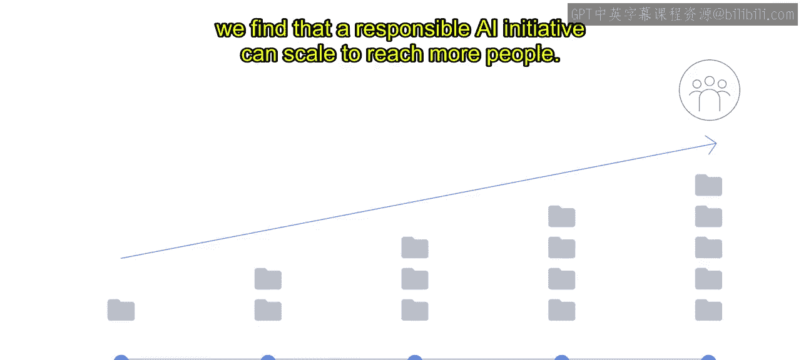

在谷歌，我们还认识到，我们现在所做的工作会影响未来的决策。因此，我们建议开发一个系统来跟踪一致性计划，包括问题、缓解措施和先例。

谷歌审查团队的一个具体目标是识别模式并保存记录，以追踪决策及其制定过程，从而为未来的工作和审查提供信息。该系统还有助于向利益相关者提供透明度，表明审查团队遵循了一条经过验证的可信路径来做出决策。

通过这种能在整个组织内提供一致信息的文档，我们发现负责任AI的倡议可以扩展到覆盖更多人。

### 保持谦逊与开放演进的态度 🌱

在我们的负责任AI之旅中，我们也认识到了保持谦逊态度的重要性。AI技术正在飞速变化，我们的世界也非静止不变。

我们尝试有意识地记住，我们始终在学习，并且总能改进。我们相信，必须在确保解读的一致性与对新研究和新信息保持开放和响应之间保持微妙的平衡。随着我们实施负责任AI实践，我们相信保持开放演进的态度将使我们能够做出最佳、最明智的决策。

### 投资于心理安全感 💡

我们认识到了投资于心理安全感的好处。当一个团队拥有心理安全感时，他们通常会感到可以安全地承担风险，并在彼此面前展现脆弱性。

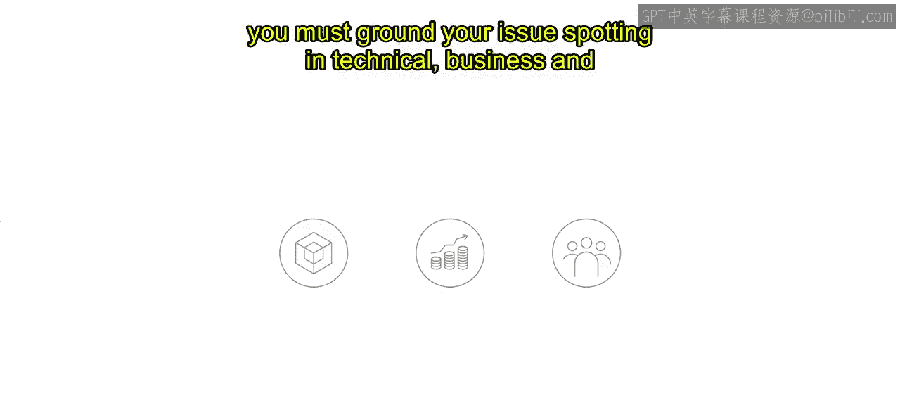

在审查过程中，团队需要感到自在地探索“如果……会怎样”的问题和滥用领域，以便共同发现潜在问题。然而，尽管探索所有潜在问题是此过程中的重要一步，但为了避免“分析瘫痪”，在制定全面的防护措施之前，你必须将问题发现建立在技术、商业和社会的现实基础之上。

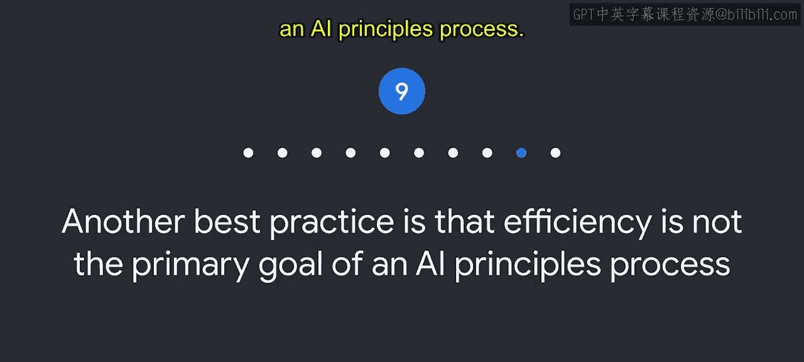

### 平衡效率与全面审查 ⚖️

另一项最佳实践是：效率并非AI原则流程的首要目标。

需要在产品开发目标与进行全面AI审查所需的时间之间取得平衡。如果过于关注效率，可能会错过那些给客户带来后续伤害的潜在问题。

尽管我们的AI原则需要解读并包含试错的成分，但它们仍然需要支持业务的速度和规模。深思熟虑和健康的异议为人们提供了探索风险和缓解措施的空间。但一个周到且稳健的伦理流程也意味着要支持产品开发目标。

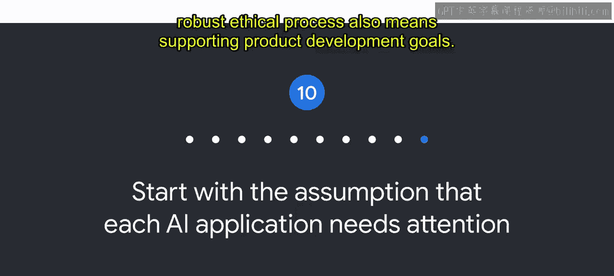

### 预设每个AI应用都需要关注 🎯

从一个假设开始：每个AI应用都需要关注。伦理问题并非总是源于最明显的争议性用例和AI产品。即使是看似有益或无伤大雅的AI用例，也可能存在相关的问题和风险。

这个假设推动我们去想象“如果……会怎样”，并探索所有可能的场景，以便制定一套全面的缓解措施。我们的AI原则审查正是指导这些对话的框架。

## 总结

本节课中，我们一起学习了谷歌从实施AI原则中总结出的一系列最佳实践。这些实践涵盖了从组建多元化团队、获取组织支持，到建立透明流程和保持谦逊态度等多个方面。核心在于认识到，负责任的AI开发不仅是伦理要求，更是商业成功的关键。我们希望这些实践能对您创建和实施自己的负责任AI流程有所帮助，并随着时间推移不断演进。