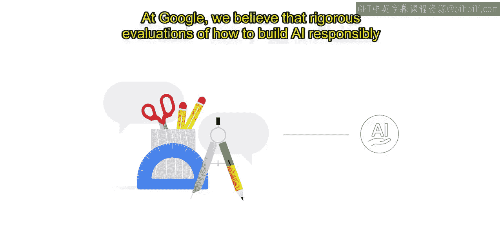
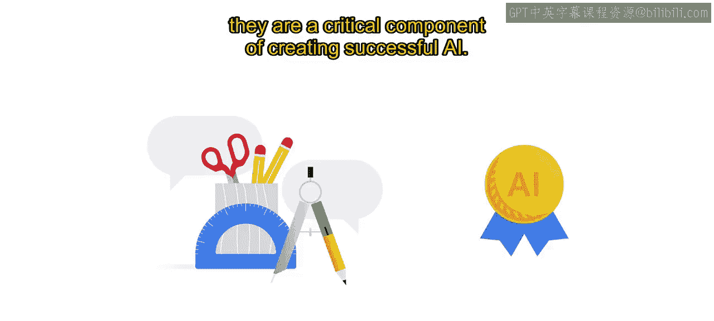
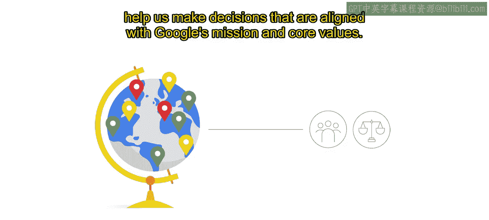
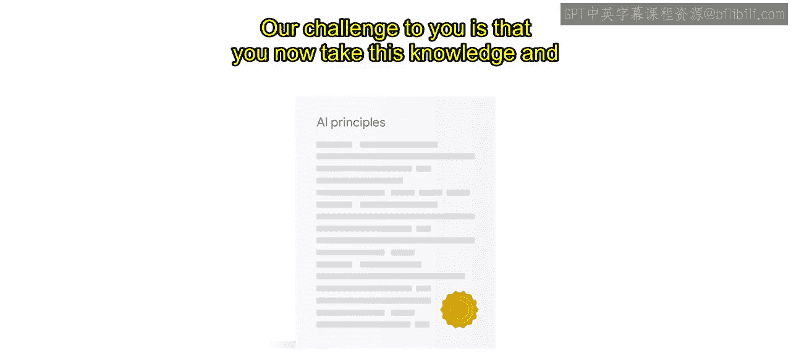

生成式AI学习路径：P20：迈向负责任的AI之旅 🚀

在本节课中，我们将学习谷歌如何构建负责任的AI，并探讨如何将相关原则与实践应用到您自己的项目中。

---

在谷歌，我们坚信对如何负责任地构建AI进行严格评估，不仅是正确之举，更是创造成功AI的关键组成部分。

上一节我们了解了负责任AI的重要性，本节中我们来看看谷歌如何将这一理念付诸实践。

我们的产品和技术应服务于所有人。我们的AI原则激励我们为一个共同目标而努力，指导我们以最符合全球人民利益的方式使用先进技术，并帮助我们做出符合谷歌使命和核心价值观的决策。

我们每个人在负责任AI的应用中都扮演着角色。

我们的目标是，通过本课程的学习，您能理解谷歌如何制定其AI原则，以及如何在组织内部将其付诸实践。

我们希望您能将本次培训中学到的经验教训和最佳实践作为一个起点，与您的团队合作，进一步推进您的负责任AI战略。

我们对您的挑战是，现在请运用这些知识，制定您自己的AI原则及相应的审查流程。

无论您在AI之旅中处于哪个阶段，一个有价值的目标是与您的团队讨论，在您自身业务背景下，负责任AI意味着什么。

这些讨论将有助于您勾勒出自己的AI原则。

我们深知，无论是人类系统还是AI驱动的系统，都永远不会完美无缺，因此我们认为改进的任务永无止境。

我们期待继续向您更新我们的所学与进展。

我们在谷歌和谷歌云的负责任AI页面上分享这些信息。

如果您想迈出下一步，与谷歌合作开展您的下一个项目或实现业务目标，您可以随时联系当地的谷歌云客户代表或谷歌云机器学习专业合作伙伴。

如果您对负责任AI有具体问题，可以直接联系谷歌云负责任AI团队。

我们对负责任AI的承诺坚定不移。

感谢您加入我们的旅程，与我们一同学习。

---

本节课中，我们一起学习了谷歌构建负责任AI的核心理念与实践方法，包括其AI原则的制定、组织内的实施，以及如何将这些经验作为起点，应用到您自己的团队和项目中。