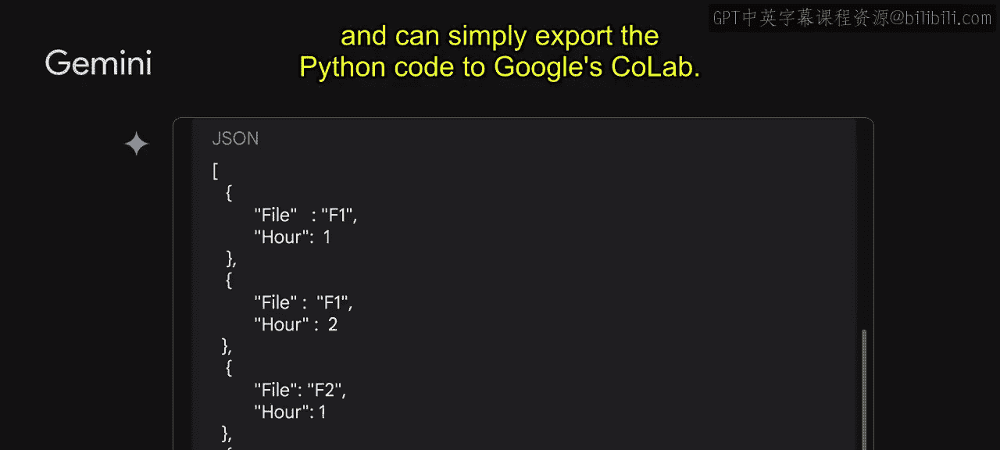
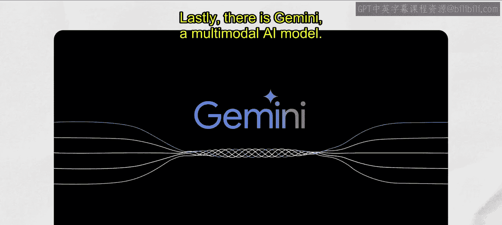

# 001：生成式AI简介

## 概述

在本节课中，我们将学习生成式人工智能的基本概念。我们将从定义生成式AI开始，探讨它与人工智能、机器学习、深度学习的关系，并了解其工作原理、模型类型以及实际应用。

---

## 什么是生成式AI？

生成式AI已成为一个流行词汇，但它究竟是什么？生成式AI是一种人工智能技术，能够生成各种类型的内容，包括文本、图像、音频和合成数据。

为了深入理解生成式AI，我们首先需要了解人工智能的背景。人工智能是计算机科学的一个分支，致力于创造能够推理、学习和自主行动的智能代理和系统。机器学习是人工智能的一个子领域，它通过输入数据训练模型，使模型能够从用于训练它的同一分布中提取的新数据中做出有用的预测，这意味着机器学习让计算机具备了无需显式编程即可学习的能力。

上一节我们介绍了人工智能和机器学习的基本概念，本节中我们来看看机器学习中两种最常见的模型类型。

以下是两种主要的机器学习模型类别：

*   **监督学习模型**：模型使用带有标签的数据进行训练。标签数据是带有名称、类型或数字等标记的数据。
*   **无监督学习模型**：模型使用未标记的数据进行训练。无监督学习旨在发现数据中自然形成的分组或模式。

理解这些概念是理解生成式AI的基础。在监督学习中，测试数据值X作为模型的输入，模型输出预测值，并与用于训练的实际值进行比较。如果预测值与实际值相差较大，则称为误差。模型会不断尝试减少这个误差，这是一个经典的优化问题。

---

## 深度学习与生成式AI

到目前为止，我们已经探讨了人工智能与机器学习、监督学习与无监督学习的区别。接下来，让我们简要了解深度学习作为机器学习方法的一个子集，以及生成式AI在其中的位置。

机器学习是一个涵盖多种技术的广泛领域，而深度学习是机器学习的一种类型，它使用人工神经网络，使其能够处理比传统机器学习更复杂的模式。人工神经网络受人脑启发，由许多相互连接的节点或神经元组成，可以通过处理数据和做出预测来学习执行任务。

深度学习模型通常具有许多神经元层，这使它们能够学习比传统机器学习模型更复杂的模式。神经网络可以同时使用标记和未标记的数据，这被称为**半监督学习**。在半监督学习中，神经网络使用少量标记数据和大量未标记数据进行训练。标记数据帮助神经网络学习任务的基本概念，而未标记数据则帮助神经网络泛化到新的示例。

现在，我们终于可以探讨生成式AI在这个AI学科中的位置了。生成式AI是深度学习的一个子集，这意味着它使用人工神经网络，并可以通过监督、无监督和半监督方法处理标记和未标记的数据。大语言模型也是深度学习的一个子集。

---

## 生成式模型与判别式模型

深度学习模型或广义的机器学习模型可以分为两种类型：生成式和判别式。

*   **判别式模型**：用于对数据点进行分类或预测标签。它学习数据点特征与标签之间的关系，训练完成后可用于预测新数据点的标签。判别式模型学习的是**条件概率分布** `P(Y|X)`，即在给定输入X的情况下，输出Y的概率。
*   **生成式模型**：基于现有数据学习到的概率分布生成新的数据实例。生成式模型学习的是**联合概率分布** `P(X, Y)`，然后可以预测条件概率并生成新的内容。

**总结来说，生成式模型可以生成新的数据实例，而判别式模型则用于区分不同类型的数据实例。**

再来看一个快速示例。下图展示了传统机器学习模型，它试图学习数据与标签（或你想要预测的内容）之间的关系。而下图则展示了生成式AI模型，它试图学习内容的模式，以便能够生成新的内容。

那么，如果有人挑战你玩一个“这是否是生成式AI”的游戏呢？下图展示了一种区分生成式AI与非生成式AI的好方法。

*   **不是生成式AI**：当输出（Y或标签）是一个数字、一个类别（例如，垃圾邮件/非垃圾邮件）或一个概率时。
*   **是生成式AI**：当输出是自然语言（如语音或文本）、音频或图像时。

让我们用一点数学来真正展示这种差异。从数学上可视化，`y = f(x)` 这个方程计算的是给定不同输入时，一个过程的因变量输出。Y代表模型输出，f代表计算或模型中使用的函数，x代表公式中使用的输入。**如果Y是一个数字（如预测销售额），则不是生成式AI；如果Y是一个句子（如“定义销售额”），则是生成式AI**，因为这个问题会引发一个基于模型已训练的海量大型数据的文本响应。

---

## 生成式AI的工作原理

传统的机器学习监督学习过程使用训练代码和标记数据来构建模型。根据用例或问题，模型可以给你一个预测、对某物进行分类或进行聚类。现在，让我们看看相比之下生成式AI的过程有多么强大。

生成式AI过程可以使用所有数据类型的训练代码、标记数据和未标记数据来构建一个**基础模型**。然后，基础模型可以生成新的内容，包括文本、代码、图像、音频、视频等。

我们从传统编程发展到神经网络，再到生成式模型，走过了很长的路。在传统编程中，我们必须硬编码区分猫的规则。在神经网络浪潮中，我们可以给网络提供猫和狗的图片，并问“这是猫吗？”，它会预测是或不是。真正酷的是，在生成式浪潮中，我们作为用户可以生成自己的内容，无论是文本、图像、音频、视频还是其他。例如，像PaLM或LaMDA这样的模型从互联网上的多个来源摄取非常庞大的数据，并构建基础语言模型，我们只需通过提问（无论是输入提示还是口头说出提示）就可以使用。所以当你问它“什么是猫”时，它可以告诉你它学到的关于猫的一切。

现在，让我们用一个正式的定义来使事情更规范。**什么是生成式AI？**

生成式AI是一种人工智能，它根据从现有内容中学到的东西创建新的内容。从现有内容中学习的过程称为**训练**，其结果是一个统计模型的创建。当给定一个提示时，生成式AI使用统计模型来预测预期的响应可能是什么，从而生成新的内容。它学习数据的底层结构，然后可以生成与训练数据相似的新样本。

正如我之前提到的，生成式语言模型可以从它被展示的示例中学习，并基于这些信息创造出全新的东西。这就是我们使用“生成式”这个词的原因。但是，大语言模型只是生成式AI的一种类型，它们以听起来自然的语言形式生成新颖的文本组合。

*   **生成式图像模型**：以图像作为输入，可以输出文本、另一张图像或视频。
*   **生成式语言模型**：以文本作为输入，可以输出更多文本、图像、音频或决策。

我提到生成式语言模型通过训练数据学习语言模式。看看这个例子。根据从训练数据中学到的东西，它提供了如何完成这个句子的预测：“我正在做一个花生酱和……果酱三明治”。很简单，对吧？所以给定一些文本，它可以预测接下来会发生什么。因此，生成式语言模型是**模式匹配系统**。它们根据你提供的数据学习模式。

生成式AI的力量来自于**Transformer**的使用。Transformer在2018年引发了自然语言处理的革命。在高层次上，Transformer模型由一个编码器和一个解码器组成。编码器对输入序列进行编码并将其传递给解码器，解码器学习如何解码表示以完成相关任务。

然而，Transformer有时也会遇到问题。**幻觉**是指模型生成的通常无意义或语法不正确的单词或短语。幻觉可能由多种因素引起，例如模型训练数据不足、训练数据嘈杂或不干净、上下文不足或约束不足。幻觉对于Transformer来说可能是一个问题，因为它们会使输出文本难以理解，也可能使模型更有可能生成不正确或误导性的信息。所以简单来说，幻觉是不好的。

---

## 提示设计与模型类型

让我们稍微转换一下话题，谈谈提示。**提示**是提供给大语言模型作为输入的一小段文本，它可以用于以多种方式控制模型的输出。**提示设计**是创建能够从LLM生成所需输出的提示的过程。

正如我之前提到的，生成式AI在很大程度上取决于你输入的训练数据。它分析输入数据的模式和结构从而学习。通过访问基于浏览器的提示，你作为用户可以生成自己的内容。

那么，让我们谈谈当文本是我们的输入时，可用的模型类型有哪些，以及它们如何有助于解决问题。

以下是几种主要的输入-输出模型类型：

*   **文本到文本**：模型接受自然语言输入并产生文本输出。这些模型被训练来学习文本对之间的映射，例如，从一种语言翻译成其他语言。
*   **文本到图像**：模型在大量图像上训练，每张图像都附有简短的文本描述。扩散是用于实现此目的的一种方法。
*   **文本到视频和文本到3D**：文本到视频模型旨在从文本输入生成视频表示。文本到3D模型生成与用户文本描述相对应的三维对象，用于游戏或其他3D世界。
*   **文本到任务**：模型被训练为基于文本输入执行定义的任务或操作。这个任务可以是广泛的动作，例如回答问题、执行搜索、进行预测或采取某种行动。

另一个比我提到的这些模型更宏观的概念是**基础模型**，它是一个在大量数据上预训练的大型AI模型，旨在适应或微调到广泛的下游任务，例如情感分析、图像描述和物体识别。基础模型有潜力彻底改变许多行业。如果你正在寻找基础模型，Vertex AI提供了一个包含基础模型的模型花园。

---

## 生成式AI的应用与工具

那么，生成式AI能帮助你的应用程序编写代码吗？当然可以。这里展示的是生成式AI应用程序，你可以看到有很多。让我们看一个代码生成的例子。在这个例子中，我输入了一个代码文件转换问题，从Python转换为JSON。我使用Gemini并插入提示框，它返回了我需要执行的步骤，并且我的输出是JSON格式。

**总结来说，像Gemini这样的代码生成可以帮助你：**
*   调试源代码行。
*   逐行向你解释代码。
*   为你的数据库编写SQL查询。
*   将代码从一种语言翻译到另一种语言。
*   为源代码生成文档和教程。

我将告诉你Google Cloud可以帮助你从生成式AI中获得更多价值的另外三种方式。

*   **Vertex AI Studio**：让你可以快速探索和定制生成式AI模型，以便在Google Cloud上的应用程序中利用。
*   **Vertex AI Search and Conversation**：对于那些没有太多编码经验的人特别有帮助。你可以用很少或无需编码且无需先前的机器学习经验，为客户和员工构建生成式AI搜索和对话功能。
*   **PaLM API**：让你测试和试验Google的大语言模型和生成式AI工具，使原型设计更快、更容易上手。

最后，还有**Gemini**，一个多模态AI模型。与传统的语言模型不同，它不局限于理解文本，还可以分析图像、理解音频的细微差别，甚至解释编程代码。这使得Gemini能够执行以前AI不可能完成的复杂任务。

---

## 总结

本节课中，我们一起学习了生成式人工智能的基础知识。我们从定义生成式AI开始，明确了它是人工智能和深度学习的一个子集。我们区分了生成式模型与判别式模型的核心差异，了解了生成式AI如何通过学习数据模式来创造新内容。我们还探讨了Transformer架构的重要性、提示设计的作用，以及文本到文本、文本到图像等多种模型类型。最后，我们简要介绍了生成式AI在代码生成等领域的应用，以及Google Cloud提供的相关工具，如Vertex AI和Gemini模型。现在，你已经掌握了生成式AI的基本概念，为进一步探索其强大潜力奠定了基础。