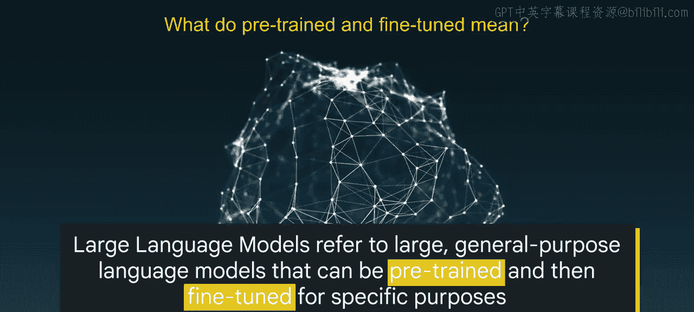
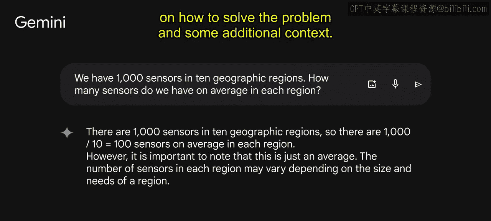
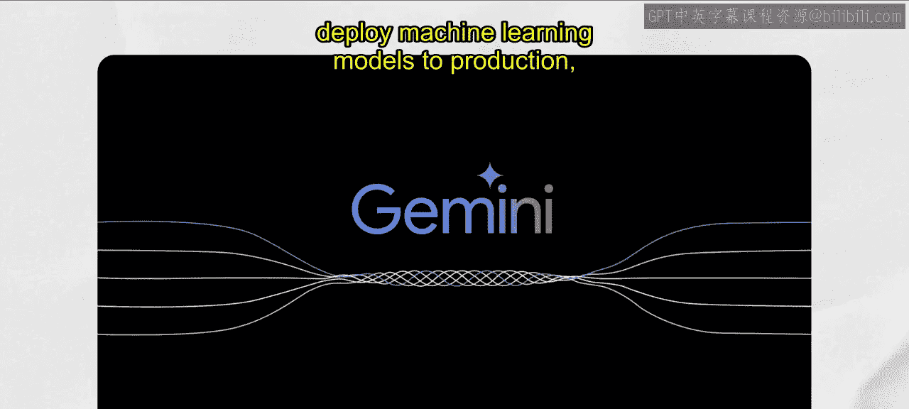
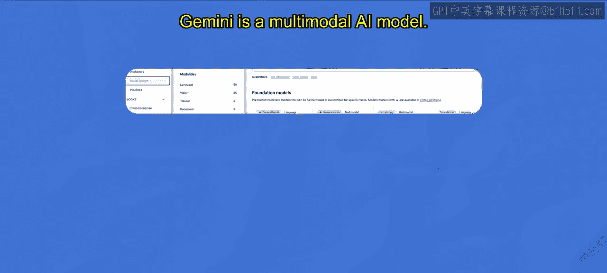
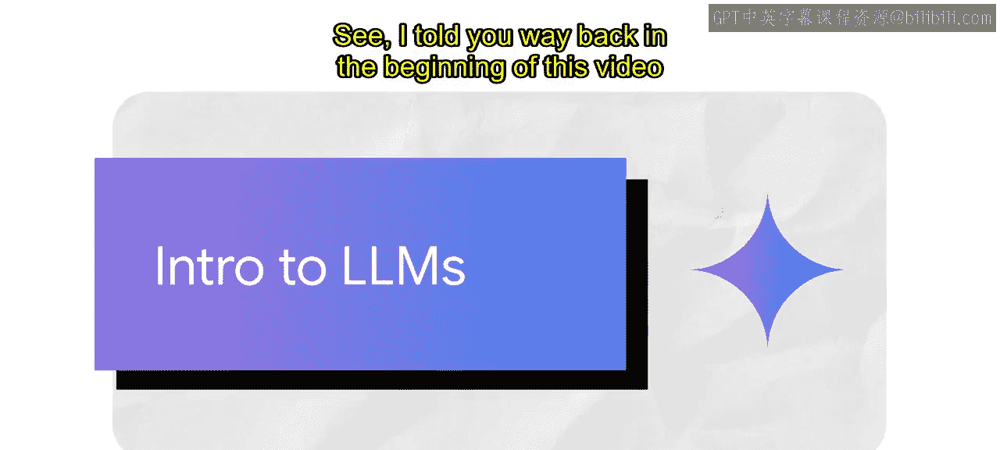

# 002：大语言模型简介 🧠

在本节课中，我们将要学习大语言模型（LLM）的核心概念、应用场景、提示调优方法以及谷歌的相关开发工具。

---

## 什么是大语言模型？🤔

上一节我们介绍了生成式AI的概览，本节中我们来看看其核心组成部分之一：大语言模型。

大语言模型（LLM）是深度学习的一个子领域。深度学习是人工智能的一个分支。你可能也经常听到另一个AI领域：生成式AI。这是一种能够生成新内容（包括文本、图像、音频和合成数据）的人工智能。

那么，什么是大语言模型？大语言模型指的是大型通用语言模型，它们可以进行预训练，然后针对特定目的进行微调。

“预训练”和“微调”是什么意思？让我们深入探讨。想象一下训练一只狗。你通常会训练它基本指令，如坐下、过来和等待。这些指令通常足以应对日常生活，帮助你的狗成为好公民。但如果你需要一只特殊的工作犬，例如警犬、导盲犬或猎犬，你就需要增加特殊训练，对吗？类似的概念也适用于大语言模型。

这些模型为通用目的而训练，以解决跨行业的常见语言问题，例如文本分类、问答、文档摘要和文本生成。然后，可以使用相对较小的领域特定数据集，对这些模型进行调整，以解决零售、金融和娱乐等不同领域的具体问题。

---

## 大语言模型的三大特征 🔑

现在你已经理解了基本概念，让我们进一步将其分解为大语言模型的三个主要特征。

我们从“大”这个词开始。“大”有两层含义。第一是指训练数据集的巨大规模，有时达到PB级别。第二是指机器学习中的参数数量。参数通常被称为超参数。参数本质上是机器从模型训练中学到的记忆和知识。参数定义了模型在解决问题（如预测文本）方面的技能。这就是我们使用“大”这个词的原因。

什么是“通用目的”？通用目的是指模型足以解决常见问题。导致这一理念的原因有两个。首先是人类语言的共性，无论具体任务是什么。其次是资源限制。只有某些组织有能力用海量数据集和巨量参数来训练这样的大语言模型。何不让它们创建基础语言模型供他人使用呢？

这就引出了我们最后的术语：“预训练”和“微调”。这意味着用大型数据集为通用目的预训练大语言模型，然后用小得多的数据集针对特定目标进行微调。

---

## 大语言模型的应用场景 💡

既然我们已经明确了大语言模型（LLM）的定义，接下来我们可以继续描述LLM的用例。

使用大语言模型的好处是直接的。以下是主要优势：

首先，单个模型可用于不同的任务。这是一个梦想成真。这些用PB级数据训练并生成数十亿参数的大语言模型足够智能，可以解决不同的任务，包括语言翻译、句子补全、文本分类、问答等。

其次，当你调整大语言模型来解决你的特定问题时，它们只需要最少的领域训练数据。大语言模型即使只有很少的领域训练数据，也能获得不错的性能。换句话说，它们可以用于少样本甚至零样本场景。在机器学习中，少样本指用最少的数据训练模型，零样本意味着模型可以识别在训练前未明确教授过的事物。

第三，当你添加更多数据和参数时，大语言模型的性能会持续增长。让我们以PaLM为例。2022年4月，谷歌发布了PaLM（Pathways语言模型），这是一个拥有5400亿参数的模型，在多项语言任务中实现了最先进的性能。PaLM是一个密集的、仅解码器的Transformer模型。它利用了新的Pathway系统，使谷歌能够高效地在多个TPU V4 Pod上训练单个模型。Pathway是一种新的AI架构，可以同时处理许多任务，快速学习新任务，并反映对世界更好的理解。该系统使PaLM能够为加速器编排分布式计算。

我之前提到PaLM是一个Transformer模型，让我解释一下这意味着什么。Transformer模型由编码器和解码器组成。编码器对输入序列进行编码，并将其传递给解码器，解码器学习如何为相关任务解码这些表示。它们从传统编程到神经网络，再到生成模型，已经走过了很长的路。

在传统编程中，我们过去必须硬编码区分猫的规则：动物腿=4，耳朵=2，毛皮=是，喜欢毛线和猫薄荷。在神经网络浪潮中，我们可以给网络猫和狗的图片并问：“这是猫吗？”，它们会预测是猫。真正酷的是，在生成浪潮中，我们作为用户可以生成自己的内容，无论是文本、图像、音频、视频还是其他。例如，像PaLM（Pathways语言模型）或LaMDA（对话应用语言模型）这样的模型，只是从互联网上的多个来源获取非常、非常大的数据，并构建基础语言模型，我们可以简单地通过提问来使用，无论是输入提示词还是口头说出提示词本身。所以当你问它“什么是猫？”时，它可以告诉你它学到的关于猫的一切。

---

## LLM开发与传统ML开发对比 ⚖️

让我们比较一下使用预训练模型的LLM开发与传统ML开发。

首先，对于LLM开发，你不需要成为专家，不需要训练示例，也不需要训练模型，你只需要考虑提示设计。提示设计是创建一个清晰、简洁且信息丰富的提示的过程。它是自然语言处理（简称NLP）的重要组成部分。

在传统机器学习中，你需要专业知识、训练示例、计算时间和硬件。这比LLM开发的要求多得多。

让我们看一个文本生成的用例示例，以真正阐明这一点。问答（QA）是自然语言处理的一个子领域，处理自动回答以自然语言提出的问题的任务。QA系统通常在大量文本和代码上进行训练，能够回答广泛的问题，包括事实性、定义性和基于观点的问题。这里的关键是，你需要领域知识来开发这些问答模型。

让我们用一个真实世界的例子来澄清这一点。开发用于客户支持、医疗保健或供应链的问答模型需要领域知识，但使用生成式QA，模型直接基于上下文生成自由文本，不需要领域知识。让我再给你展示几个例子，看看这有多酷。

让我们看看向Gemini（谷歌AI开发的大语言模型聊天机器人）提出的三个问题。

问题1：今年的销售额是10万美元。支出是6万美元。净利润是多少？Gemini首先分享了净利润的计算方法，然后执行计算，接着提供了净利润的定义。

问题2：手头有6000个单位。一个新订单需要8000个单位。我需要补充多少单位才能完成订单？同样，Gemini通过执行计算来回答问题。

问题3：我们在10个地理区域有1000个传感器。每个区域平均有多少个传感器？Gemini通过一个如何解决问题的例子和一些额外的上下文来回答问题。

---

## 提示设计与提示工程 🎯

那么，在我们的每个问题中，是如何获得期望的响应的呢？这是由于提示设计。

提示设计和提示工程是自然语言处理中两个密切相关的概念。两者都涉及创建一个清晰、简洁且信息丰富的提示的过程，但两者之间存在一些关键区别。

提示设计是创建一个针对系统被要求执行的特定任务而定制的提示的过程。例如，如果系统被要求将文本从英语翻译成法语，提示应该用英语书写，并应指定翻译应为法语。

提示工程是创建一个旨在提高性能的提示的过程。这可能涉及使用领域特定知识、提供期望输出的示例或使用已知对该特定系统有效的关键词。

一般来说，提示设计是一个更通用的概念，而提示工程是一个更专业的概念。提示设计是必不可少的，而提示工程仅对需要高度准确性或性能的系统才是必要的。

---

## 大语言模型的类型与提示方法 📝

有三种大语言模型：通用模型、指令调优模型和对话调优模型。每种都需要不同的提示方式。

让我们从通用语言模型开始。通用语言模型根据训练数据中的语言预测下一个词。这是一个通用语言模型的例子：在这个例子中，“the cat sat on the”下一个词应该是“mat”，你可以看到“the”最可能是下一个词。可以将这种模型类型视为搜索中的自动补全。

接下来是指令调优模型。这种类型的模型被训练来预测对输入中给出的指令的响应。例如：“总结X的文本。”“生成一首X风格的诗。”“根据语义相似度给我一个X的关键词列表。”在这个例子中：“将文本分类为中性、负面或正面。”

最后是对话调优模型。这种模型通过下一个响应被训练来进行对话。对话调优模型是指令调优的一个特例，其中请求通常被框定为对聊天机器人的问题。对话调优期望在较长的来回对话的上下文中进行，并且通常在自然的问题式措辞下效果更好。

思维链推理是一个观察结果，即模型在首先输出解释答案原因的文本时，更有可能得到正确答案。让我们看看这个问题：“罗杰有五个网球。他又买了两罐网球。每罐有三个网球。他现在有多少个网球？”这个问题最初提出时没有响应，模型直接得到正确答案的可能性较小。然而，当第二个问题被提出时，输出更有可能以正确答案结束。

---

## 模型调优与高效方法 ⚙️

但是有一个问题。总是有一个问题。一个能做所有事情的模型有实际限制。但任务特定调优可以使LLM更可靠。Vertex AI提供了任务特定的基础模型。

让我们通过一些真实世界的例子来了解如何进行调优。假设你有一个用例，需要收集客户对你的产品或服务的感受，你可以使用情感分析任务模型。同样，如果你需要执行占用率分析，也有针对你用例的任务特定模型。

调优模型使你能够基于你希望模型执行的任务示例来定制模型响应。它本质上是通过在新数据上训练模型，使模型适应新领域或一组自定义用例的过程。例如，我们可以收集训练数据，并专门为法律或医疗领域调优模型。

你还可以通过微调进一步调优模型，即你带入自己的数据集，通过调整LLM中的每个权重来重新训练模型。这需要一个大型训练任务并托管你自己的微调模型。这是一个在医疗数据上训练的医疗基础模型的例子。任务包括问答、图像分析、寻找相似患者等。

然而，微调成本高昂，在许多情况下不现实。那么，有没有更高效的调优方法？是的。参数高效调优。

---

## 总结 📚

本节课中我们一起学习了大语言模型（LLM）的核心概念。我们定义了什么是大语言模型，描述了它们的应用场景，解释了提示设计与工程的区别，并介绍了通过预训练、微调和参数高效调优来定制模型的方法。理解这些基础是有效利用生成式AI强大能力的关键第一步。