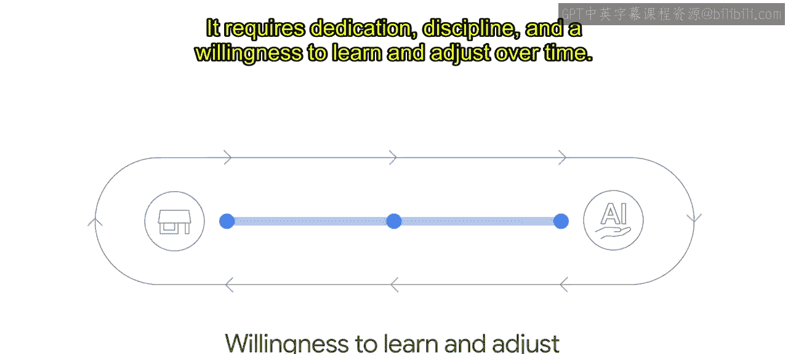

# 005：负责任AI的重要性与谷歌实践

在本节课中，我们将要学习负责任AI的概念、其必要性，以及谷歌如何将责任与伦理融入AI的开发与部署流程中。我们将探讨AI创新可能带来的意外影响，并理解建立负责任的文化与实践对于构建成功且可信赖的AI系统至关重要。

---

## 技术创新与伴随的责任

我们许多人依赖技术创新来帮助过上幸福健康的生活。

无论是规划最佳回家路线，还是在身体不适时寻找正确的信息。

技术创新的机遇是巨大的。但这也伴随着技术提供商必须正确行事的重大责任。

## AI创新带来的潜在挑战

人们日益关注AI创新可能带来的一些非预期或不良影响。

这些担忧包括机器学习公平性问题、历史偏见的大规模延续、AI驱动的失业对未来工作的影响，以及AI所做决策的问责与责任归属问题。

我们将在课程后续部分更详细地探讨这些内容。

由于AI有潜力影响社会的许多领域，更不用说人们的日常生活，因此在开发这些技术时，将伦理考虑在内非常重要。

## 什么是负责任AI？🤔

负责任AI并不仅仅关注那些明显存在争议的用例。如果没有负责任的AI实践，即使是看似无害的AI用例或出于良好意图的用例，仍可能引发伦理问题、导致非预期结果，或者无法实现其应有的益处。

伦理和责任之所以重要，不仅因为它们代表了正确的行事方式，还因为它们可以指导AI设计，使其更能造福人们的生活。

在谷歌，我们认识到，将责任融入任何AI部署中，能构建出更好的模型，并与我们的客户以及客户的客户建立信任。

如果在任何环节这种信任被打破，我们将面临AI部署停滞、失败，或最坏情况下对相关利益方造成伤害的风险。

这都符合我们在谷歌的信念：**负责任AI = 成功AI**。

## 谷歌的负责任AI实践流程 🛠️

我们通过一系列评估和审查来做出关于AI的产品和业务决策。

这些流程确保了我们在不同产品领域和地区的方法上的一致性与严谨性。

这些评估和审查始于确保任何项目都符合我们的AI原则。

在本课程中，你将看到我们如何在谷歌，特别是在谷歌云内部，构建负责任AI的流程。

有时你可能会想，你们资源雄厚、人才济济，做起来当然容易。我们只有几个人，资源也有限。

你可能也会因为需要应对棘手的新哲学和实际问题而感到不知所措或畏惧。

正是在这里，我们向你保证，无论你的组织规模大小，本课程都将为你提供指导。负责任AI是一种迭代实践。它需要奉献精神、纪律性，以及随时间学习和调整的意愿。

## 开启你的负责任AI之旅 🚀

事实是这并不容易，但做对至关重要。因此，开启这段旅程，即使从小步骤开始，也是关键。

无论你已经走在负责任AI的道路上，还是刚刚起步，定期花时间反思公司的价值观以及你希望通过产品产生的影响，都将对负责任地构建AI大有裨益。

最后，在我们深入探讨之前，我们想在谷歌澄清一点：我们知道，在AI用户和开发者社区中，我们只代表一种声音。😊

我们在开发和部署这项强大技术时认识到，我们并不、也不可能知道和理解所有我们需要知道的事情。

只有当我们共同应对这些挑战时，我们才能做到最好。

## 社区与文化的力量 👥

确保AI被负责任地开发和使用的真正要素是社区。

我们希望这门课程能成为我们在这个重要议题上共同合作的起点。

虽然AI原则有助于一个团体基于共同的承诺站稳脚跟，但并非每个人都会同意每一个决策以及产品应如何负责任地设计。

这就是为什么建立人们可以信任的稳健流程非常重要，这样即使他们不同意最终决定，也会信任驱动该决策的过程。

简而言之，根据我们的经验，必须存在一种基于集体价值体系、并接受健康审议的文化，才能指导负责任AI的发展。

通过完成本课程，随着AI持续经历惊人的普及和创新，你本人也正在通过推进负责任AI开发的实践，为这种文化做出贡献。

---

## 总结

本节课中，我们一起学习了负责任AI的核心概念及其重要性。我们探讨了AI创新可能伴随的公平性、偏见、就业等社会挑战，并理解了将伦理考量融入技术开发的必要性。我们介绍了谷歌“负责任AI等于成功AI”的理念及其通过评估审查流程确保AI原则落地的实践。最后，我们认识到负责任AI是一个需要社区协作、文化建设和持续迭代的旅程，鼓励所有组织无论规模大小，都可以从小处着手，共同推动AI向更负责任、更可信赖的方向发展。