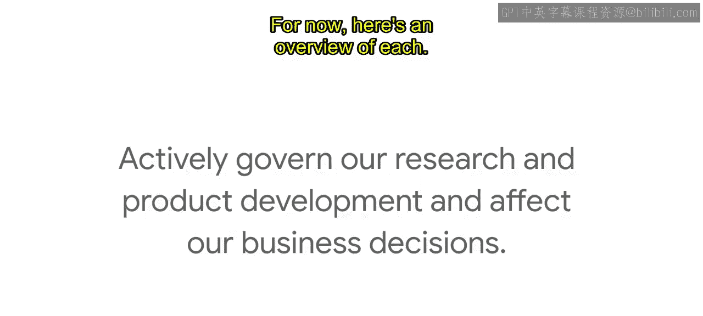
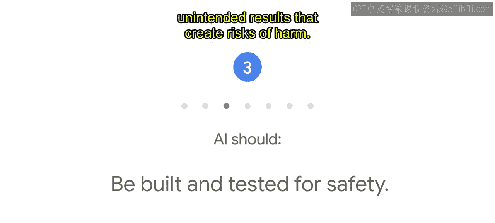
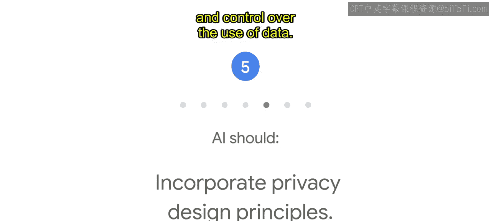
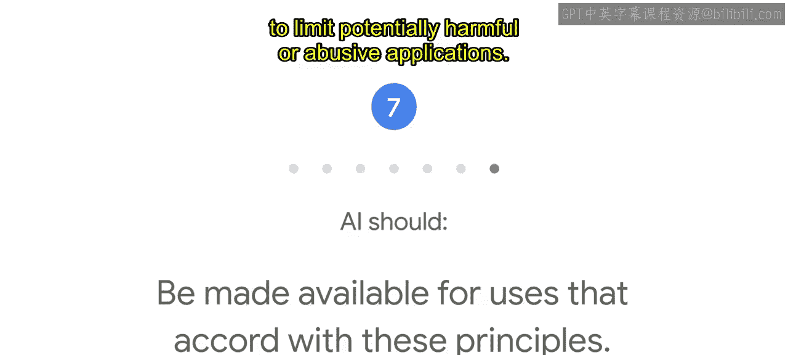
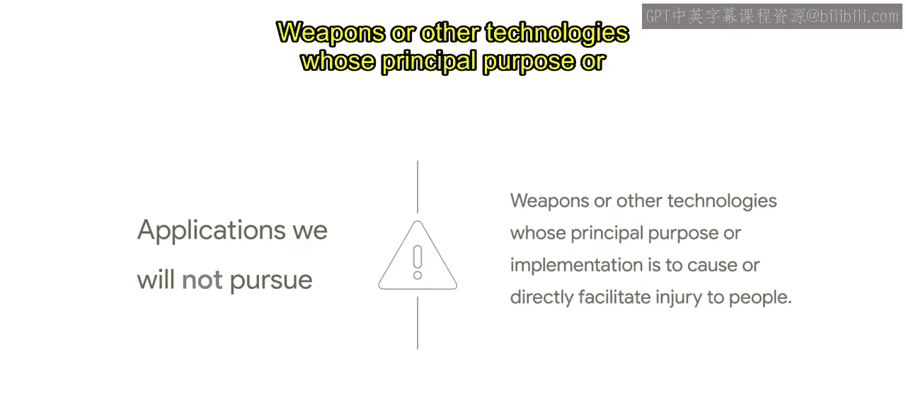
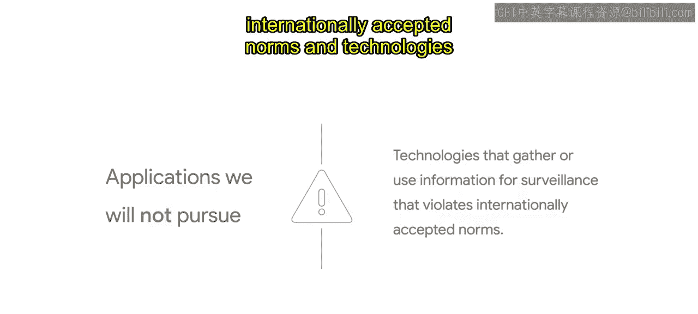
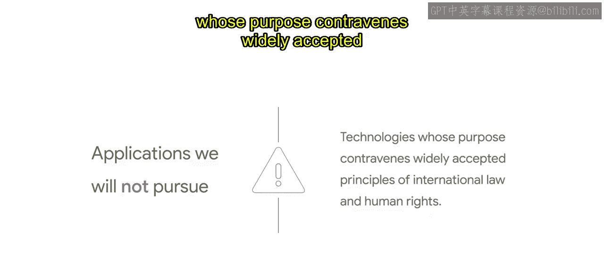
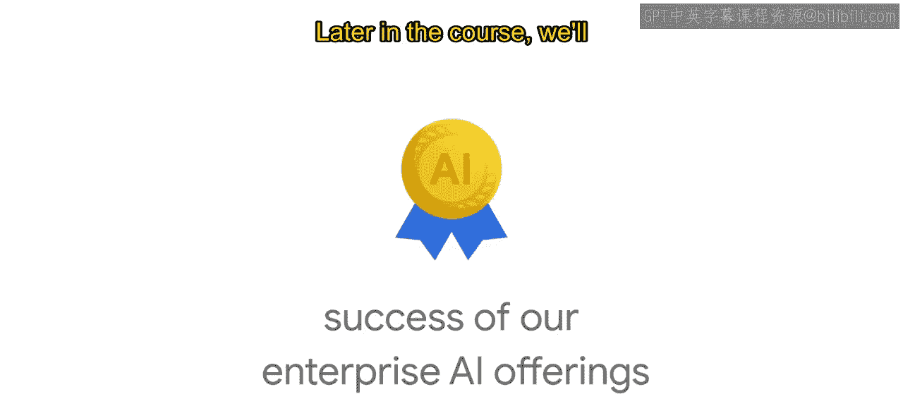
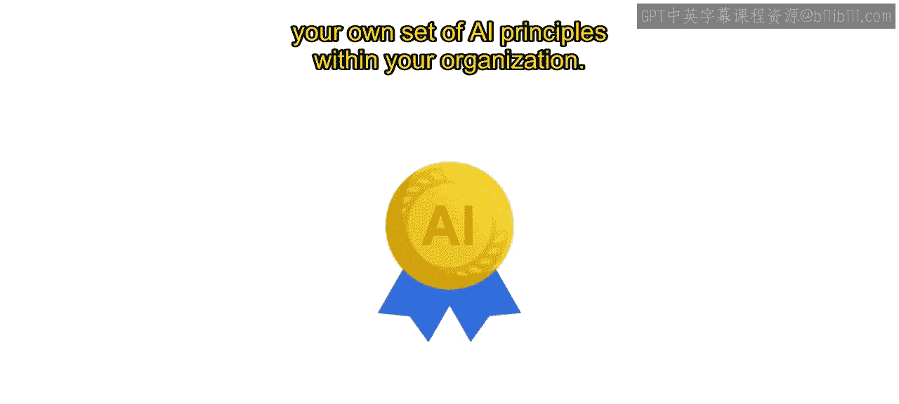

生成式AI学习路径：P6：Google的AI原则介绍 🧭

在本节课中，我们将要学习谷歌公司提出的七项人工智能原则。这些原则是谷歌在AI研究、产品开发和商业决策中遵循的具体标准，旨在确保AI技术对社会有益且负责任地发展。

---

作为AI领域的领导者，AI的开发和使用方式将在未来多年对社会产生重大影响。谷歌和谷歌云认识到，我们有责任妥善处理此事并确保其正确性。

2018年6月，我们宣布了七项指导我们工作的原则。这些是积极管理我们研究和产品开发、并影响我们商业决策的具体标准。

我们将在课程后面更深入地介绍这些原则及其发展过程。现在，我们先对每一项原则进行概述。

以下是谷歌AI的七项核心原则：

**一、AI应有益于社会。**
任何项目都应考虑广泛的社会和经济因素，并且只在我们认为总体可能的收益大大超过可预见的风险和不利因素时才会进行。

**二、AI应避免制造或加剧不公平偏见。**
我们力求避免对人们造成不公正的影响，特别是与敏感特征相关的影响，例如种族、民族、性别、国籍、收入、性取向、能力以及政治或宗教信仰。

**三、AI应基于安全目的构建和测试。**
我们将继续发展和应用强有力的安全实践，以避免产生可能造成伤害风险的意外结果。

**四、AI应对人类负责。**
我们将设计能提供适当反馈机会、相关解释和申诉渠道的AI系统。

**五、AI应融入隐私设计原则。**
我们将提供通知和同意的机会，鼓励采用具有隐私保护措施的架构，并对数据的使用提供适当的透明度和控制权。

**六、AI应坚持高标准的科学卓越性。**
我们将与一系列利益相关者合作，在此领域促进深思熟虑的领导力，借鉴科学严谨和多学科的方法，并通过发布教育材料、最佳实践和研究来负责任地分享AI知识，使更多人能够开发有用的AI应用。

**七、AI的应用应符合这些原则。**
许多技术都有多种用途，因此我们将努力限制可能有害或被滥用的应用。

---

除了这七项原则，还有一些特定的AI应用是我们不会追求的。我们不会在以下四个应用领域设计或部署AI：

1.  **会造成或可能造成整体伤害的技术。**

    

2.  **主要目的或实施方式是造成或直接促进人员伤害的武器或其他技术。**

    

    

3.  **收集或使用信息进行违反国际公认规范的监控的技术。**

    

4.  **目的违背国际法和人权广泛接受原则的技术。**

    

---

制定原则是一个起点，而非终点。

现实情况是，我们的AI原则很少直接给出关于如何构建产品的答案。

它们不能也不应让我们回避艰难的对话。它们是一个基础，确立了我们的立场、我们构建什么以及我们为何构建。它们也是我们企业AI产品成功的核心。

在课程后面，我们将提供一些建议，帮助你在组织内部制定一套自己的AI原则。

---

本节课中，我们一起学习了谷歌提出的七项AI原则及其四项禁止的应用领域。这些原则强调了AI技术发展应遵循**有益社会、公平、安全、负责、保护隐私、科学卓越和符合道德**的核心价值观，为负责任地开发和部署AI提供了基本框架。记住，原则是行动的指南，而非简单的答案，它们需要在实际应用中不断被审视和践行。