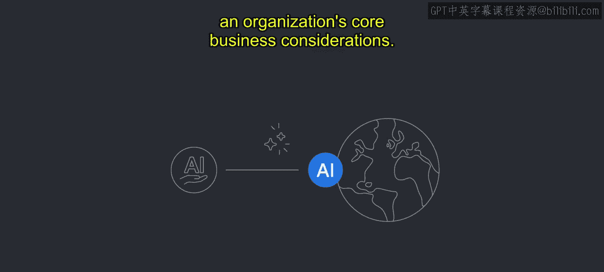
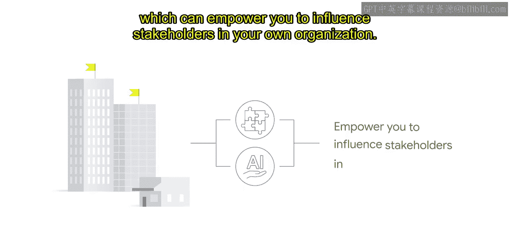
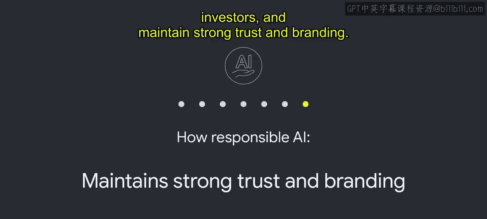

# 007：3_经济学人智库报告 📊

在本节课中，我们将要学习一份由经济学人智库（EIU）为谷歌撰写的报告，该报告深入探讨了负责任的人工智能（Responsible AI）如何为企业带来战略优势和商业价值。我们将了解报告的核心发现及其对组织的重要性。

---

普华永道的一项主要预测表明，到2030年，人工智能可能推动全球GDP增长14%，即高达**15.7万亿美元**。在谷歌，我们相信，**负责任、包容且公平地部署AI**是实现这一预测的关键因素。简而言之，我们认为，负责任的人工智能等同于能够长期获得信任并成功部署的人工智能。

我们还相信，负责任的人工智能项目和实践能为企业领导者带来战略和竞争优势。

为了深入探讨负责任人工智能的商业利益，我们赞助了一份原创报告，题为《保持领先：负责任人工智能的商业案例》。该报告由经济学人集团旗下的研究和分析部门——经济学人智库（EIU）编制。

上一节我们提到了报告的背景，本节中我们来看看报告的核心价值。这份报告展示了在一个日益由AI驱动的世界中，负责任AI实践的价值。它全面阐述了负责任AI对一个组织的核心商业考量可能产生的影响。

需要强调的是，为撰写本报告所收集的数据来源于广泛的数据驱动研究、行业专家访谈以及一项高管调查项目。该报告反映了AI开发者、部署AI的行业领导者以及AI最终用户的普遍看法。

我们将分享主要发现，并鼓励您阅读本课程资源部分提供的完整报告。我们希望您能利用这些要点，将您的商业目标与负责任AI计划联系起来，从而帮助您影响组织内的相关利益方。

接下来，我们具体了解报告的结构。该报告细分为七个部分，包含了关于负责任AI如何带来以下益处数据：
*   提升产品质量。
*   改善人才招聘、留任和参与度的前景。
*   有助于更好的数据管理、安全性和隐私保护。
*   为当前和未来的AI法规做好准备。
*   促进收入和利润的增长。
*   有助于加强与利益相关者和投资者的关系。
*   维持强大的信任和品牌声誉。

在下一个视频中，我们将详细探讨这七个部分。

---

本节课中我们一起学习了经济学人智库报告的核心内容。我们了解到，负责任的人工智能不仅是道德要求，更是实现长期商业成功（如推动高达**15.7万亿美元**的GDP增长）和获得竞争优势的关键战略。报告从七个方面系统阐述了负责任AI的商业价值，为组织将AI原则与业务目标结合提供了有力依据。