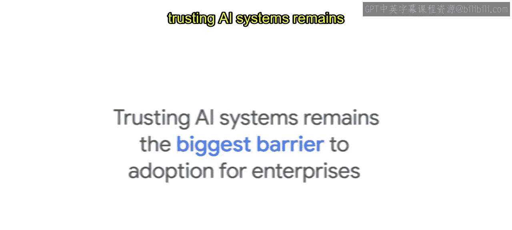
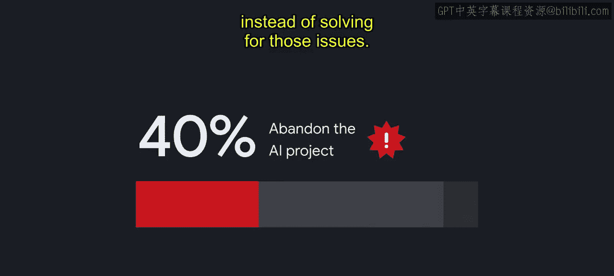
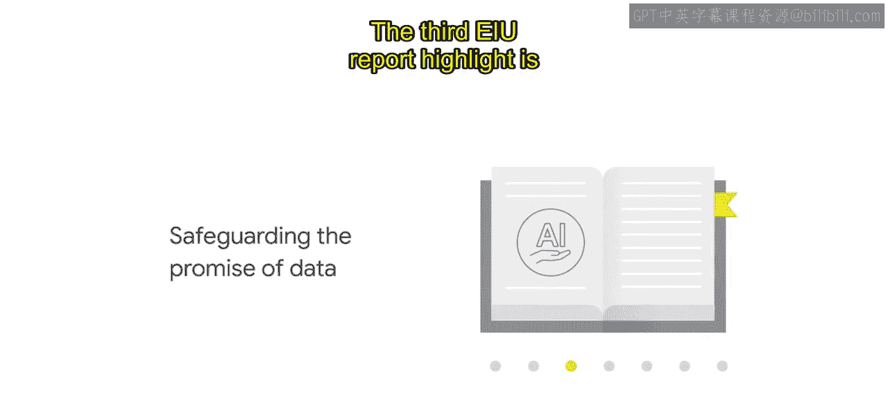
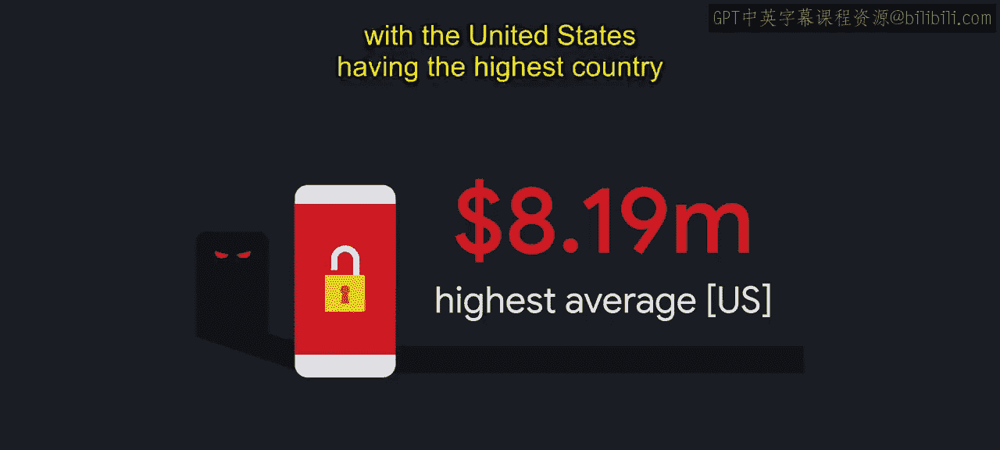
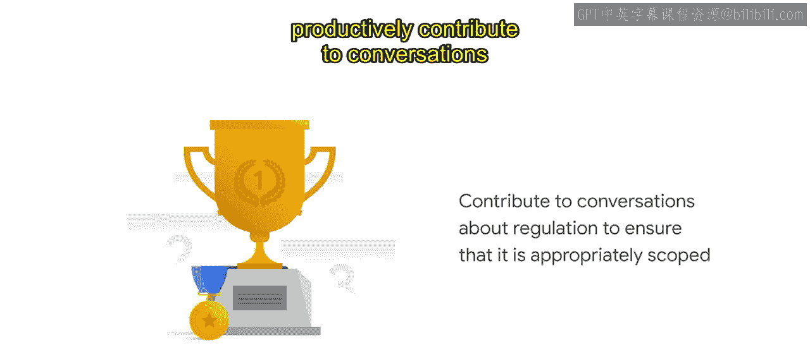
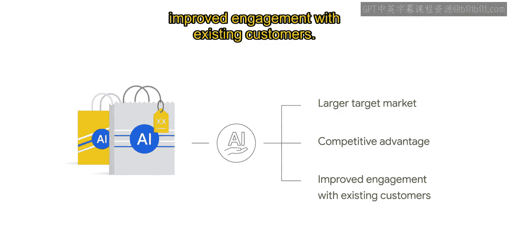
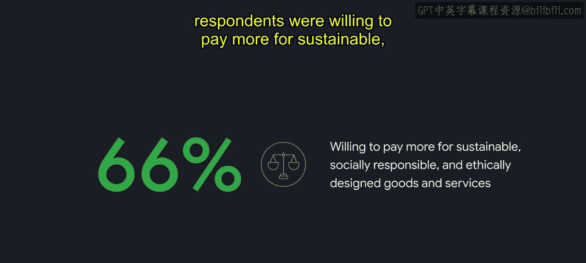

# 008：负责任创新的商业案例 📈

在本节课中，我们将一起探讨《经济学人智库报告》中关于负责任人工智能的七个商业亮点。我们将了解为何将负责任AI实践融入企业战略不仅是一项道德要求，更是一项明智的商业投资。

---

## 概述

本节内容基于《经济学人智库报告》，旨在阐述采纳负责任AI实践能为企业带来的具体商业价值。我们将逐一分析七个核心亮点，理解它们如何从产品开发、人才吸引、数据安全、法规遵从、收入增长、伙伴关系及品牌信任等方面推动商业成功。

---

## 亮点一：负责任AI是产品开发的明智投资 💡

上一节我们介绍了课程概述，本节中我们来看看第一个商业亮点：将负责任AI实践融入产品开发是一项明智的投资。

根据报告，97%的受访者同意，伦理审查对于产品创新至关重要。伦理审查旨在评估新技术带来的潜在机遇与危害，以使产品设计更好地符合负责任AI原则。

以下是伦理审查通常关注的核心方面：

*   **数据集审查**：仔细检查训练数据是否存在偏见或不平衡。
*   **模型性能评估**：评估模型在不同子群体（如不同性别、种族）中的表现是否公平。
*   **影响分析**：考量技术预期与非预期结果可能带来的社会影响。

如果企业未能积极采纳负责任AI实践，将面临多种风险，包括产品发布延迟、工作中断，甚至在极端情况下需要将已上市的产品撤出市场。

通过在开发早期融入负责任AI实践，并为识别和减轻危害留出空间，企业可以通过减少下游的伦理违规来降低开发成本。

多项研究证实了信任与采纳的挑战：
*   CCS Insight 2019年的调查显示，**信任AI系统**仍是企业采用AI的最大障碍。
*   Cap Gemini的一项研究发现，90%的组织报告遇到过伦理问题，其中**40%的公司**选择直接放弃AI项目，而非解决问题。

在许多案例中，AI技术因其实在风险而未能从实验室走向实际生产。因此，那些已规模化应用AI的公司，其**1.7倍**更可能以负责任AI原则为指导，这便不足为奇了。

如果实施得当，负责任AI能通过以下方式让产品变得更好：
*   **发现并努力减少不公平偏见可能造成的危害**。
*   **提高透明度**。
*   **增强安全性**。

这些是培养产品利益相关者信任的关键组成部分，既能提升产品对用户的价值，也能增强企业的竞争优势。

---

## 亮点二：负责任AI的先行者能吸引并留住顶尖人才 🧑‍💼

在了解了产品开发方面的价值后，我们转向人力资源视角。报告的第二大亮点指出，负责任AI的先行者能够吸引并留住顶尖人才。

如今，顶尖人才寻求的远不止一份有活力的工作和优厚的薪水。随着对科技人才的需求竞争日益激烈且成本高昂，研究表明，找到合适的员工是值得的。

*   一项研究发现，顶尖员工的生产力比技能一般的普通员工高出**400%**。
*   在软件开发等高度复杂的职业中，顶尖员工的生产力甚至高出**800%**。

研究还表明，留住已有的人才至关重要。更换一名初级技术员工的成本约为**3万美元**，而一名技术专家或领导者离职的成本可能高达**31.2万美元**。

那么，如何留住优秀人才？德勤的全球千禧一代调查显示，员工对那些致力于解决他们关心的问题（尤其是伦理问题）的雇主忠诚度更高。

那些建立共同承诺并践行负责任AI实践的组织，最能与员工建立信任和互动，从而有助于激励和留住顶尖人才。

---

## 亮点三：守护数据的承诺至关重要 🔐

人才是企业内部的核心资产，而数据则是外部信任的基石。报告的第三个亮点强调了守护数据承诺的重要性。

根据《经济学人智库》的高管调查，网络安全和数据隐私问题是采用AI的最大障碍。组织需要非常谨慎地思考如何收集、使用和保护数据。

如今，超过**90%的消费者**如果对一家公司如何使用其数据感到担忧，就不会从该公司购买产品或服务。

数据泄露对企业而言代价高昂。IBM和波耐蒙研究所的报告指出，全球范围内：
*   平均每次数据泄露涉及 **25,575条**记录。
*   平均成本为 **392万美元**。
*   美国的平均成本最高，达 **819万美元**。

研究还发现，**业务损失**是数据泄露中财务危害最大的方面，占总平均成本的**36%**。

消费者也更可能因数据泄露而责怪公司本身，而非黑客，这突显了保护数据对客户参与度的影响。企业客户也需要确信，公司本身是其数据值得信赖的托管方。

在谷歌，我们认为隐私在赢得和维持客户信任方面起着关键作用。通过公开的隐私政策，我们希望明确说明我们如何主动保护客户的数据。

当一个组织能够被信任处理数据时，它可以获得更大、更多样化的数据集，这反过来会改善AI的产出效果。思科研究报告称，企业在加强数据隐私上每投资**1美元**，平均将获得**2.70美元**的回报。

所有这些发现都清楚地表明，使用负责任AI实践来解决数据问题，将带来AI技术更广泛的采用和更大的商业价值。

---

## 亮点四：在AI法规出台前做好准备 ⚖️

处理好数据隐私是应对当前挑战，而预见法规变化则是面向未来。报告的第四个亮点强调了在AI法规出台前做好准备的重要性。

随着AI技术的进步，来自社会、商业界乃至科技行业内部对其监管的呼声也日益高涨。各国政府已意识到AI监管的重要性，并开始着手制定相关法规。

例如，为确保欧洲AI发展以人为本且合乎伦理，欧洲议会成员已批准了对AI系统的新透明度与风险管理规则。一旦通过，这将成为世界上首部人工智能规则。

这是一个良好的开端，然而，要在全球范围内建立稳健成熟的AI法规仍需大量时间和努力。

《经济学人智库》的高管调查数据显示，来自五大受调查行业的**92%** 美国企业高管认为，在缺乏官方AI监管的情况下，科技公司必须主动确保负责任的AI实践。

那些正在发展负责任AI的组织，有望在新法规生效时获得显著优势。这可能意味着当法规生效时，不合规的风险降低，甚至能够富有成效地参与关于法规的讨论，以确保其范围适当。

挑战在于制定法规的方式需要相称地定制，以减轻风险并促进可靠、可信赖的AI应用，同时仍能实现AI为社会造福的承诺创新。

以欧盟的《通用数据保护条例》为例，当它首次被采纳时，只有**31%** 的企业认为自己在法律颁布前已经符合GDPR要求。

研究发现，不遵守GDPR的成本是遵守成本的**2.71倍**。尽管监管罚款是不合规的众所周知的风险，但它们仅占总不合规成本的**13%**，而业务运营中断占**34%**，其次是生产力损失和收入损失。

对这一经验的反思促使许多组织开始提前规划，以应对即将到来的AI法规。

---

## 亮点五：负责任AI可以促进收入增长 📊

在应对法规挑战的同时，负责任AI本身也能直接创造商业机会。报告的第五个亮点指出，负责任AI可以改善收入增长。

对于AI供应商而言，负责任AI可以带来更大的目标市场、竞争优势以及与现有客户更深入的互动。

在《经济学人智库》调查的高管中：
*   **91%** 表示伦理考量已被纳入其公司招标流程的一部分。
*   **91%** 表示，如果供应商能提供关于负责任使用AI的指导，他们将更愿意与之合作。
*   **66%** 表示，他们的组织曾因伦理问题而决定不与某AI供应商合作。

越来越多的证据表明，组织的伦理行为与其核心财务绩效之间存在正相关关系。

例如，投资于环境、社会和公司治理措施的公司，在股市上表现更好。近期数据显示，全球最具伦理道德的公司，其五年期表现超过大盘指数**14.4%**。

客户行为也受到伦理的影响。尼尔森一项覆盖60个国家3万名消费者的调查发现，**66%** 的受访者愿意为可持续、对社会负责且符合伦理设计的产品和服务支付更高价格。

---

## 亮点六：负责任AI正在赋能合作伙伴关系 🤝

收入增长离不开健康的商业生态，而负责任AI正成为连接优质伙伴的桥梁。报告的第六个亮点是，负责任AI正在赋能合作伙伴关系。

投资者越来越倾向于将他们的投资组合与个人价值观保持一致，这反映在对可持续、长期投资的兴趣上。利益相关者关系可以影响组织的企业战略和财务绩效。

可持续投资最广泛的定义包括任何筛选掉不良投资对象，或明确考虑ESG因素和风险的投资。尽管ESG评估标准传统上不包括负责任AI，但这种投资于社会责任公司的趋势表明，资金将重新分配给那些优先考虑负责任AI的公司。

例如，英国投资公司Hermes Investment Management在其报告中明确指出，它根据一套负责任AI原则来评估被投资公司。

更近期的研究也显示了同样的趋势。Forrester Research显示，投资者对培育负责任AI初创公司的兴趣日益浓厚。

*   2013年，负责任AI初创公司的融资额为**800万美元**。
*   到2020年，这一数字增长到**3.35亿美元**。
*   从2018年到2019年，融资额甚至增长了**93%**。

---

## 亮点七：维护强大的信任与品牌形象 🛡️

最后，所有的商业价值最终都汇聚于企业的无形资产。报告的最后一个亮点关乎维护强大的信任与品牌形象。

正如缺乏负责任AI实践会削弱客户信任和忠诚度一样，证据证实，那些在负责任AI方面领先的组织有望在公众舆论、信任和品牌方面获得回报。

对于科技公司而言，信任与品牌形象之间的联系从未如此紧密。专家表示，如果没有对AI的强有力监督，开发或实施AI的公司将使自己面临风险，包括不利的公众舆论、品牌侵蚀和负面新闻循环。

品牌侵蚀的影响不会止步于犯错公司的门口。组织可以通过实施负责任AI实践来减轻这类信任和品牌风险，这些实践有潜力提升与其相关的组织和品牌。

正如《经济学人智库》报告所强调的，负责任AI为企业带来了不可否认的价值，同时也带来了拥抱它的明确道德要求。尽管不可能识别出不负责任的AI实践可能带来的所有负面结果，但企业今天有一个独特的机会做出决策，以防止这些结果在未来发生。

---

## 总结

本节课中，我们一起学习了《经济学人智库报告》中关于负责任AI的七大商业亮点。我们了解到，负责任AI不仅是伦理要求，更是驱动产品创新、吸引顶尖人才、保障数据安全、应对未来法规、促进收入增长、建立优质伙伴关系以及维护品牌信任的核心商业策略。希望本课提供的数据和观点，能帮助你在与商业利益相关者和客户沟通时，有力地阐述投资负责任AI的商业理由，并推动相关实践的发展。