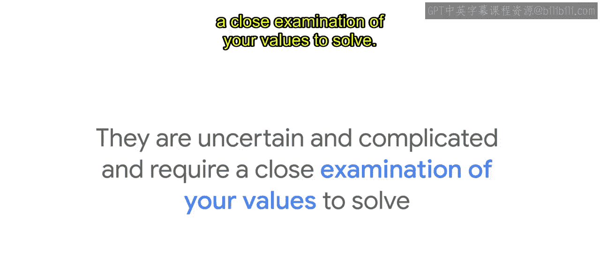
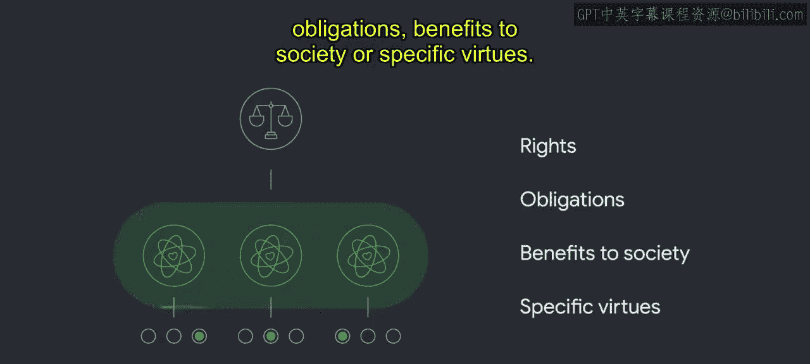
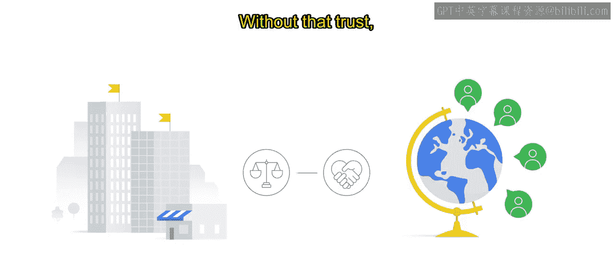

# 009：AI的技术考虑与伦理问题

在本节课中，我们将要学习人工智能领域的伦理困境与道德考量。我们将探讨伦理困境的定义、其与道德诱惑的区别，并理解为何在开发AI时，负责任的实践至关重要。

---

想象一个场景：你有一位从小一起长大的挚友，如今你们也是同事。

有一天，与你关系同样密切的经理向你透露，你的这位童年好友即将被解雇，并要求你暂时保密。

当天晚些时候，你的朋友打电话给你，兴奋地分享他计划购买新房的消息。

这真是一个两难的处境。你该怎么办？

**伦理困境**是一种必须在不同行动方案之间做出艰难选择的情境，而每种方案都可能违背某种道德原则。

不作为本身也是一种做出“什么都不做”的决定。

伦理困境充满不确定性和复杂性，需要仔细审视个人价值观才能解决。

> 

需要明确的是，伦理困境不同于**道德诱惑**。

道德诱惑是在正确与错误之间做选择，特别是当做错事对自身有利时。

想象一下，你看完一场电影离开影院时，发现另一部你想看的电影即将开始，周围没有检票员。你会进去看吗？

这不会被视作伦理困境，而是一种道德诱惑。

> 

回到最初的场景，你面临一个艰难的选择。

以下是几种可能的行动方案：

*   不顾经理的保密要求，将信息告知朋友。
*   假装不知情，遵守对经理的承诺。
*   寻找其他不越界的方式来提醒朋友。

根据询问对象的不同，这些不同的观点都可能被认为是合乎伦理的，并且有其正当性。

尽管没有标准正确答案，但一个艰难的选择必须被做出。

> 

上一节我们探讨了个人层面的伦理困境，本节中我们来看看人工智能领域面临的伦理挑战。

在构建人工智能时，由于AI可能对社会产生的巨大影响，开发者会面临许多需要应对的伦理困境。这就是为什么伦理考量必须始终处于AI社区关注的最前沿。

请看以下新闻标题：
*   建立数字信任对AI工具的采用至关重要。
*   前景广阔，但潜藏危机。
*   随着AI在更多行业承担更大决策角色，伦理担忧加剧。
*   负责任的人工智能在2021年变得至关重要。

这些标题凸显了负责任AI对公司和社会的重要性。

根据凯捷咨询2020年的一份报告，来自内部和外部的广泛利益相关者越来越要求公司建立更健全的伦理价值观、流程、专业知识、企业文化和领导力。

但当我们谈论“伦理”时，具体指的是什么？

广义而言，**伦理**是一个持续的过程，包括阐明价值观，并依据这些价值观（通常涉及权利、义务、社会利益或特定美德）来质疑和证明决策的合理性。

> 

最终，伦理是让社会中的每个人都能共同繁荣发展的基石。

这并非否认其中存在需要被承认和面对的主观性与文化相对性元素。审视世界各地的伦理框架和理论时，各种方法常常相互矛盾。但无论你认同哪种方法，伦理都是与他人和谐共处的艺术。因此，伦理审议必须汲取多样化的视角和经验。

然而，伦理并不完全适用于规则或清单，尤其是在试图解决前所未有的道德挑战时——例如那些由突破性技术所创造的挑战。

解决前所未遇的新道德挑战需要一定的创造性。它要求谦逊、直面难题的意愿，以及在面对新证据和有效反对时改变观点的开放性。

同样重要的是要理解，伦理不应被视为法律和政策。伦理反映了我们对彼此的价值观和期望，其中大部分并未被书面记录或由正式系统强制执行。

虽然法律和政策常常从伦理中汲取见解，但许多不道德的行为是合法的，而一些合乎道德的行为却是非法的。例如，大多数类型的撒谎、违背承诺或欺骗通常被认为是不道德的，但往往是合法的。而一些最英勇的公民不服从行为在当时却是非法的。

归根结底，定义伦理对你的组织意味着什么，应该促使你思考希望通过所做的工作，与用户、团队及更广泛的社会建立何种信任纽带。没有这种信任，牢固的客户关系将不复存在。

> 

随着21世纪技术的社会、政治和环境影响迅速扩大，先进技术带来的挑战也在成倍增加。使用AI的技术有可能以惊人的速度和规模无意中复制伤害，这使得采取深思熟虑、谨慎的方法变得更加重要。

各组织正迅速认识到对负责任AI的需求。

凯捷咨询2020年的“AI与伦理困境”调查显示，意识到AI相关问题的企业高管数量是2019年的两倍。在同一时期，制定了为AI开发提供指导的伦理章程的组织比例从5%增加到了45%。

> 
> 

---

本节课中我们一起学习了伦理困境与道德诱惑的核心区别，探讨了伦理在人工智能开发中的根本重要性，并了解了企业界对建立负责任AI实践日益增长的认识。我们认识到，伦理是一个动态的、基于价值观的决策过程，对于在快速发展的技术时代建立和维护社会信任至关重要。