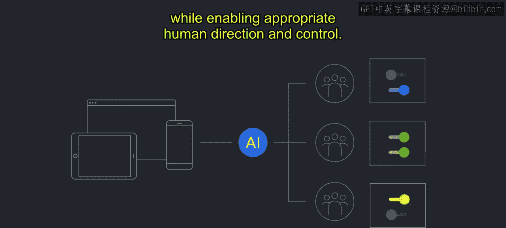
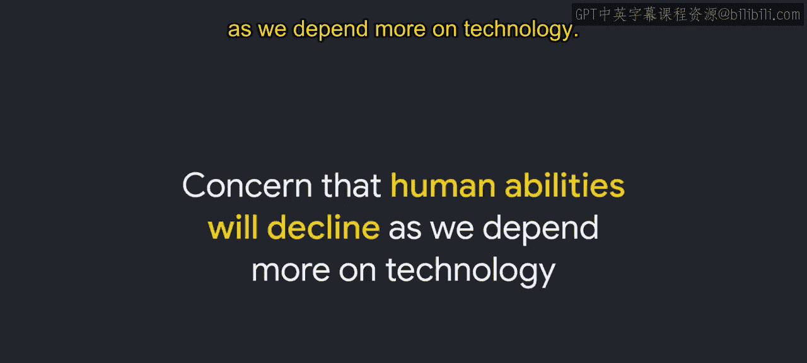
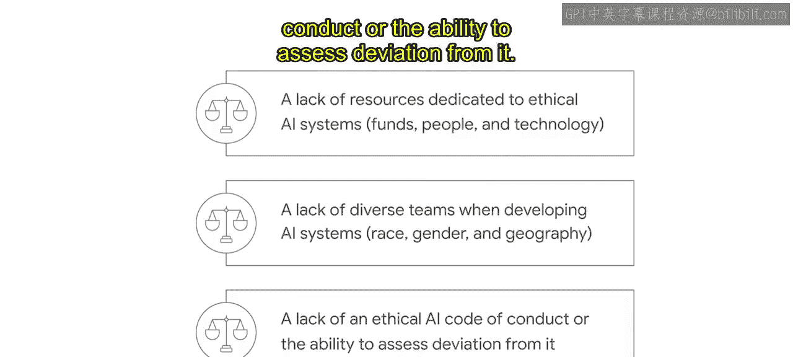
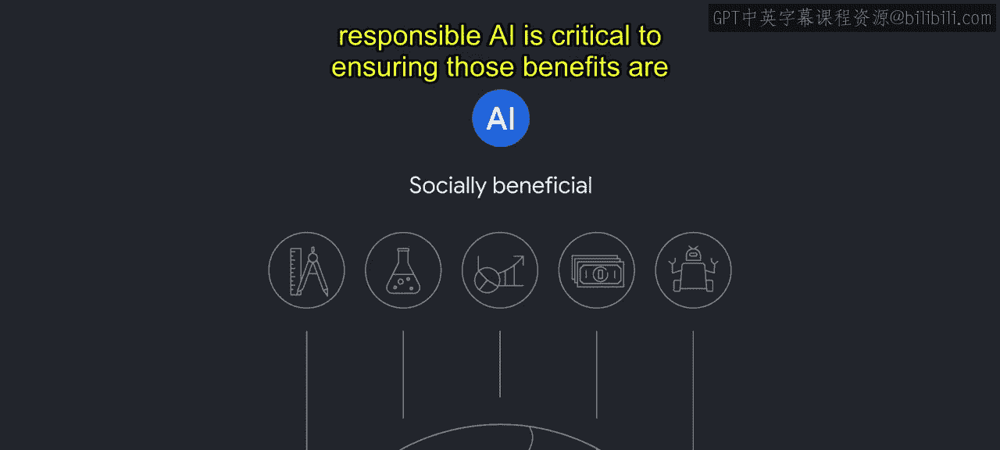

# 010：对人工智能的担忧 🤖

在本节课中，我们将要学习人工智能，特别是生成式AI，所引发的主要伦理关切。我们将逐一探讨透明度、偏见、安全、隐私等核心问题，并了解这些挑战的根源以及应对它们的重要性。

上一节我们从宏观层面探讨了伦理问题。然而，人工智能所驱动的先进技术也带来了一些尤为相关的伦理担忧。虽然本模块无法涵盖所有问题，但我们将审视在讨论AI伦理时备受关注的一些主题。AI的每一个用例都带来了独特的挑战，谷歌正致力于解决这些挑战。但作为一个行业，我们必须提高对这些问题的认识，以便共同制定应对策略。

以下是当前被提出的主要AI关切点。

## 透明度 🔍

随着AI系统变得越来越复杂，建立足够的透明度以让人们理解AI系统如何做出决策，正变得日益困难。在许多情况下，能够理解AI系统的工作原理对于终端用户的自主权或做出知情选择的能力至关重要。缺乏透明度也会使开发者更难预测这些系统何时以及如何会失败或造成意外伤害。

允许人类了解决策背后因素的模型，可以帮助AI系统的利益相关者更好地与AI协作。这可能意味着知道在AI表现不佳时何时进行干预、加强使用AI系统结果的策略，以及确定如何改进AI。

## 不公平偏见 ⚖️

第二个关切是不公平偏见。AI本身不会制造不公平偏见，它揭示并放大了现有社会系统中存在的偏见。AI的一个主要陷阱在于，其规模化能力会强化和延续不公平偏见，这可能导致进一步的意外伤害。塑造社会的不公平偏见也塑造了AI的每一个阶段，从数据集和问题定义，到模型创建和验证。AI是其设计和部署所处的社会背景的直接反映。为了减轻伤害，需要识别并解决社会背景和可能的偏见。

例如，视觉系统正被应用于公共安全和物理安防的关键领域，以监控建筑活动或公共示威。在这里，偏见可能使监控系统更有可能将边缘化群体误认为罪犯。这些挑战源于许多根本原因，例如训练数据中某些群体的代表性不足和其他群体的过度代表性、缺乏充分理解系统影响所需的关键数据，或产品开发中缺乏社会背景考量。

## 安全 🛡️

第三个AI关切是安全。与任何计算机系统一样，恶意行为者有可能利用AI系统中的漏洞进行恶意目的。随着AI系统嵌入社会的关键组成部分，这些攻击代表了可能严重影响安全与安保的漏洞。

安全可靠的AI涉及信息安全的传统关切，以及新的关切。AI的数据驱动特性使得训练数据对窃取者更有价值，同时AI也可能使攻击的规模和速度更大。我们还看到了AI特有的新型操纵技术，例如深度伪造，它可以模仿某人的声音或生物特征。

## 隐私 🕵️

第四个AI关切是隐私。AI提供了快速、轻松地收集、分析和组合来自不同来源的海量数据的能力。

AI对隐私的潜在影响是巨大的，导致了数据利用、非自愿识别与追踪、侵入性的语音和面部识别以及用户画像等风险。AI的广泛使用伴随着采取负责任隐私方法的需求。

## AI伪科学 🧪

另一个关切是AI伪科学，即AI从业者推广缺乏科学基础的系统。

例子包括声称能够根据面部特征以及头部的形状和大小来测量一个人犯罪倾向的面部分析算法，或用于情绪检测以根据面部表情判断某人是否可信的模型。科学界认为这些做法不科学且无效，并可能造成伤害。然而，它们被用AI重新包装，使得伪科学看起来更可信。这些AI的伪科学用途不仅伤害个人和社区，还可能破坏AI适当且有益的用例。

## 对人的问责 👥

第六个关切是对人的问责。AI系统的设计应确保满足各类人群的需求和目标，同时允许适当的人类指导和控制。

我们通过多种方式努力在AI系统中实现问责制：通过为系统明确定义目标和操作参数、提高关于AI何时及如何被使用的透明度，以及确保人们有能力干预系统或向系统提供反馈。

## AI驱动的失业与技能退化 📉

最后一个AI关切是AI驱动的失业和技能退化。虽然AI为常见任务带来了效率和速度，但更普遍的担忧是AI会导致失业和技能退化。此外，还有人担心随着我们对技术的依赖加深，人类能力会下降。

社会在过去经历过技术创新，我们也相应地进行了调整，例如汽车取代了马匹，但也创造了以前无法想象的新产业和工作。如今，创新和技术进步以前所未有的速度和规模发生。如果生成式AI兑现其承诺的能力，劳动力市场可能面临重大颠覆。然而，工作将会转移，就像在任何重大技术进步期间一样。例如，在商业航空旅行出现之前，谁能想象出空乘人员这个职业？虽然许多工作可能会得到生成式AI的补充，但我们也将会创造出今天无法想象的崭新工作。

这一挑战伴随着机遇。我们需要共同努力制定计划，帮助人们在面对挑战并抓住机遇的同时，维持生计并在工作中找到意义。

除了通用AI应用和模型的关切列表外，生成式AI还有其独特的关切。作为广为人知的一种生成式AI，大语言模型能以听起来自然的语言形式生成文本的创造性组合。

大语言模型主要有三个关切：幻觉、事实性和拟人化。在生成式AI中，幻觉指的是AI模型生成了不切实际、虚构或完全捏造的内容。事实性关系到生成式AI模型所产生信息的准确性或真实性。拟人化指的是将类似人类的品质、特征或行为赋予非人类实体，如机器或AI模型。

以上只是与AI及生成式AI开发和部署相关的一些常见关切的选择。你对这些独特技术挑战的认识，可以指导你在制定应对策略时有所侧重。

那么，是什么导致了这些关切？凯捷咨询的一项调查中，高管受访者列举了这些报告的伦理问题的一些原因：缺乏专门用于伦理AI系统的资源（资金、人员和技术）；在开发AI系统时缺乏多元化的团队（涉及种族、性别和地域）；以及缺乏伦理AI行为准则或评估偏离该准则的能力。

在报告中，高管们还将急于实施AI的压力列为AI使用引发伦理问题的首要原因。这种压力可能源于获得先发优势的紧迫性、需要通过创新的AI应用获得竞争优势，或者仅仅是利用AI所能提供好处的压力。同样值得注意的是，33%的受访者表示，他们在构建AI系统时实际上并未考虑伦理问题，这本身就令人担忧。

但伦理不仅仅关乎我们不想做或不应该做的事情。AI和新兴技术有许多有益社会的用途，可以帮助对生活和社会做出积极贡献。AI和新技术可以通过改进材料、设计和流程来帮助解决复杂问题；开发新的医学和科学突破；实现对复杂动态系统更可靠的预测；以及提供更实惠的商品和服务，使人们从常规或重复性任务中解放出来。即使对于这些非常有益社会的解决方案，负责任的人工智能对于确保这些好处被所有人而不仅仅是少数利益相关者所享有也至关重要。

组织中伦理实践的关键好处在于，它们有助于避免对客户、用户乃至整个社会造成伤害。伦理实践促进人类的繁荣。这是我们最需要关注的。在谷歌，我们AI治理的目标是试图解决这些引发伦理问题的关切，而负责任的AI实践有助于实现这一目标。实施你自己的负责任AI治理和流程，可以帮助解决你业务中的这些伦理问题。

本节课中我们一起学习了人工智能，特别是生成式AI，所面临的主要伦理挑战，包括透明度、偏见、安全、隐私、伪科学、问责制以及对社会就业的影响。我们还探讨了这些问题的根源，并认识到通过负责任的AI实践来应对这些挑战、促进技术向善的重要性。