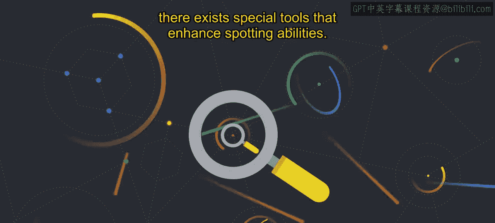
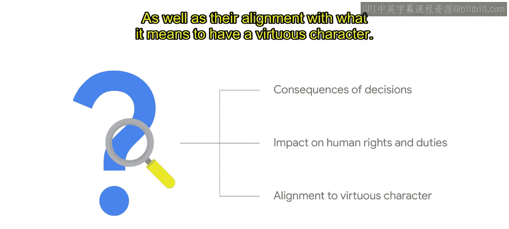

# 012：伦理问题发现 🕵️

在本节课中，我们将要学习人工智能治理中的一个核心环节：伦理问题发现。我们将了解什么是问题发现，为什么简单的清单法行不通，以及如何通过实践和哲学视角来提升我们发现伦理问题的能力。

## 概述

人工智能治理的一个核心部分是建立稳健的问题发现实践。

问题发现是识别人工智能项目中潜在伦理关切的过程。

您所在组织制定的人工智能原则可以作为发现这些问题的指南。

## 为何清单法行不通

为了应对伦理关切，我们首先需要识别它们。人们可能会试图通过清单或概述每条原则的可行与不可行之处来提高这一过程的效率。

我们知道这很诱人，因为我们尝试过。我们曾试图创建决策树和清单，以确保我们的技术符合伦理。

但这行不通。现实情况是，我们需要应对伦理问题，不仅是在熟悉的产品或使用案例中，还要识别出从未见过的新技术所带来的新风险。

每个使用案例、客户和社会背景都是独特的。在一种情境下符合我们人工智能原则的工具或解决方案，在另一种情境下可能就不符合。我们从未想象过的技术正在以极快的速度和规模发展，这需要一个适应性的过程，而非僵化的、规定性的“是”或“否”的答案。

期望为每个使用案例创建一个简单的清单来满足您的人工智能原则是不可行的。我们认识到，没有什么可以替代对每个案例事实的仔细审查。

## 问题发现的类比：观鸟

一个有用的类比是将伦理问题想象成鸟。它们无处不在，但常常不被察觉。它们在某些区域出现的频率更高，并且大小不一，从奇特到普通都有。通过练习，发现它们会变得更容易。

在上班的路上，你可能经过了很多鸟，但你可能并没有真正注意到它们。现在，想象一下，如果你是一位训练有素的观鸟者。你会对你沿途遇到的物种更加敏感，并且更有可能注意到你每天经过的鸟类之间错综复杂的差异。

类似地，在问题发现中，目标是变得更加敏感，能够快速准确地识别和分类伦理问题与风险。

和观鸟一样，团队合作能看到更多。因此，让多位审查者参与是有帮助的。没有一个人能看到所有东西，而且存在一些特殊工具可以增强发现能力。

## 利用伦理视角（Lenses）

在伦理问题发现方面，道德哲学家们花费了数千年时间开发了各种“视角”来帮助识别伦理问题。

虽然你可能会审视各种哲学视角，并想知道应该选择哪一种来遵循，但我们发现，这并不真的是在所有场景中选择一种方法而放弃另一种。

在实践中，利用伦理视角提供了一种结构化的方式，从多个角度和视角来考虑问题，以确保我们审视并服务于那些重要的考量因素。

学习何时以及如何使用这些视角，可以让你在评估决策的后果、它们对人权和责任的影响，以及它们与拥有美德品格的含义是否一致之间进行切换。

如果你想了解更多关于伦理视角的信息。

请参阅马库拉应用伦理学中心的材料。

## 总结

本节课中，我们一起学习了人工智能伦理治理中的“问题发现”环节。我们了解到，识别伦理问题是一个需要实践和敏感度的过程，无法通过简单的清单一劳永逸。通过类比观鸟，我们明白了团队协作和持续练习的重要性。最后，我们介绍了利用多种哲学“视角”来结构化地审视问题，这是确保全面考虑伦理风险的关键方法。掌握这些，将帮助我们更负责任地开发和部署人工智能技术。