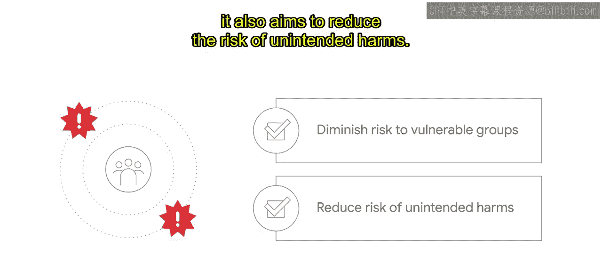
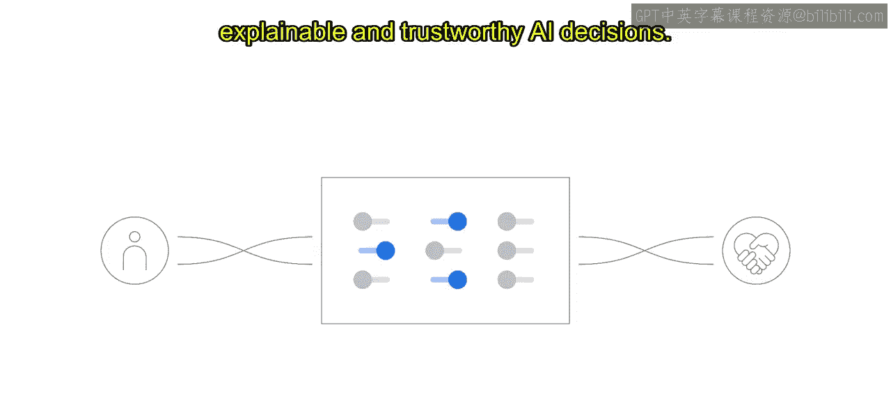
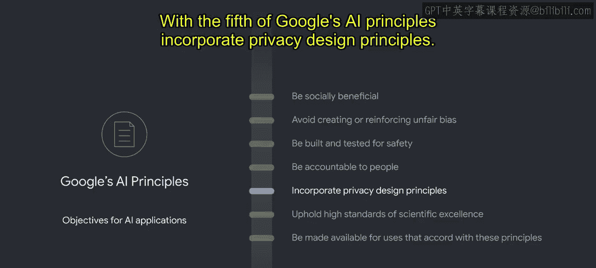
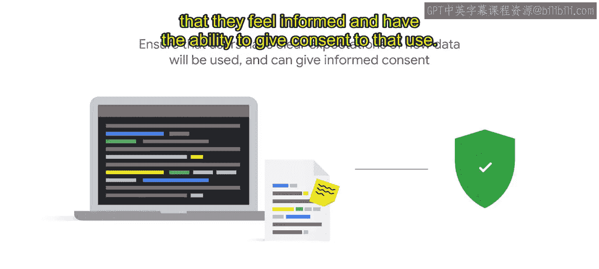
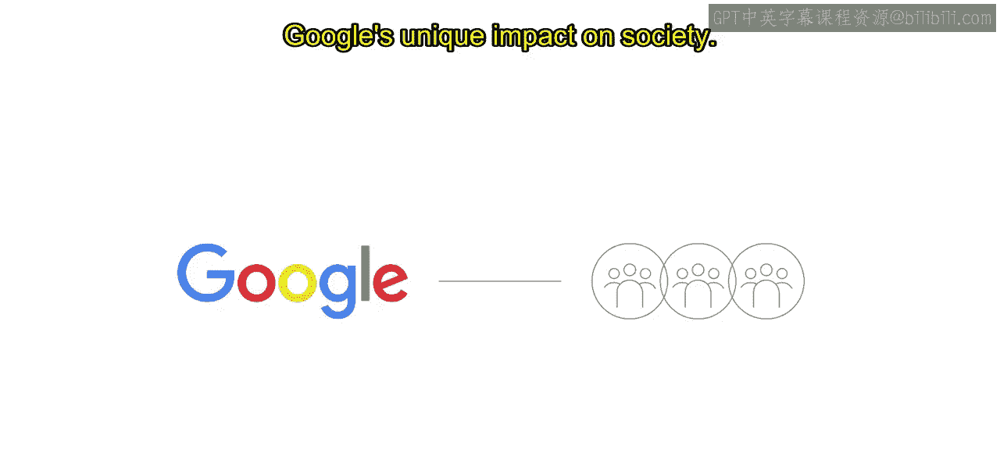

# 013：谷歌AI原则的伦理目标 🎯

在本节课中，我们将要学习谷歌AI原则背后的核心伦理目标。这些目标不仅解释了每条原则的精神内涵，还为我们提供了一致性的评估框架。我们将逐一探讨这些旨在构建有益、公平、安全且负责任的人工智能应用的伦理目标。

---

## 概述

谷歌确立了一系列核心伦理目标，它们可以被视为对每项AI原则背后理念的阐释。这些伦理目标帮助我们以一致的方式评估项目是否符合原则。它们能指导我们发现可能存在的伦理问题，但并非一份简单的核对清单。接下来，我们将详细解析构成谷歌AI原则的几项核心伦理目标。

---

## 第一节：有益于社会 🤝

上一节我们介绍了伦理目标的总体概念，本节中我们来看看第一个目标：**有益于社会**。该目标旨在支持健康的社会体系和制度。

以下是其具体内涵：

*   **防止不公**：这意味着要防止自动化系统不公平地剥夺对人们福祉至关重要的服务，例如就业、住房、保险或教育。
*   **降低社会危害风险**：旨在从数量、严重性、可能性和范围上减少社会危害的风险。
*   **保护弱势群体**：致力于降低对弱势群体的风险。
*   **减少意外伤害**：同时旨在减少非预期伤害的风险。

---

## 第二节：避免制造或加剧不公平偏见 ⚖️

在追求社会效益的基础上，第二个原则强调**避免制造或加剧不公平偏见**。其目标是推动AI实现对个人和群体的公平、公正及平等对待。

以下是实现该目标的关键考量：

*   **限制历史偏见影响**：应限制训练数据中对边缘化群体的历史偏见的影响。这既包括已包含的数据，也包括因历史上被排斥而缺失或不可见的数据。
*   **关注歧视性影响**：通过这一原则，我们密切关注技术歧视可能对产品对所有用户的有用性产生的影响。

为了更直观地理解，让我们看一个图像分类的例子。一个在带有偏见数据上训练的AI图像分类器，可能只将穿着传统西方婚礼服饰的情侣图片标记为“婚礼”。然而，一对穿着其他文化传统婚礼服饰的情侣图片，可能只会被标记为“人”而非“婚礼”。这展示了该分类器可能无法识别来自世界不同地区或文化的婚礼图像。这不是我们希望看到的标签和区分方式，这也是数据集未能反映我们全球用户基础的一个例子。正如本例所示，代表性不足是有害的。

认识到这一点，谷歌致力于构建旨在为所有人服务的全球性产品。为了实现更广泛的多样性代表，谷歌曾举办竞赛，邀请全球公民将他们的图像添加到一个扩展数据集中。因为训练数据必须能够如实反映社会，而不是像有限数据集可能代表的那样。

重要的是要认识到，不公平可能在机器学习生命周期的任何阶段进入系统：从最初如何定义问题，到如何收集和准备数据，再到模型如何训练和评估，直至模型如何集成和使用。在这个流程的每个阶段，开发者都面临着不同的负责任AI问题和考量。在生命周期内，我们采样数据的方式、标记数据的方式、模型的训练方式以及目标是否排除了特定用户群体，所有这些因素都可能共同作用，产生偏见。你很少能找出这些问题的单一原因或单一解决方案。

机器学习公平性的工作就是理清这些根本原因和相互作用，并找到尽可能公平的前进方案。我们通过明确生命周期每个阶段需要回答的问题来实现这一点，例如：

*   模型将解决什么问题？
*   目标用户是谁？
*   可能影响哪些其他群体？
*   哪些群体在今天是不可见的？
*   训练数据是如何收集、采样和标记的？
*   训练数据是否存在偏差？
*   模型是如何测试和验证的？
*   模型的行为是否符合预期？

虽然这并非一份详尽的清单，但我们发现，在每个阶段提出此类问题有助于指导我们的调查并识别可能的不公平偏见。尽管这些问题可能难以回答，并且需要一系列社会技术层面的输入，但有一些基础工具可以在此过程中提供帮助。其中一些通过TensorFlow生态系统开源，另一些则是谷歌云提供的托管产品。我们在此不重点介绍工具，但你可以查看资源链接以获取更多信息。

这些问题对数据集和模型的开发方式有着巨大影响。其中一些问题看似简单，但实际上常常被低估，这可能导致项目在最后阶段进行重大修改，甚至完全取消项目。负责任地开展AI工作的核心在于提出难题。

---

## 第三节：为安全而构建和测试 🛡️

在关注公平性之后，第三个原则是**为安全而构建和测试**。该原则旨在促进人与社区的安全（包括身体完整性和整体健康），以及场所、系统、财产和基础设施免受攻击或破坏的安全。

以下是其核心要求：

*   **有效监督与测试**：确保对安全关键型应用进行有效的监督和测试。
*   **控制AI系统行为**：实现对AI系统行为的控制。
*   **限制对机器智能的依赖**：限制对机器智能的依赖程度。

---

## 第四节：对人类负责 👥

确保安全的同时，AI系统必须**对人类负责**。第四个原则旨在尊重人的权利和独立性。

这意味着：

*   **限制权力不平等**：限制权力不平等的情况。
*   **保障选择退出权**：限制人们缺乏选择退出AI交互能力的情况。
*   **促进知情同意**：旨在促进用户的知情同意。
*   **确保反馈与纠错路径**：寻求确保存在报告和解决滥用、不公正使用或故障的途径。

其目标是实现对AI系统的有意义的人类控制和监督，以促进可解释且值得信赖的AI决策。

---

## 第五节：融入隐私设计原则 🔒

与问责制紧密相关的是隐私保护。谷歌AI原则的第五项是**融入隐私设计原则**。

其目标是保护个人和群体的隐私与安全。为此，我们希望确保通过强大的安全措施特别谨慎地处理个人身份信息和敏感数据。该原则的目标还包括确保用户对数据将如何被使用有清晰的预期，并且他们感到知情并有能力对该使用给予同意。

---

## 第六节：坚持高标准的科学卓越性 🔬

在技术层面，第六项原则**坚持高标准的科学卓越性**，旨在推动AI领域的知识进步。

这意味着：

*   **遵循科学严谨的方法**：遵循科学严谨的方法。
*   **确保主张科学可信**：确保功能主张具有科学可信度。

该原则旨在通过致力于开放探究、学术严谨、诚信和协作来实现这一点。通过发布教育材料、最佳实践和研究来负责任地分享AI知识，使更多人能够开发有用且有益的AI应用，同时避免AI伪科学。

---

## 第七节：仅用于符合这些原则的用途 ✅

最后，AI原则中关于AI应用的目标是**仅用于符合这些原则的用途**。这旨在为谷歌对社会的独特影响寻求问责。

许多技术都有多种用途。该原则旨在限制潜在有害或滥用的应用。这包括技术解决方案与有害用途的关联程度或适应程度。该原则追求我们有益AI技术的最广泛可用性和影响力，同时阻止有害或滥用的AI应用。它考虑到谷歌不仅仅是构建和控制供自己使用的技术，还使该技术可供他人使用。谷歌希望确保不仅是我们拥有和运营的技术符合我们的AI原则，我们提供给客户和合作伙伴的技术也同样符合。我们使用各种因素来准确定义我们对特定AI应用的责任范围。

---

## 总结与谷歌的承诺

本节课中，我们一起学习了构成谷歌AI原则的七项核心伦理目标：有益于社会、避免偏见、保障安全、对人类负责、保护隐私、坚持科学卓越性以及限定使用用途。

除了这七项代表我们如何负责任地使用AI的承诺的伦理目标外，谷歌还概述了**四个不会追求的AI应用领域**：

1.  可能造成整体伤害的应用。
2.  武器或其他主要目的是造成人身伤害的技术。
3.  违反国际公认规范的监控技术。
4.  目的违反国际法和人权的应用。

这七项目标和四个禁区共同构成了谷歌的AI原则，并简洁地传达了我们在开发先进技术时的价值观。我们相信这些原则是我们公司及AI未来发展的正确基础。然而，确立AI原则只是第一步。要运用这些原则来解释问题和做出决策，需要一个流程。负责任的AI决策需要仔细考虑AI原则应如何应用、当原则发生冲突时如何权衡取舍，以及如何针对特定情况降低风险。为了将AI原则付诸实践，我们建立了一个正式的审查流程和治理结构，以评估新项目、产品和交易中出现的多方面伦理问题。我们还有几个相关的计划和倡议。这就是AI原则的实践方式。