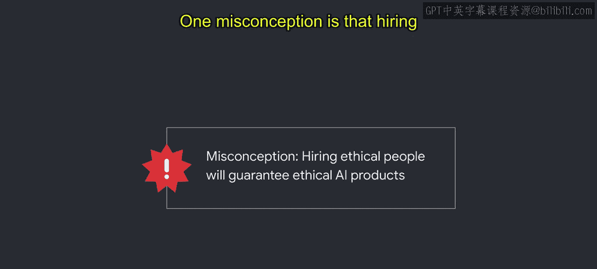
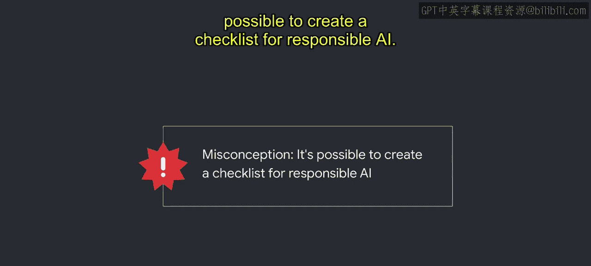
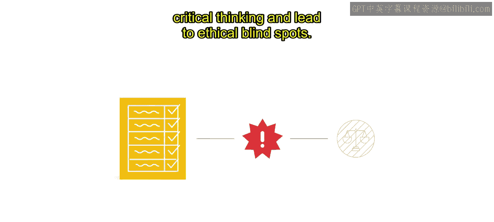
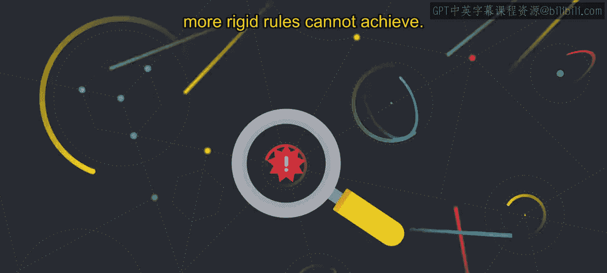
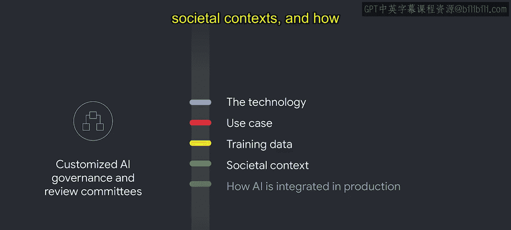

# 014：Google的AI治理 🏛️

在本节课中，我们将学习在定义了AI原则之后，如何建立有效的AI治理体系，特别是通过设立审查流程来实践这些原则。我们将探讨常见的误解，并深入了解Google如何构建其AI治理委员会结构。

## 概述：从原则到实践

上一节我们介绍了制定AI原则的重要性。本节中我们来看看如何将这些原则付诸实践。定义AI原则只是第一步，下一步是建立一个审查流程来落实它们。

拥有AI原则作为指导并不能立即解答所有关于AI伦理的疑问，它们也不能免除你进行艰难对话的责任。这些原则提供的是一个起点，用于确立你所秉持的价值观，以及你在技术开发中需要评估的内容。应用这些AI原则需要持续且协同的努力。

虽然负责任AI的技术工具有助于检查特定机器学习模型的性能，但建立稳健的AI治理流程是确立目标的关键第一步。只有在你拥有明确的责任目标时，技术工具才有用。一个专门的流程能促进负责任AI的文化，而这在传统的产品开发生命周期中通常不存在。

## 澄清常见误解

在深入探讨具体流程之前，让我们先快速澄清一些关于负责任AI治理的常见误解。

以下是两个需要特别注意的误解：

*   **误解一：雇佣有道德的人就能保证AI产品的道德性。**
    *   现实情况是，两个被认为道德感很强的人，基于他们的经验和背景，可能对同一情况或AI解决方案得出截然不同的结论。世界经济论坛报告《Ethics by design》中的研究表明，即使是最有道德的人也可能存在道德盲点。因此，围绕道德决策建立实践并为道德审议留出空间非常重要，这两者都是实现道德结果的重要因素。

*   **误解二：可以为负责任AI创建一个检查清单。**
    *   检查清单或决策树可能让人感到安心，但根据我们的经验，对于如此新兴的技术，检查清单在治理方面是无效的。对于每个产品，其技术细节和使用背景都是独特的，需要自己的评估。遵循检查清单可能会限制批判性思维，并导致道德盲点。

## AI治理的核心：程序与实践

澄清了误解后，我们认识到AI治理的核心在于拥有支持技术审查的程序和实践。这些程序让你的团队能够运用**道德想象力**，即在特定情境中设想全部可能性以解决道德挑战的能力。它还鼓励人们建立自己的问题发现实践，这是规定的检查清单和更僵化的规则所无法实现的。

## Google的AI治理委员会结构

那么，让我们详细了解我们是如何将审查流程操作化的。Google创建了一个正式的审查委员会结构，以评估新项目、产品和交易是否符合我们的AI原则。

该委员会结构由以下AI治理团队组成：

以下是构成Google AI治理框架的四个关键团队：

1.  **核心负责任创新团队**：该团队为Google不同产品领域实施AI原则审查的团队提供指导，建立对我们AI原则的共同解释，并确保全公司决策的一致性。他们处理日常运营和初步评估。这个小组包括用户研究员、社会科学家、伦理学家、人权专家、政策与隐私顾问以及法律专家等，确保了视角和学科的多样性。
2.  **高级专家团队**：这是我们委员会结构中的第二个AI治理团队，由来自Google各学科领域的高级专家组成，他们提供技术、功能和应用程序方面的专业知识。这些专家为新兴技术和主题制定战略和指南，并在需要时就审查提供咨询。
3.  **高级执行官委员会**：这是我们委员会结构中的第三个AI治理团队，是一个由高级执行官组成的委员会，负责处理最复杂和困难的问题，包括影响多个产品和技术的决策。他们作为升级机构，做出复杂的、具有先例意义的决策，并在公司最高层面提供问责。
4.  **定制化AI治理与审查委员会**：最后，在某些产品领域内嵌入了定制的AI治理和审查委员会，它们与负责任创新团队紧密合作。这些委员会会考虑其技术、用例、训练数据、社会背景以及AI在生产中的集成方式等方面的独特情况。

## 最佳实践：多样性与心理安全

所有团队审查的一个最佳实践是寻求来自不同背景的人员参与，这确保了基于审议的稳健和可信的结果。为了使这种讨论和辩论取得成功，需要培养一种心理安全的环境。

为了让你更好地了解Google Cloud如何实践负责任AI，接下来我们将介绍我们的定制AI治理流程。

## 总结

本节课中我们一起学习了建立AI治理的关键步骤。我们了解到，仅有AI原则和道德员工是不够的，必须建立结构化的审查流程和实践。Google通过设立包含核心创新团队、专家团队、高管委员会及定制委员会的多层治理结构，将原则转化为可操作的审查机制，并强调多样化的参与和心理安全的环境对于做出稳健、负责任的决策至关重要。下一节，我们将具体进入Google Cloud的定制化治理流程。