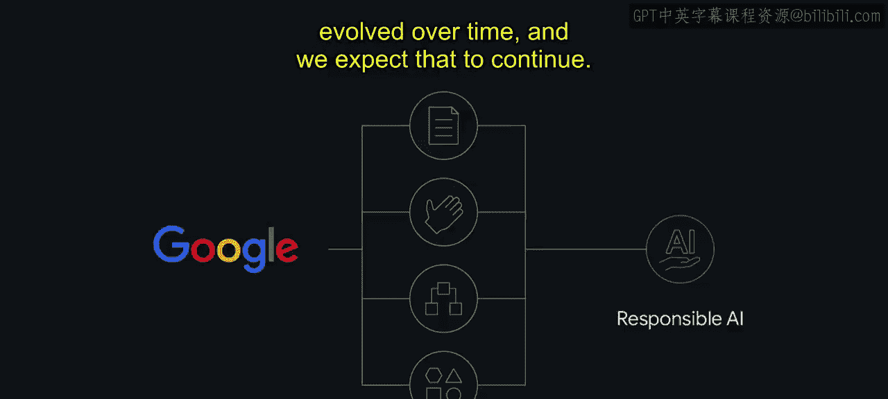
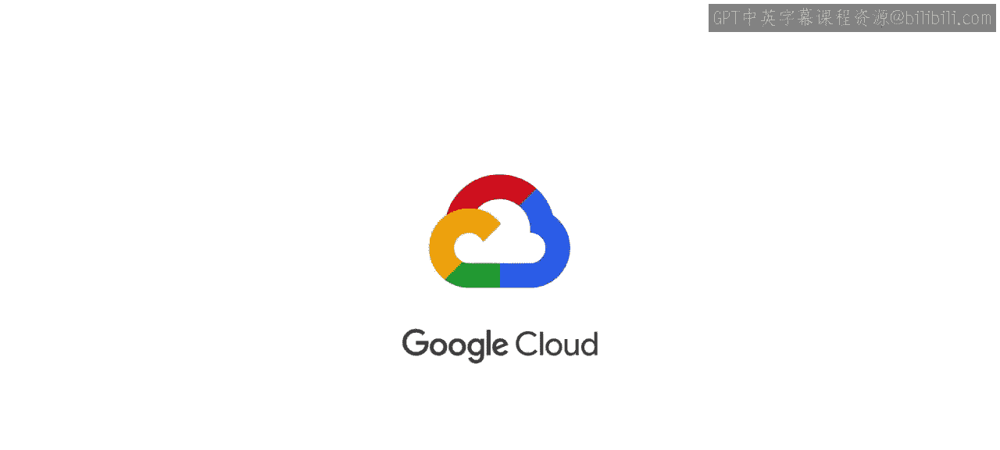

# 015：Google Cloud的AI审核流程 🛡️

在本节课中，我们将要学习Google Cloud如何通过其内部审核流程，确保其开发和应用的人工智能技术符合伦理原则并负责任地发展。我们将详细解析其两大核心审核机制：客户AI交易审核与云AI产品开发审核。

## 概述

Google Cloud为企业提供广泛的AI技术，包括AI平台Vertex AI、MLOps能力、API及端到端解决方案。我们认为，对所创造产品的影响进行伦理评估，对于建立信任和取得成功至关重要。因此，Google Cloud实施了自定义的AI原则审核流程。

为了确保AI的开发是负责任的，Google Cloud内部存在两个相互关联但职责分明的审核机构：**客户AI交易审核** 和 **云AI产品开发审核**。它们共同回答两个核心问题：提议的用例是否符合我们的AI原则？如果符合，我们应如何设计和集成此解决方案，以确保实现预期效益并减轻潜在危害？

## 客户AI交易审核流程 🔍

上一节我们介绍了审核流程的整体框架，本节中我们来看看针对具体客户项目的“客户AI交易审核”。该流程的目标是在交易推进前，识别任何可能不符合我们AI原则的用例风险。

以下是该审核流程的几个关键阶段：

**1. 销售交易提交**
这是信息收集的入口流程，通过两种方式确保覆盖全面。现场销售代表经过培训，会提交其AI客户机会以供审核。此外，一个自动化流程会在公司级的销售工具中标记需要审核的交易。

**2. 初步审查**
在此阶段，云AI原则团队的成员在中心“负责任创新”团队的协助下，审查通过入口流程提交的交易，并确定哪些交易需要更深入的审查。他们会应用相关的历史先例，讨论和辩论潜在的AI原则风险，并在需要时要求提供额外信息。此分析为后续的“AI原则交易审核委员会”会议设定了议程。

**3. 评审、讨论与决策**
AI原则交易审核委员会召开会议讨论客户交易。该委员会由组织中跨多个职能的领导者组成，例如产品、政策、销售、AI伦理和法律部门。委员会仔细考量AI原则如何适用于具体的交易和用例，并决定交易是否可以推进。

该小组做出的决策范围包括：
*   **推进**：交易可以按计划进行。
*   **不推进**：交易因不符合原则而被否决。
*   **满足条件后推进**：在满足某些特定条件或指标前，交易暂时不能推进。
*   **升级决策**：将决策权提交给更高级别的委员会。

此处的决策基于共识达成。如果无法达成明确决定，交易审核委员会可以将议题升级至高级执行委员会。

## 云AI产品开发审核流程 🏗️

了解了客户项目的审核后，我们转向Google Cloud自身产品的开发审核流程。该流程同样包含多个阶段，旨在将伦理考量融入产品设计之初。

**1. 管道开发与规划**
云AI原则团队会跟踪产品开发管道并规划审核时间，确保审核发生在产品开发生命周期的早期。这对于实现“设计即伦理”的开发方法至关重要，确保负责任的AI考量被整合到产品设计中，而非事后补救。

**2. 初步审查与简报准备**
团队根据产品发布时间线来确定AI产品的审核优先级，除非某个特定用例被认为风险更高。在审核会议之前，云AI原则团队的成员会评估产品并起草审核简报。他们与产品经理、工程师、其他原则团队成员以及公平性专家紧密合作，深入理解并界定审核范围。

审核简报通常包含以下核心内容：
*   产品的预期目标和社会效益。
*   产品将解决的业务问题。
*   所使用的数据。
*   模型的训练和监控方式。
*   产品将被集成的社会背景。
*   其潜在的风险和危害。

在评估中，团队会协作思考受AI系统影响的每一个利益相关者群体，讨论在选择一种行动方案而非另一种时存在的伦理困境和价值冲突。最后，简报的一个关键部分是提出一个“校准计划”，通过解决潜在危害，使产品开发与AI原则保持一致。

**3. 讨论与校准**
团队实际召开会议，从负责任AI的角度评审AI产品。这些深入的实时产品评审是我们审核流程的关键组成部分，使我们能够以团队形式发现并讨论额外的伦理问题，并将负责任的AI融入产品设计、开发和未来路线图的决策中。

**4. 批准与执行**
评审会议结束后，AI原则团队会综合评审简报中的相关内容，并添加会议中提出的新问题、缓解措施或决策，以更新并最终确定校准计划。在校准阶段，该计划会被发送给委员会和产品负责人签署批准。批准后，校准计划将被纳入产品开发路线图，并由AI原则团队跟踪其执行与完成情况。

需要强调的是，校准计划因产品或解决方案而异。并非所有前进路径都涉及技术解决方案或修复。伦理风险和危害并非总是技术失误的结果，也可能源于产品被集成的环境背景。因此，前进路径可能包括：
*   缩小技术应用的范围。
*   采用“许可名单”方式发布（即产品不普遍可用，使用前需经过客户交易审核）。
*   随产品附带教育材料发布，例如相关的模型卡片或实施指南，告知用户如何负责任地使用解决方案。

## 流程演进与经验总结 📈

随着时间的推移，评审具有类似问题的产品揭示了一些可在多次评审中借鉴的发现。这使得我们可以创建某些通用政策，这些政策随后成为先例，简化了产品团队的流程。当然，每一次评审仍需保持同等程度的谨慎，因为每个新案例都会带来新的考量，这也凸显了流程和深入讨论的重要性。

我们将AI原则付诸实践的过程本身也在不断成长和演变，并且我们预计这一过程将持续下去。

## 总结

本节课中，我们一起学习了Google Cloud为确保AI负责任发展而建立的两大核心审核流程。**客户AI交易审核** 聚焦于早期客户项目，评估其用例是否符合伦理原则；而**云AI产品开发审核** 则贯穿产品开发生命周期，旨在将伦理设计融入产品构建之初。这两个流程通过多阶段、跨职能的深入讨论与决策，共同致力于实现技术的预期效益并减轻潜在危害。

当您思考建立自己的AI治理流程时，我们希望这可以作为一个有用的框架，供您调整以适应您组织的使命、价值观和目标。在后续课程中，我们将探讨更多使Google审核流程更有效的经验教训。